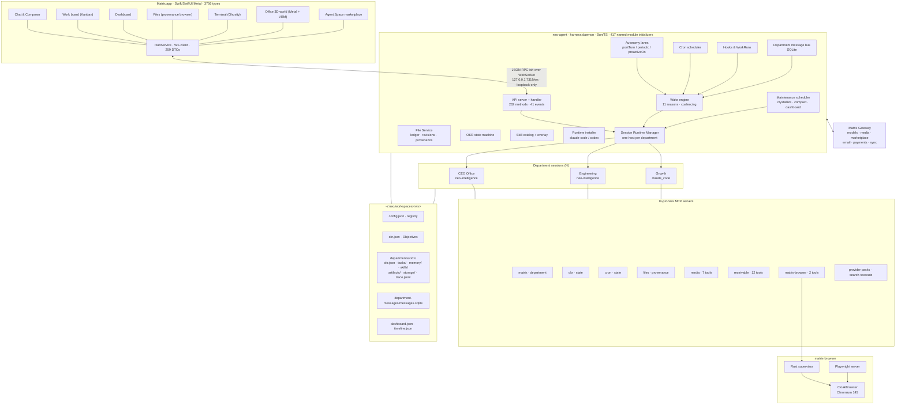

# Executive Summary

> **Accuracy note:** a second review pass found 14 substantive errors in the first draft of this
> dossier. See [`ERRATA.md`](ERRATA.md) for every correction with evidence. Claims carry
> **[V]** verified · **[O]** observed · **[I]** inferred · **[U]** unverifiable markers.

## 1. The product idea

Matrix sells one idea: **an AI company you own, running on your Mac.**

Not "a chat app with agents" — a *company*. It has a name, a mission, an org chart, an OKR
book, departments that own domains, employees that hold memory and skills, a message bus for
cross-department handoffs, a dashboard, a payroll-equivalent (model billing), a marketplace to
buy and sell departments, a mailbox, a payments account, and an office you can walk around in.

The user's role is explicitly framed as *founder*, not *operator*:

> **You do founder work** — set direction, provide assets, approve permissions, review proof,
> decide tradeoffs.
> **Lead dispatches** — reads OKRs and context, slices tasks, chooses Workers, synthesizes results.
> **Workers execute narrowly** — Neo coordinates; Codex and Claude Code change code, inspect
> files, and return artifacts.
> **System wakes lightly** — uses OKR gaps, blockers, proof, and schedules to nudge or dispatch
> at the right time.
>
> — `tutorial.roles.*`, shipped in `en.lproj/Localizable.strings`

## 2. The three-plane model

Everything in the codebase enforces a strict separation the vendor calls **three planes**:

| Plane | Question it answers | Storage | Written through |
|---|---|---|---|
| **Topology** | *Who owns what* | `config.json` department registry | `mcp__matrix__department` |
| **Knowledge** | *What is known* | `memory/knowledge/*.md` belief cards, `skills/`, `RULES.md` | direct file writes + `crystallize` maintenance |
| **Execution** | *What is being done and proven* | `okr.json`, `tasks/*.md`, `department-messages/messages.sqlite` | `mcp__okr__state` |

> "Keep three planes separate: topology is who owns, knowledge is what is known, execution is
> what is being done and proven." — `neo-agent-seed/prompts/workspace-schema.md`

A **derived plane** (`dashboard.json`, `timeline.json`) is a projection only; agents are
forbidden from editing it.

## 3. The operating vocabulary

```
Objective ──► Key Result ──► Task ──► Criteria ──► Proof ──► Check-in
 (workspace)   (department)  (department)  (gate)   (refs)   (judgment)
```

- **Objective** lives in workspace `okr.json`. Only the *primary department* may write it.
- **Key Result** lives in the owning department's `okr.json`. Never in the parent's.
- **Task** is a Markdown packet under `departments/<id>/tasks/`, with YAML frontmatter and
  fixed body sections (`Brief`, `Trigger`, `Criteria`, `Context Refs`, `Next Action`,
  `Proof Refs`, `Learning Refs`, `Check-ins`).
- **Criteria** are the completion gate; each is `open | satisfied | blocked | not_applicable`.
- **Proof** is a concrete ref — a path, URL, screenshot, message id, test result.
- **Check-in** is the only writer of terminal task states, and carries `judgment`,
  `nextAction`, `keyResultDecision` (accept/modify/reject) and `learningDecision`
  (ignore/proof-only/memory-card/skill-update/next-task).

The learning decision is the loop that makes the company improve: a check-in can *promote
itself into memory or into a skill*.

## 4. The whole system in one picture



## 5. Component inventory

| Component | Tech | Size | Role |
|---|---|---|---|
| `Matrix` | Swift 6 / SwiftUI / Metal / AppKit | 166 MB | Cockpit, 3D office, terminal, file browser |
| `neo-agent` | TypeScript → Bun single-file exe | 65 MB | The harness daemon: state, orchestration, MCP |
| `neo-intelligence` | TypeScript → Bun single-file exe | 78 MB | The **Neo** agent runtime (Claude-Code lineage) |
| `matrix-browser-server` | Bun + Playwright | 61 MB | Browser automation server |
| `matrix-browser-mcp` | Rust | 545 KB | Supervisor / stdio bridge for CloakBrowser |
| `CloakBrowser` (`Matrix Browser.app`) | Chromium 145 fork | 351 MB bundle (≈237 MB is the Chromium framework) | Headed, persistent, anti-detection browser |
| `LiveKitWebRTC` + `RustLiveKitUniFFI` | ObjC++/Rust | 29 MB | WebRTC transport for the ElevenLabs conversational-voice SDK (not the multi-user "live workspace" path) |
| `Sparkle` | ObjC | — | Signed auto-update (`download.matrix.build`) |
| `GhosttyRuntime` | libghostty | — | Real terminal emulator inside the app |
| `neo-agent-seed` | Markdown/Python/Bash | — | Workspace schema, 9 managed skills (+2 reference files, 1 legacy template), integration packs |
| 3D assets | GLB / USDZ / HDR / OSM JSON | ~60 MB | Office furniture, avatars, San Francisco city |

## 6. The five things worth stealing

1. **Ownership as a first-class constraint.** The prompt spends hundreds of words telling the
   primary agent *not to do the work*. Routing is enforced by tool permissions
   (`canManageDepartments`, `canManageObjectiveState`), not just by instruction.
2. **Proof-gated completion.** Nothing is "done" without a check-in citing concrete refs.
   Placeholders (`TBD`, empty owners) are explicitly classified as blockers, never proof.
3. **Multi-lane autonomy with a cost gate.** Agents wake on 11 distinct reasons, coalesced in
   a time window, filtered by per-department lane policy, and gated by an activity probe so
   quiet workspaces don't burn tokens.
4. **Learning as an explicit decision.** Every check-in must choose what the system *learns* —
   nothing, a proof ref, a memory card, a skill edit, or a follow-up task.
5. **The office as the interface.** A 3D room per department with an avatar per worker turns
   invisible concurrency into something you can point at. This is the single biggest
   differentiator and the hardest part to rebuild.

## 7. What shotgun-next should change

Matrix is an *agent company*. The target — shotgun-next — is an **agent studio**: fewer,
richer professional roles (Creative Director, Researcher, Writer, Designer, Engineer, Critic,
Producer) collaborating on creative deliverables rather than running a business.

The mapping is mostly a relabel of the same machine, with three real substitutions:

| Matrix | shotgun-next |
|---|---|
| Objective / Key Result / Task | Brief / Milestone / Work Item |
| Department | Role (studio seat) |
| Dashboard (business metrics) | Production board + review gates |
| Receivable / payouts / marketplace | *dropped* |
| Office 3D world | Studio floor (same renderer concept, creative props) |
| Proof refs | Deliverables + critique rounds |

The full plan is in [`shotgun/`](shotgun/).
