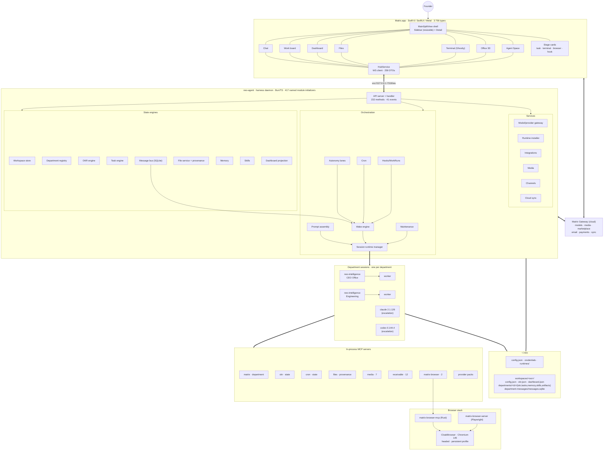

# D01 · System Architecture

```mermaid
flowchart TB
    U(("Founder"))

    subgraph client["Matrix.app · Swift 6 / SwiftUI / Metal · 3 756 types"]
        direction TB
        SHELL["MainSplitView shell<br/>Sidebar (resizable) + Detail"]
        S1["Chat"]; S2["Work board"]; S3["Dashboard"]; S4["Files"]
        S5["Terminal (Ghostty)"]; S6["Office 3D"]; S7["Agent Space"]
        STAGE["Stage cards<br/>task · terminal · browser · hook"]
        HUB["HubService<br/>WS client · 259 DTOs"]
        SHELL --- S1 & S2 & S3 & S4 & S5 & S6 & S7
        SHELL --- STAGE
        S1 & S2 & S3 & S4 & S5 & S6 & S7 --- HUB
    end

    U --> client

    HUB <==>|"ws://127.0.0.1:7319/ws"| API

    subgraph daemon["neo-agent · harness daemon · Bun/TS · 417 named module initializers"]
        direction TB
        API["API server + handler<br/>232 methods · 41 events"]
        subgraph state["State engines"]
            WSS["Workspace store"]; DEPT["Department registry"]
            OKR["OKR engine"]; TASK["Task engine"]; MSG["Message bus (SQLite)"]
            FILE["File service + provenance"]; MEM["Memory"]; SKILL["Skills"]
            DASH["Dashboard projection"]
        end
        subgraph orch["Orchestration"]
            SM["Session runtime manager"]; PROMPT["Prompt assembly"]
            WAKE["Wake engine"]; NUDGE["Autonomy lanes"]
            CRON["Cron"]; HOOK["Hooks/WorkRuns"]; MAINT["Maintenance"]
        end
        subgraph svc["Services"]
            GW["Model/provider gateway"]; INST["Runtime installer"]
            INTEG["Integrations"]; MEDIA["Media"]; CHAN["Channels"]; SYNC["Cloud sync"]
        end
        API --> state & orch & svc
        WAKE --> SM; NUDGE --> WAKE; CRON --> WAKE; HOOK --> WAKE; MSG --> WAKE
        PROMPT --> SM; MAINT --> SM
    end

    subgraph sessions["Department sessions · one per department"]
        NI1["neo-intelligence<br/>CEO Office"]
        NI2["neo-intelligence<br/>Engineering"]
        CC["claude 2.1.126<br/>(escalation)"]
        CX["codex 0.144.4<br/>(escalation)"]
        W1["worker"]; W2["worker"]
        NI1 --> W1; NI2 --> W2
    end
    SM ==> sessions

    subgraph mcp["In-process MCP servers"]
        M1["matrix · department"]; M2["okr · state"]; M3["cron · state"]
        M4["files · provenance"]; M5["media · 7"]; M6["receivable · 12"]
        M7["matrix-browser · 2"]; M8["provider packs"]
    end
    sessions === mcp

    subgraph browser["Browser stack"]
        SUP["matrix-browser-mcp (Rust)"]; PW["matrix-browser-server (Playwright)"]
        CB["CloakBrowser · Chromium 145<br/>headed · persistent profile"]
        SUP --> CB; PW --> CB
    end
    M7 --> SUP

    subgraph disk["~/.neo"]
        RC["config.json · credentials · runtimes/"]
        WS["workspaces/&lt;ws&gt;/<br/>config.json · okr.json · dashboard.json<br/>departments/&lt;id&gt;/{okr,tasks,memory,skills,artifacts}<br/>department-messages/messages.sqlite"]
    end
    daemon === disk
    sessions === disk

    GWC["Matrix Gateway (cloud)<br/>models · media · marketplace<br/>email · payments · sync"]
    daemon <==> GWC
    client <==> GWC
```
