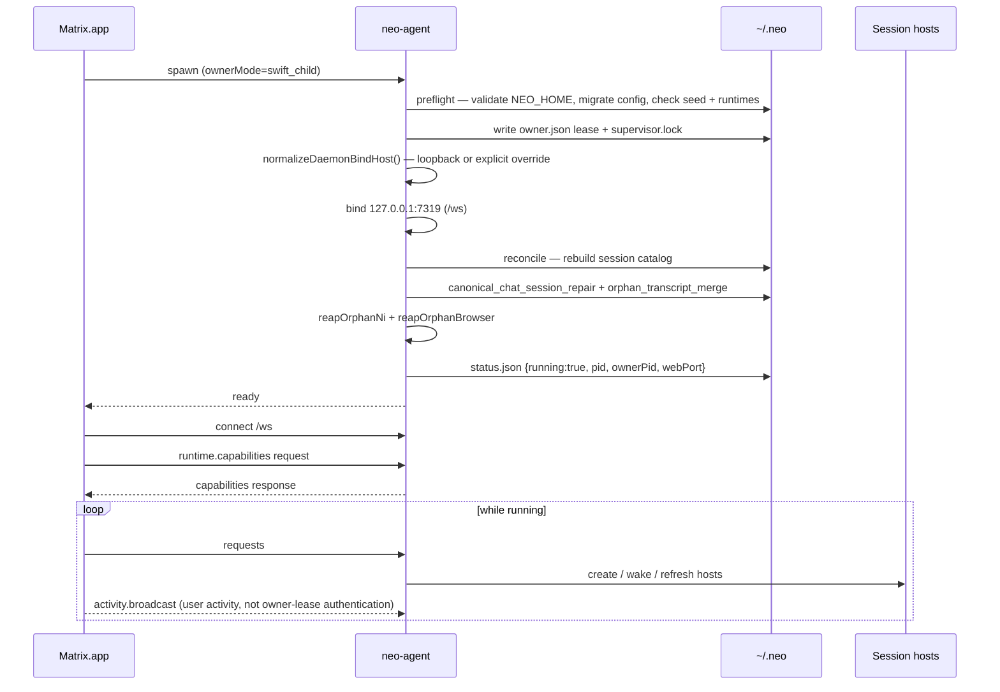
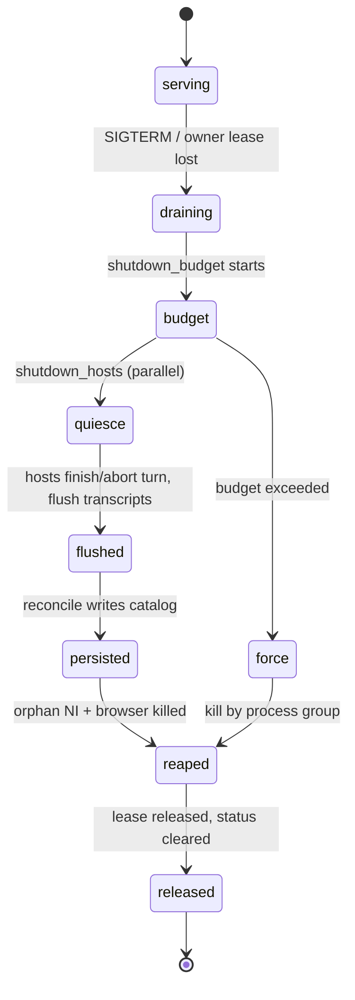
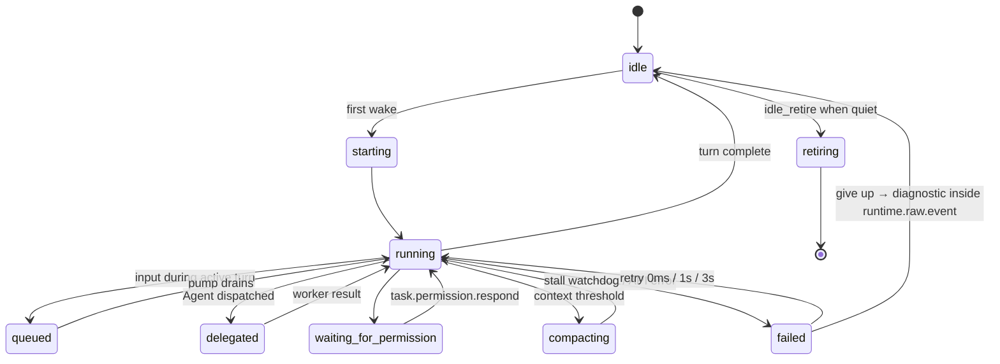

# D02 · Process Lifecycle

## Boot and supervision

```mermaid
sequenceDiagram
    participant App as Matrix.app
    participant D as neo-agent
    participant FS as ~/.neo
    participant H as Session hosts

    App->>D: spawn (ownerMode=swift_child)
    D->>FS: preflight — validate NEO_HOME, migrate config, check seed + runtimes
    D->>FS: write owner.json lease + supervisor.lock
    D->>D: normalizeDaemonBindHost() — loopback or explicit override
    D->>D: bind 127.0.0.1:7319 (/ws)
    D->>FS: reconcile — rebuild session catalog
    D->>FS: canonical_chat_session_repair + orphan_transcript_merge
    D->>D: reapOrphanNi + reapOrphanBrowser
    D->>FS: status.json {running:true, pid, ownerPid, webPort}
    D-->>App: ready
    App->>D: connect /ws
    App->>D: runtime.capabilities request
    D-->>App: capabilities response

    loop while running
        App->>D: requests
        D->>H: create / wake / refresh hosts
        App-->>D: activity.broadcast (user activity, not owner-lease authentication)
    end
```

## Shutdown

```mermaid
stateDiagram-v2
    [*] --> serving
    serving --> draining: SIGTERM / owner lease lost
    draining --> budget: shutdown_budget starts
    budget --> quiesce: shutdown_hosts (parallel)
    quiesce --> flushed: hosts finish/abort turn, flush transcripts
    flushed --> persisted: reconcile writes catalog
    persisted --> reaped: orphan NI + browser killed
    reaped --> released: lease released, status cleared
    released --> [*]
    budget --> force: budget exceeded
    force --> reaped: kill by process group
```

## Session host state

```mermaid
stateDiagram-v2
    [*] --> idle
    idle --> starting: first wake
    starting --> running
    running --> queued: input during active turn
    queued --> running: pump drains
    running --> delegated: Agent dispatched
    delegated --> running: worker result
    running --> waiting_for_permission
    waiting_for_permission --> running: task.permission.respond
    running --> compacting: context threshold
    compacting --> running
    running --> idle: turn complete
    idle --> retiring: idle_retire when quiet
    retiring --> [*]
    running --> failed: stall watchdog / API error
    failed --> running: retry 0ms / 1s / 3s
    failed --> idle: give up → diagnostic inside runtime.raw.event
```
