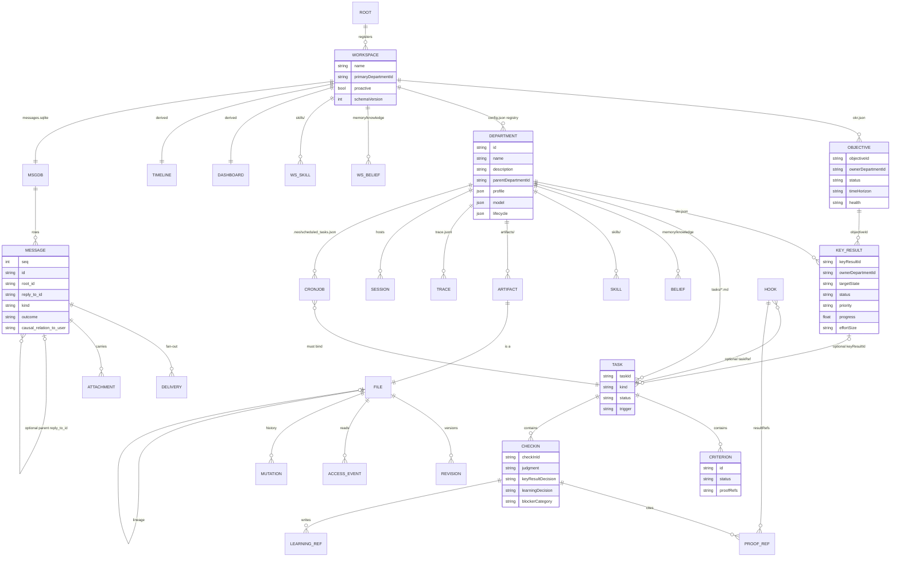

# D03 · Data Model

```mermaid
erDiagram
    ROOT ||--o{ WORKSPACE : registers
    WORKSPACE {
        string name
        string primaryDepartmentId
        bool   proactive
        int    schemaVersion
    }
    WORKSPACE ||--o{ OBJECTIVE : "okr.json"
    WORKSPACE ||--o{ DEPARTMENT : "config.json registry"
    WORKSPACE ||--o{ WS_BELIEF : "memory/knowledge"
    WORKSPACE ||--o{ WS_SKILL : "skills/"
    WORKSPACE ||--|| DASHBOARD : "derived"
    WORKSPACE ||--|| TIMELINE : "derived"
    WORKSPACE ||--|| MSGDB : "messages.sqlite"

    DEPARTMENT {
        string id
        string name
        string description
        string parentDepartmentId
        json   profile
        json   model
        json   lifecycle
    }
    DEPARTMENT ||--o{ KEY_RESULT : "okr.json"
    DEPARTMENT ||--o{ TASK : "tasks/*.md"
    DEPARTMENT ||--o{ BELIEF : "memory/knowledge"
    DEPARTMENT ||--o{ SKILL : "skills/"
    DEPARTMENT ||--o{ ARTIFACT : "artifacts/"
    DEPARTMENT ||--o{ TRACE : "trace.jsonl"
    DEPARTMENT ||--o{ SESSION : hosts
    DEPARTMENT ||--o{ CRONJOB : ".neo/scheduled_tasks.json"

    OBJECTIVE {
        string objectiveId
        string ownerDepartmentId
        string status
        string timeHorizon
        string health
    }
    OBJECTIVE ||--o{ KEY_RESULT : objectiveId

    KEY_RESULT {
        string keyResultId
        string ownerDepartmentId
        string targetState
        string status
        string priority
        float  progress
        string effortSize
    }
    KEY_RESULT |o--o{ TASK : "optional keyResultId"

    TASK {
        string taskId
        string kind
        string status
        string trigger
    }
    TASK ||--o{ CRITERION : contains
    TASK ||--o{ CHECKIN : contains
    CRITERION {
        string id
        string status
        string proofRefs
    }
    CHECKIN {
        string checkInId
        string judgment
        string keyResultDecision
        string learningDecision
        string blockerCategory
    }
    CHECKIN ||--o{ PROOF_REF : cites
    CHECKIN ||--o{ LEARNING_REF : writes

    MSGDB ||--o{ MESSAGE : rows
    MESSAGE {
        int    seq
        string id
        string root_id
        string reply_to_id
        string kind
        string outcome
        string causal_relation_to_user
    }
    MESSAGE ||--o{ DELIVERY : "fan-out"
    MESSAGE ||--o{ ATTACHMENT : carries
    MESSAGE |o--o{ MESSAGE : "optional parent reply_to_id"

    CRONJOB }o--|| TASK : "must bind"
    HOOK }o--o| TASK : "optional taskRef"
    HOOK ||--o{ PROOF_REF : resultRefs

    FILE ||--o{ REVISION : versions
    FILE ||--o{ ACCESS_EVENT : reads
    FILE ||--o{ MUTATION : history
    FILE ||--o| FILE : lineage
    ARTIFACT ||--|| FILE : "is a"
```
