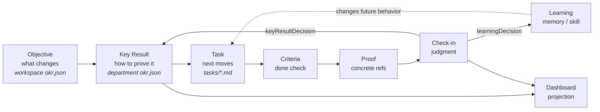
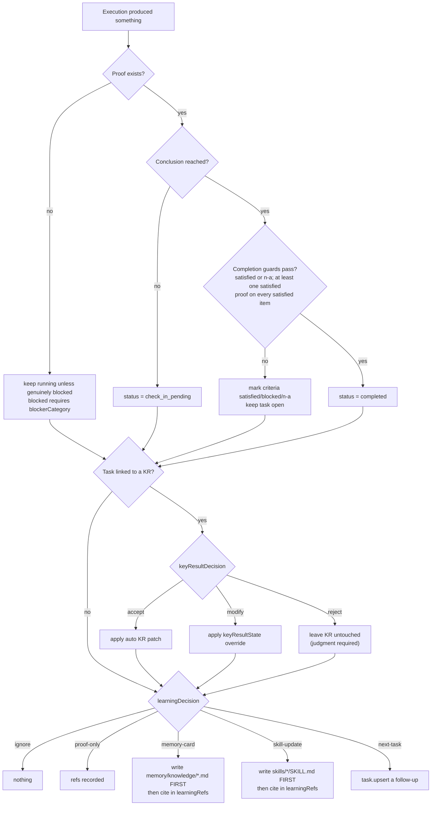
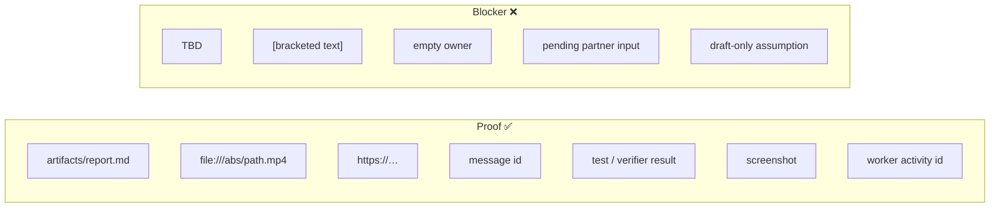

# D04 · OKR Workflow

## The loop

```mermaid
flowchart LR
    O["Objective<br/>what changes<br/><i>workspace okr.json</i>"]
    KR["Key Result<br/>how to prove it<br/><i>department okr.json</i>"]
    T["Task<br/>next moves<br/><i>tasks/*.md</i>"]
    C["Criteria<br/>done check"]
    P["Proof<br/>concrete refs"]
    CI["Check-in<br/>judgment"]
    L["Learning<br/>memory / skill"]
    D["Dashboard<br/>projection"]
    O --> KR --> T --> C --> P --> CI
    CI -->|keyResultDecision| KR
    CI -->|learningDecision| L
    L -.->|"changes future behavior"| T
    KR --> D
    CI --> D
```

## Check-in decision tree

```mermaid
flowchart TD
    S["Execution produced something"] --> Q1{"Proof exists?"}
    Q1 -->|no| B["keep running unless genuinely blocked<br/>blocked requires blockerCategory"]
    Q1 -->|yes| Q2{"Conclusion reached?"}
    Q2 -->|no| CP["status = check_in_pending"]
    Q2 -->|yes| Q3{"Completion guards pass?<br/>satisfied or n-a; at least one satisfied<br/>proof on every satisfied item"}
    Q3 -->|no| PART["mark criteria satisfied/blocked/n-a<br/>keep task open"]
    Q3 -->|yes| DONE["status = completed"]
    B & CP & PART & DONE --> Q4{"Task linked to a KR?"}
    Q4 -->|yes| KRD{"keyResultDecision"}
    KRD -->|accept| A["apply auto KR patch"]
    KRD -->|modify| M["apply keyResultState override"]
    KRD -->|reject| R["leave KR untouched<br/>(judgment required)"]
    Q4 -->|no| LD
    A & M & R --> LD{"learningDecision"}
    LD -->|ignore| E1["nothing"]
    LD -->|proof-only| E2["refs recorded"]
    LD -->|memory-card| E3["write memory/knowledge/*.md FIRST<br/>then cite in learningRefs"]
    LD -->|skill-update| E4["write skills/*/SKILL.md FIRST<br/>then cite in learningRefs"]
    LD -->|next-task| E5["task.upsert a follow-up"]
```

## What counts as proof

```mermaid
flowchart LR
    subgraph yes["Proof ✅"]
        A1["artifacts/report.md"]; A2["file:///abs/path.mp4"]
        A3["https://…"]; A4["message id"]; A5["test / verifier result"]
        A6["screenshot"]; A7["worker activity id"]
    end
    subgraph no["Blocker ❌"]
        B1["TBD"]; B2["[bracketed text]"]; B3["empty owner"]
        B4["pending partner input"]; B5["draft-only assumption"]
    end
```
