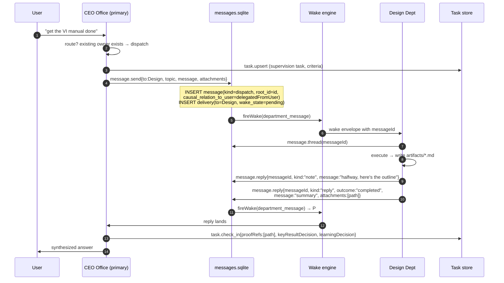
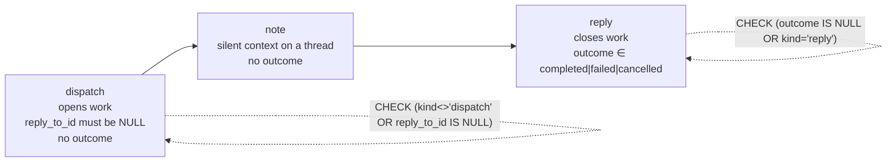
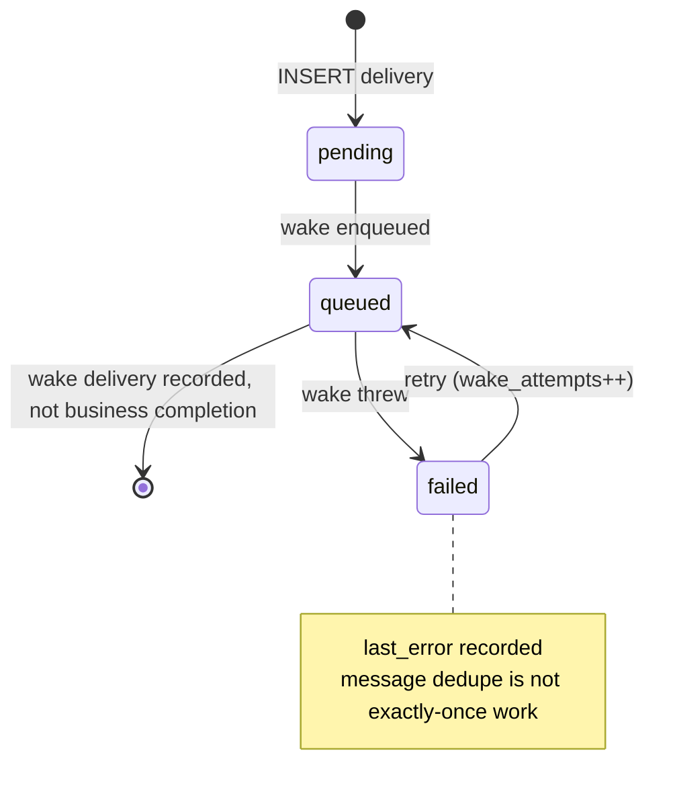
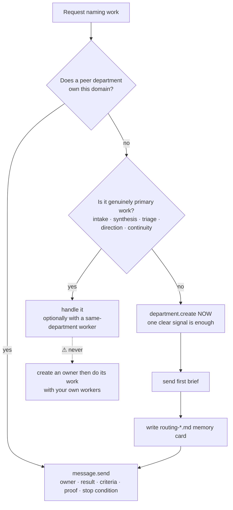

# D05 · Department Message Flow

## Dispatch → reply

```mermaid
sequenceDiagram
    autonumber
    participant U as User
    participant P as CEO Office (primary)
    participant BUS as messages.sqlite
    participant W as Wake engine
    participant D as Design Dept
    participant T as Task store

    U->>P: "get the VI manual done"
    P->>P: route? existing owner exists → dispatch
    P->>T: task.upsert (supervision task, criteria)
    P->>BUS: message.send{to:Design, topic, message, attachments}
    Note over BUS: INSERT message(kind=dispatch, root_id=id,<br/>causal_relation_to_user=delegatedFromUser)<br/>INSERT delivery(to=Design, wake_state=pending)
    BUS->>W: fireWake(department_message)
    W->>D: wake envelope with messageId
    D->>BUS: message.thread(messageId)
    D->>D: execute → write artifacts/*.md
    D->>BUS: message.reply{messageId, kind:"note", message:"halfway, here's the outline"}
    D->>BUS: message.reply{messageId, kind:"reply", outcome:"completed",<br/>message:"summary", attachments:[path]}
    BUS->>W: fireWake(department_message) → P
    W->>P: reply lands
    P->>T: task.check_in{proofRefs:[path], keyResultDecision, learningDecision}
    P->>U: synthesized answer
```

## Kind semantics

```mermaid
flowchart LR
    DS["dispatch<br/>opens work<br/>reply_to_id must be NULL<br/>no outcome"]
    NT["note<br/>silent context on a thread<br/>no outcome"]
    RP["reply<br/>closes work<br/>outcome ∈ completed|failed|cancelled"]
    DS --> NT --> RP
    DS -.->|"CHECK (kind<>'dispatch' OR reply_to_id IS NULL)"| DS
    RP -.->|"CHECK (outcome IS NULL OR kind='reply')"| RP
```

## Delivery reliability

```mermaid
stateDiagram-v2
    [*] --> pending: INSERT delivery
    pending --> queued: wake enqueued
    queued --> [*]: wake delivery recorded, not business completion
    queued --> failed: wake threw
    failed --> queued: retry (wake_attempts++)
    note right of failed
        last_error recorded
        message dedupe is not exactly-once work
    end note
```

## Routing decision (what the primary must choose)

```mermaid
flowchart TD
    R["Request naming work"] --> Q1{"Does a peer department<br/>own this domain?"}
    Q1 -->|yes| DIS["message.send<br/>owner · result · criteria · proof · stop condition"]
    Q1 -->|no| Q2{"Is it genuinely primary work?<br/>intake · synthesis · triage ·<br/>direction · continuity"}
    Q2 -->|yes| SELF["handle it<br/>optionally with a same-department worker"]
    Q2 -->|no| CREATE["department.create NOW<br/>one clear signal is enough"]
    CREATE --> BRIEF["send first brief"]
    BRIEF --> ROUTE["write routing-*.md memory card"]
    ROUTE --> DIS
    SELF -.->|"⚠ never"| ANTI["create an owner then do its work<br/>with your own workers"]
```
