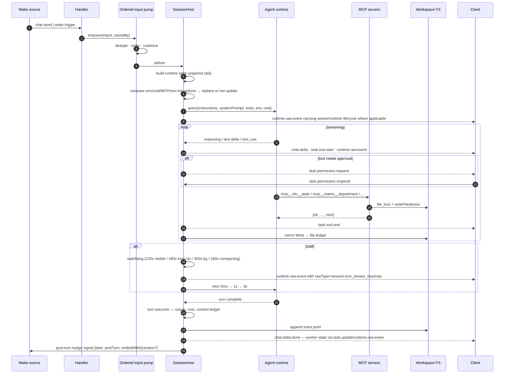
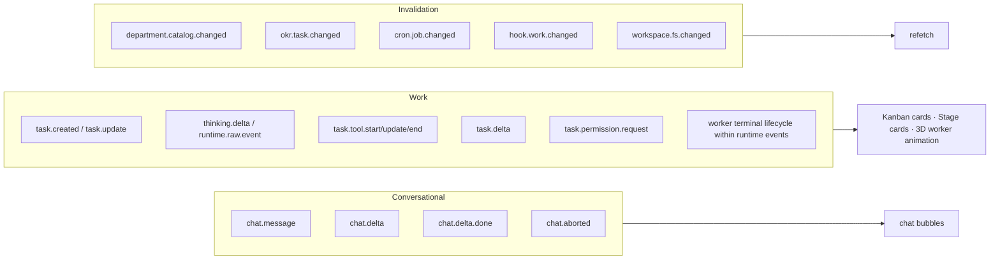

# D06 · Turn Lifecycle

```mermaid
sequenceDiagram
    autonumber
    participant SRC as Wake source
    participant H as Handler
    participant P as Ordered input pump
    participant SH as SessionHost
    participant R as Agent runtime
    participant MCP as MCP servers
    participant FS as Workspace FS
    participant C as Client

    SRC->>H: chat.send | wake trigger
    H->>P: enqueue(input, causality)
    P->>P: dedupe · order · coalesce
    P->>SH: deliver
    SH->>SH: build runtime state snapshot (tail)
    SH->>SH: compare env/cwd/MCP/non-hot options → replace or hot update
    SH->>R: query(instructions, systemPrompt, tools, env, cwd)
    SH-->>C: runtime.raw.event carrying worker/runtime lifecycle where applicable

    loop streaming
        R-->>SH: reasoning / text delta / tool_use
        SH-->>C: chat.delta · task.tool.start · runtime.raw.event
        alt tool needs approval
            SH-->>C: task.permission.request
            C->>SH: task.permission.respond
        end
        R->>MCP: mcp__okr__state / mcp__matrix__department / …
        MCP->>FS: file_lock + writeFileAtomic
        MCP-->>R: {ok, …, next}
        SH-->>C: task.tool.end
        SH->>FS: mirror Write → file ledger
    end

    alt stall
        SH->>SH: watchdog (120s visible / 180s long-ctx / 300s bg / 180s compacting)
        SH-->>C: runtime.raw.event with rawType=session.turn_stream_inactivity
        SH->>R: retry 0ms → 1s → 3s
    end

    R-->>SH: turn complete
    SH->>SH: turn outcome — usage, cost, context ledger
    SH->>FS: append trace.jsonl
    SH-->>C: chat.delta.done — worker state via task.update/runtime.raw.event
    SH->>SRC: post-turn nudge signal (lane: postTurn, endedWithQuestion?)
```

## Event streams the client sees

```mermaid
flowchart LR
    subgraph conv["Conversational"]
        A1["chat.message"]; A2["chat.delta"]; A3["chat.delta.done"]; A4["chat.aborted"]
    end
    subgraph work["Work"]
        B1["task.created / task.update"]; B2["thinking.delta / runtime.raw.event"]
        B3["task.tool.start/update/end"]; B4["task.delta"]
        B5["task.permission.request"]; B6["worker terminal lifecycle within runtime events"]
    end
    subgraph inval["Invalidation"]
        C1["department.catalog.changed"]; C2["okr.task.changed"]
        C3["cron.job.changed"]; C4["hook.work.changed"]; C5["workspace.fs.changed"]
    end
    conv --> UI1["chat bubbles"]
    work --> UI2["Kanban cards · Stage cards · 3D worker animation"]
    inval --> UI3["refetch"]
```
