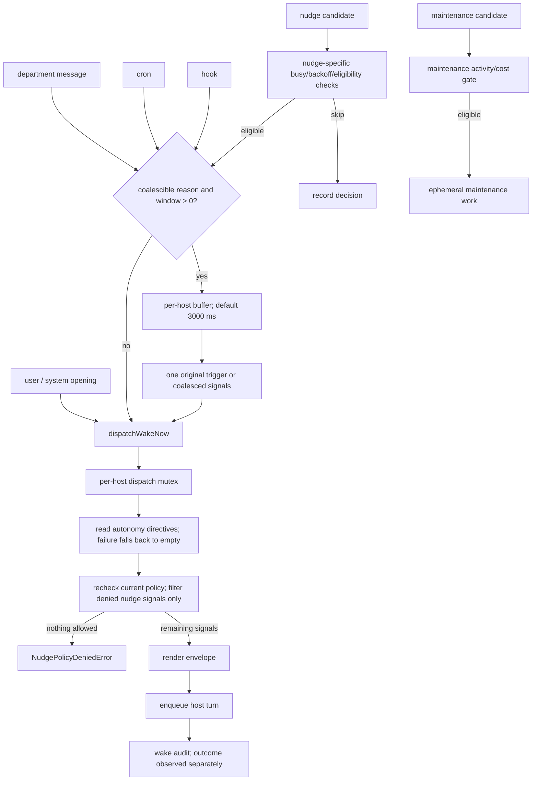
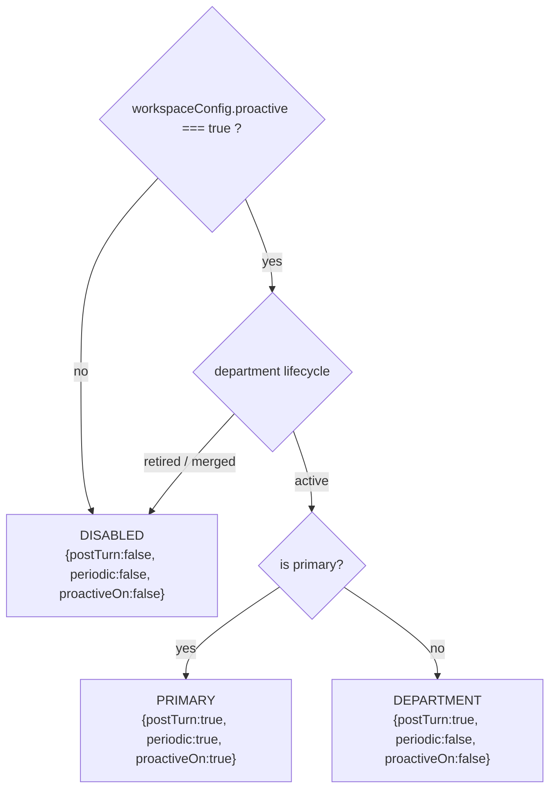
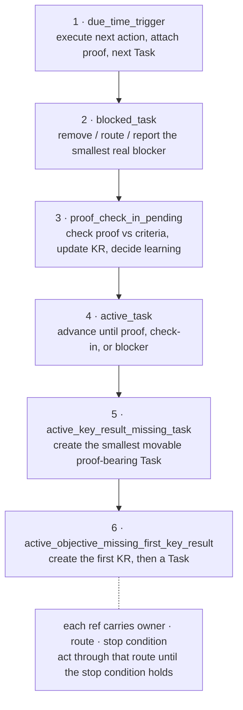

# D07 · Wake Engine

## Full pipeline

```mermaid
flowchart TB
    U["user / system opening"] --> NOW["dispatchWakeNow"]
    DM["department message"] --> COAL
    CR["cron"] --> COAL
    HK["hook"] --> COAL
    ND["nudge candidate"] --> ELIG["nudge-specific busy/backoff/eligibility checks"]
    ELIG -->|eligible| COAL
    ELIG -->|skip| LOG["record decision"]
    COAL{"coalescible reason and window > 0?"}
    COAL -->|no| NOW
    COAL -->|yes| BUF["per-host buffer; default 3000 ms"]
    BUF --> FLUSH["one original trigger or coalesced signals"] --> NOW
    NOW --> MX["per-host dispatch mutex"]
    MX --> DIR["read autonomy directives; failure falls back to empty"]
    DIR --> POL["recheck current policy; filter denied nudge signals only"]
    POL -->|nothing allowed| DENY["NudgePolicyDeniedError"]
    POL -->|remaining signals| ENV["render envelope"]
    ENV --> HOST["enqueue host turn"]
    HOST --> AUDIT["wake audit; outcome observed separately"]
    MAINT["maintenance candidate"] --> GATE["maintenance activity/cost gate"]
    GATE -->|eligible| RUN["ephemeral maintenance work"]
```

## Lane policy

```mermaid
flowchart TD
    W{"workspaceConfig.proactive === true ?"}
    W -->|no| D0["DISABLED<br/>{postTurn:false, periodic:false, proactiveOn:false}"]
    W -->|yes| L{"department lifecycle"}
    L -->|"retired / merged"| D0
    L -->|active| P{"is primary?"}
    P -->|yes| PR["PRIMARY<br/>{postTurn:true, periodic:true, proactiveOn:true}"]
    P -->|no| DP["DEPARTMENT<br/>{postTurn:true, periodic:false, proactiveOn:false}"]
```

## Next-step reason order (shared with the dashboard)

```mermaid
flowchart TD
    R1["1 · due_time_trigger<br/>execute next action, attach proof, next Task"]
    R2["2 · blocked_task<br/>remove / route / report the smallest real blocker"]
    R3["3 · proof_check_in_pending<br/>check proof vs criteria, update KR, decide learning"]
    R4["4 · active_task<br/>advance until proof, check-in, or blocker"]
    R5["5 · active_key_result_missing_task<br/>create the smallest movable proof-bearing Task"]
    R6["6 · active_objective_missing_first_key_result<br/>create the first KR, then a Task"]
    R1 --> R2 --> R3 --> R4 --> R5 --> R6
    NOTE["each ref carries owner · route · stop condition<br/>act through that route until the stop condition holds"]
    R6 -.- NOTE
```
