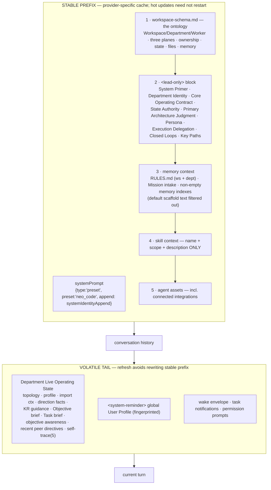
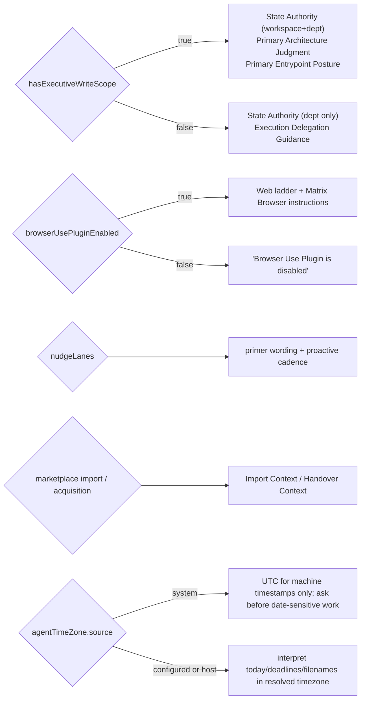
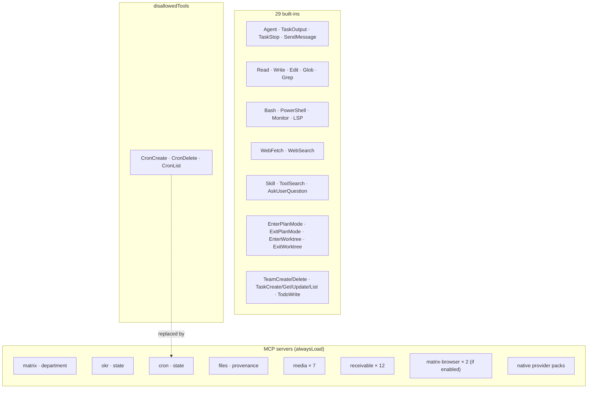

# D08 · Prompt Assembly

## Layers and the cache boundary

```mermaid
flowchart TB
    subgraph PREFIX["STABLE PREFIX — provider-specific cache; hot updates need not restart"]
        direction TB
        SP["systemPrompt<br/>{type:'preset', preset:'neo_code', append: systemIdentityAppend}"]
        I1["1 · workspace-schema.md — the ontology<br/>Workspace/Department/Worker · three planes · ownership · state · files · memory"]
        I2["2 · &lt;lead-only&gt; block<br/>System Primer · Department Identity · Core Operating Contract ·<br/>State Authority · Primary Architecture Judgment · Persona ·<br/>Execution Delegation · Closed Loops · Key Paths"]
        I3["3 · memory context<br/>RULES.md (ws + dept) · Mission intake · non-empty memory indexes<br/>(default scaffold text filtered out)"]
        I4["4 · skill context — name + scope + description ONLY"]
        I5["5 · agent assets — incl. connected integrations"]
        I1 --> I2 --> I3 --> I4 --> I5
    end

    HIST["conversation history"]

    subgraph TAIL["VOLATILE TAIL — refresh avoids rewriting stable prefix"]
        direction TB
        L1["Department Live Operating State<br/>topology · profile · import ctx · direction facts ·<br/>KR guidance · Objective brief · Task brief ·<br/>objective awareness · recent peer directives · self-trace(5)"]
        L2["&lt;system-reminder&gt; global User Profile (fingerprinted)"]
        L3["wake envelope · task notifications · permission prompts"]
    end

    NOW["current turn"]
    PREFIX --> HIST --> TAIL --> NOW
```

## Conditional branches

```mermaid
flowchart LR
    F1{"hasExecutiveWriteScope"} -->|true| A["State Authority (workspace+dept)<br/>Primary Architecture Judgment<br/>Primary Entrypoint Posture"]
    F1 -->|false| B["State Authority (dept only)<br/>Execution Delegation Guidance"]
    F2{"browserUsePluginEnabled"} -->|true| C["Web ladder + Matrix Browser instructions"]
    F2 -->|false| D["'Browser Use Plugin is disabled'"]
    F3{"nudgeLanes"} --> E["primer wording + proactive cadence"]
    F4{"marketplace import / acquisition"} --> G["Import Context / Handover Context"]
    F5{"agentTimeZone.source"} -->|system| H["UTC for machine timestamps only; ask before date-sensitive work"]
    F5 -->|configured or host| I["interpret today/deadlines/filenames in resolved timezone"]
```

## Tool surface mounted

```mermaid
flowchart TB
    subgraph builtin["29 built-ins"]
        T1["Agent · TaskOutput · TaskStop · SendMessage"]
        T2["Read · Write · Edit · Glob · Grep"]
        T3["Bash · PowerShell · Monitor · LSP"]
        T4["WebFetch · WebSearch"]
        T5["Skill · ToolSearch · AskUserQuestion"]
        T6["EnterPlanMode · ExitPlanMode · EnterWorktree · ExitWorktree"]
        T7["TeamCreate/Delete · TaskCreate/Get/Update/List · TodoWrite"]
    end
    subgraph disallowed["disallowedTools"]
        X["CronCreate · CronDelete · CronList"]
    end
    subgraph mcpsrv["MCP servers (alwaysLoad)"]
        M1["matrix · department"]; M2["okr · state"]; M3["cron · state"]
        M4["files · provenance"]; M5["media × 7"]; M6["receivable × 12"]
        M7["matrix-browser × 2 (if enabled)"]; M8["native provider packs"]
    end
    X -.->|"replaced by"| M3
```
