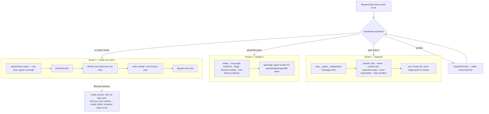
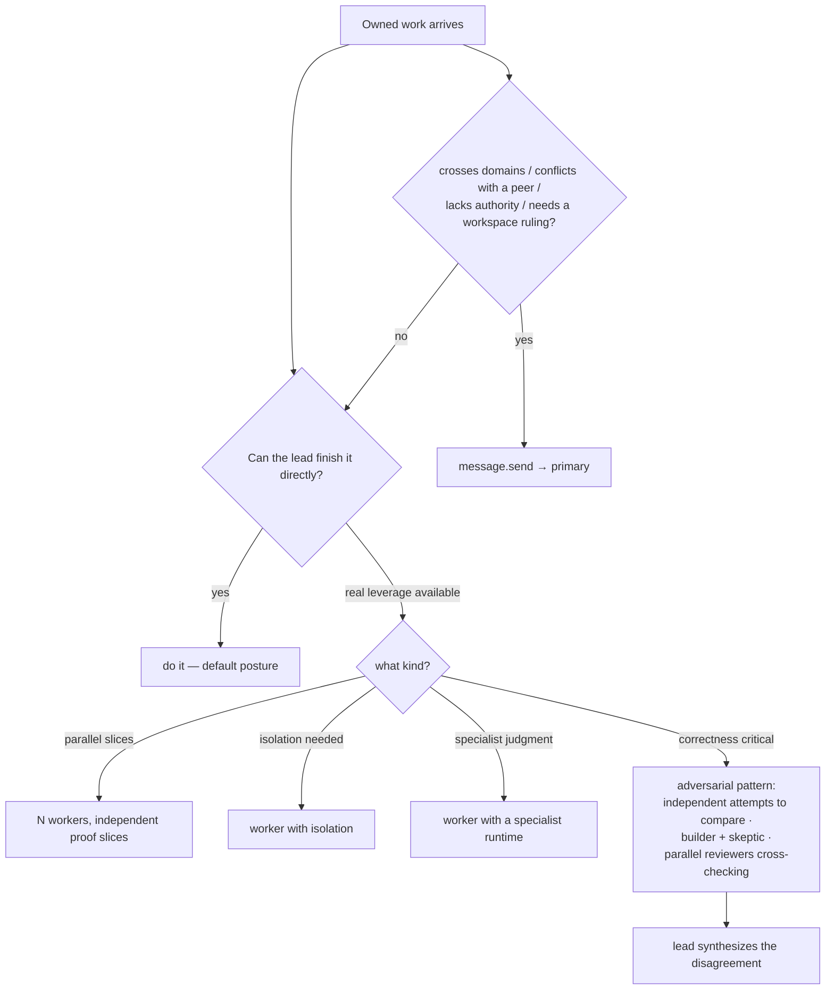
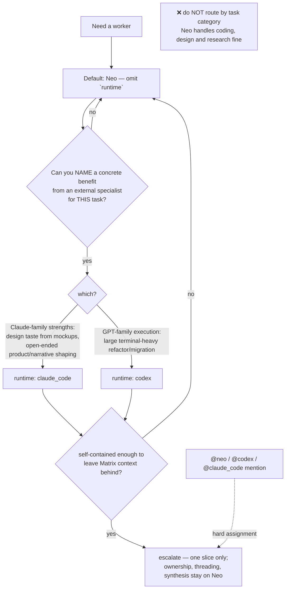
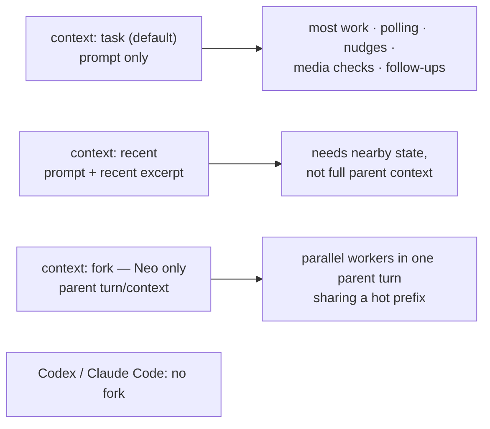

# D09 · Delegation Decision

## The one-line rule

> A **worker** parallelizes work that is already yours;
> a **department message** moves work that belongs to someone else.

## Primary department routing

## Non-primary department

## Runtime escalation test

## Worker context modes

