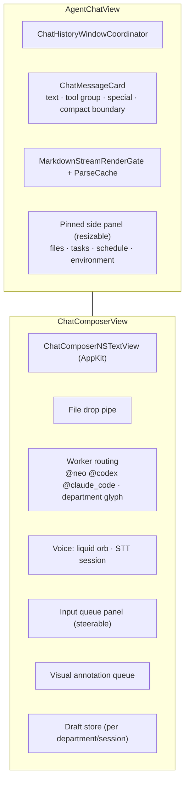
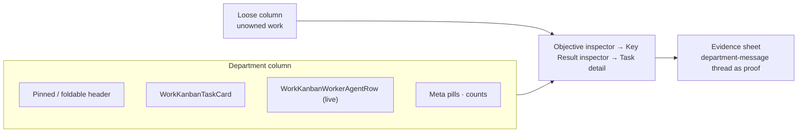
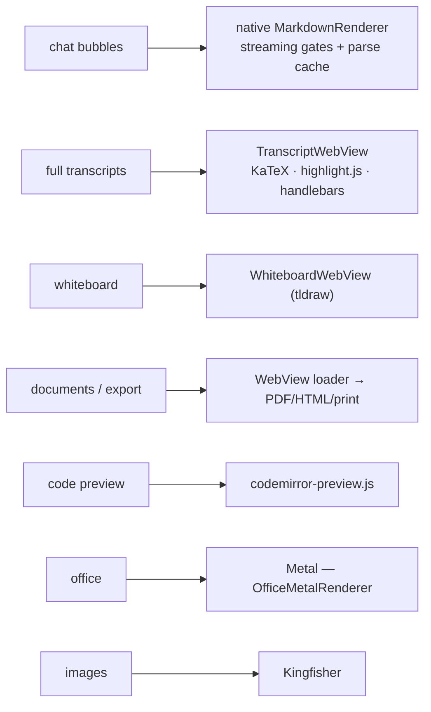

# D10 · UI Surfaces

## Navigation

```mermaid
flowchart LR
    subgraph rail["Sidebar · resizable"]
        direction TB
        WH["Workspace header<br/>+ proactive toggle · waveform"]
        PIN["Pinned navigation"]
        DEP["Departments<br/>avatar stacks · live dots ·<br/>active-worker badges · message flights"]
        MOD["Dashboard · Work · Files · Terminal<br/>Memory · Skills · Marketplace"]
        TV["Office TV<br/>live 3D preview + LIVE badge"]
        ACC["Account"]
    end
    subgraph detail["Detail column"]
        direction TB
        CH["Chat + side panel"]
        WK["Work board"]
        DS["Dashboard"]
        FL["Files"]
        TM["Terminal"]
        OF["Office 3D"]
        MK["Agent Space"]
    end
    subgraph float["Floating"]
        ST["Stage cards<br/>task · terminal · browser · hook"]
        FP["MatrixDesign floating panels"]
    end
    rail --> detail
    detail -.-> float
```

## Chat surface composition

```mermaid
flowchart TB
    subgraph view["AgentChatView"]
        HW["ChatHistoryWindowCoordinator"]
        MC["ChatMessageCard<br/>text · tool group · special · compact boundary"]
        SG["MarkdownStreamRenderGate + ParseCache"]
        SP["Pinned side panel (resizable)<br/>files · tasks · schedule · environment"]
    end
    subgraph comp["ChatComposerView"]
        NT["ChatComposerNSTextView (AppKit)"]
        DR["File drop pipe"]
        RT["Worker routing<br/>@neo @codex @claude_code · department glyph"]
        VO["Voice: liquid orb · STT session"]
        QU["Input queue panel (steerable)"]
        AN["Visual annotation queue"]
        DF["Draft store (per department/session)"]
    end
    view --- comp
```

## Work board

```mermaid
flowchart LR
    subgraph col["Department column"]
        HD["Pinned / foldable header"]
        TC["WorkKanbanTaskCard"]
        WR["WorkKanbanWorkerAgentRow (live)"]
        MP["Meta pills · counts"]
    end
    LC["Loose column<br/>unowned work"]
    IN["Objective inspector → Key Result inspector → Task detail"]
    EV["Evidence sheet<br/>department-message thread as proof"]
    col --> IN --> EV
    LC --> IN
```

## Rendering strategy

```mermaid
flowchart LR
    C1["chat bubbles"] --> R1["native MarkdownRenderer<br/>streaming gates + parse cache"]
    C2["full transcripts"] --> R2["TranscriptWebView<br/>KaTeX · highlight.js · handlebars"]
    C3["whiteboard"] --> R3["WhiteboardWebView (tldraw)"]
    C4["documents / export"] --> R4["WebView loader → PDF/HTML/print"]
    C5["code preview"] --> R5["codemirror-preview.js"]
    C6["office"] --> R6["Metal — OfficeMetalRenderer"]
    C7["images"] --> R7["Kingfisher"]
```
