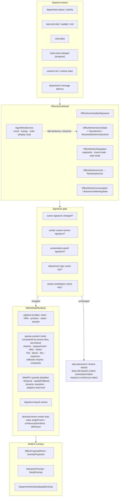
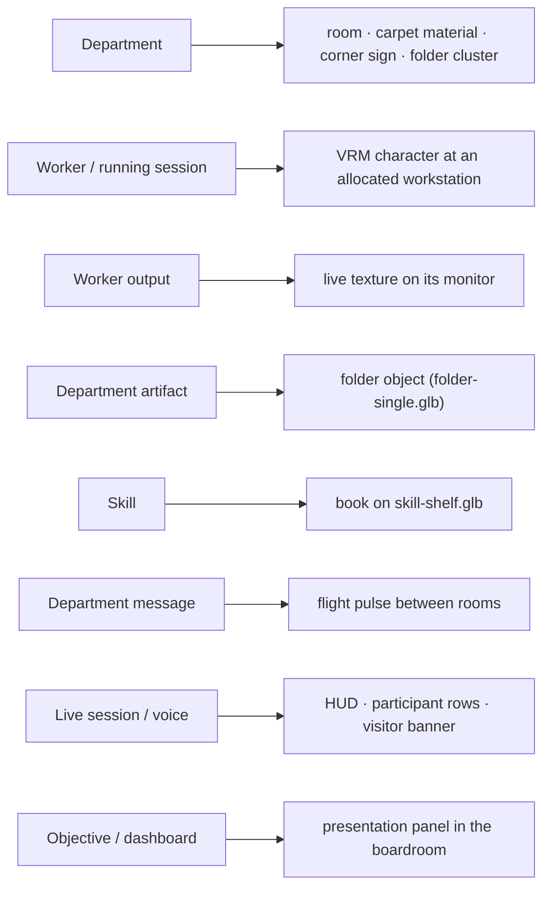
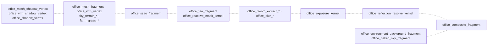
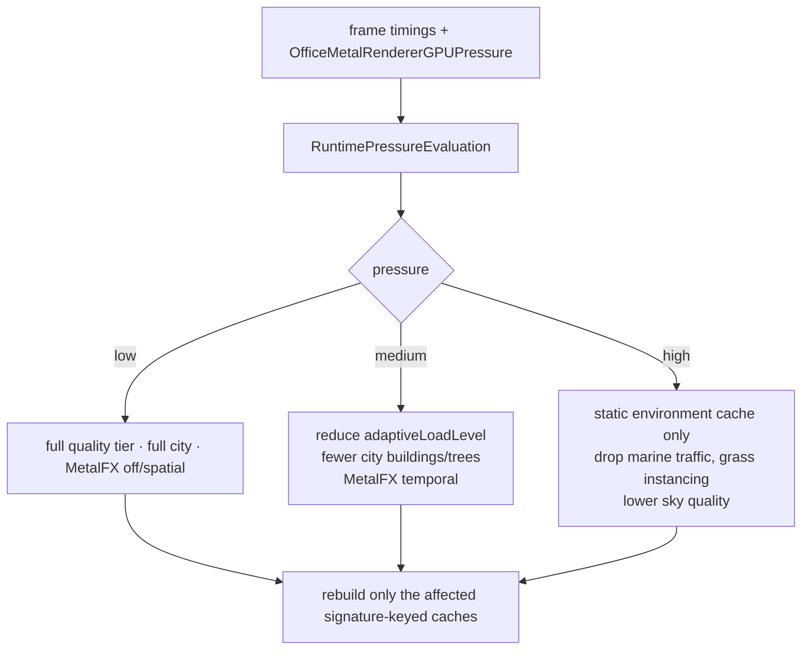

# D11 · Office Scene Synchronization

## App state → 3D scene

## Entity mapping

## Render passes — **[I] order constrained, not read**

The shader entry points below are **verified** present in `default.metallib`. Their *sequence*
was never read from the renderer's draw code; but the fourth pass recovered the renderer's
stored-property metadata (`docs/08` §2.1), which fixes the **texture data-flow**:
`shadowDepthTexture` → geometry (`sceneColor/Depth/Normal/Velocity`) → `aoTexture` →
`aoBlurTexture` → composite → `taaHistory/taaResolved` → `bloomTextureA…D` → `exposureTexture` →
MetalFX (`reactiveMaskTexture`, `metalFXUpscaledTexture`) → drawable. The arrows therefore mean
"this stage consumes the previous one's output"; only bloom-vs-TAA placement and the exposure
sample point remain open. The dotted `V1 → … → CO` chain is that dependency chain.

## Adaptive degradation

