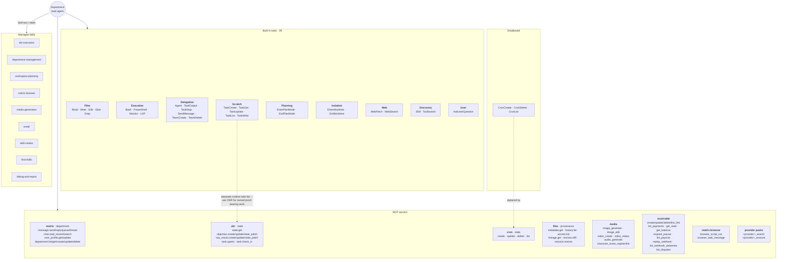
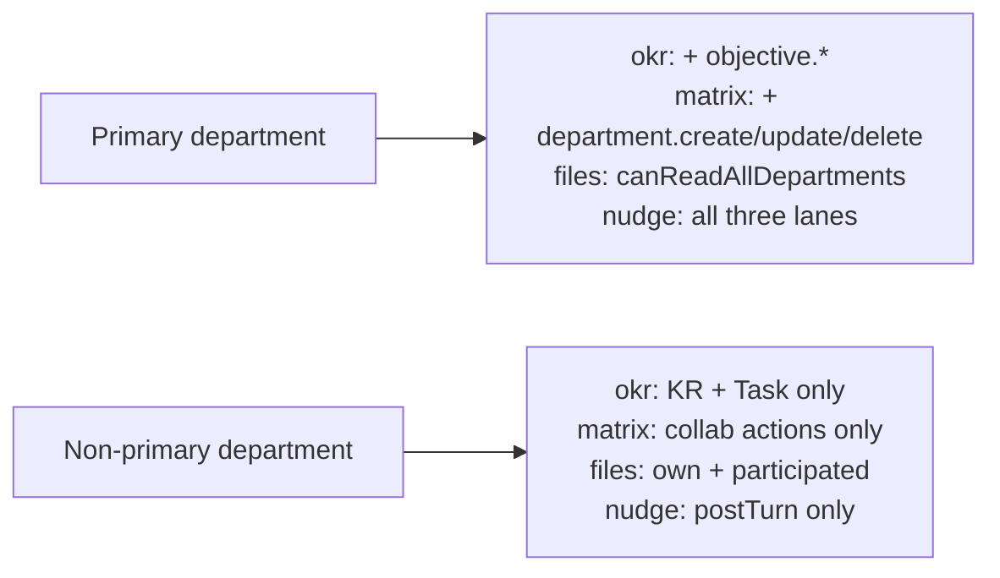
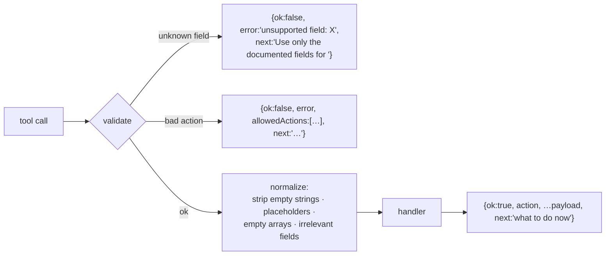

# D12 · Complete Tool Surface

```mermaid
flowchart TB
    AG(("Department<br/>lead agent"))

    subgraph builtin["Built-in tools · 29"]
        direction TB
        B1["<b>Files</b><br/>Read · Write · Edit · Glob · Grep"]
        B2["<b>Execution</b><br/>Bash · PowerShell · Monitor · LSP"]
        B3["<b>Delegation</b><br/>Agent · TaskOutput · TaskStop ·<br/>SendMessage · TeamCreate · TeamDelete"]
        B4["<b>Scratch</b><br/>TaskCreate · TaskGet · TaskUpdate ·<br/>TaskList · TodoWrite"]
        B5["<b>Planning</b><br/>EnterPlanMode · ExitPlanMode"]
        B6["<b>Isolation</b><br/>EnterWorktree · ExitWorktree"]
        B7["<b>Web</b><br/>WebFetch · WebSearch"]
        B8["<b>Discovery</b><br/>Skill · ToolSearch"]
        B9["<b>User</b><br/>AskUserQuestion"]
    end

    subgraph blocked["Disallowed"]
        X["CronCreate · CronDelete · CronList"]
    end

    subgraph mcp["MCP servers"]
        direction TB
        M1["<b>matrix</b> · department<br/>message.send/reply/queue/thread<br/>chat.read_recent/search<br/>user_profile.get/update<br/>department.list/get/create/update/delete"]
        M2["<b>okr</b> · state<br/>state.get<br/>objective.create/update/state_patch<br/>key_result.create/update/state_patch<br/>task.upsert · task.check_in"]
        M3["<b>cron</b> · state<br/>create · update · delete · list"]
        M4["<b>files</b> · provenance<br/>metadata.get · history.list · access.list<br/>lineage.get · revision.diff · revision.restore"]
        M5["<b>media</b><br/>image_generate · image_edit<br/>video_create · video_status<br/>audio_generate<br/>character_asset_register/list"]
        M6["<b>receivable</b><br/>create/update/delete/list_link<br/>list_payments · get_stats · get_balance<br/>request_payout · list_payouts<br/>replay_webhook · list_webhook_deliveries<br/>list_disputes"]
        M7["<b>matrix-browser</b><br/>browser_script_run<br/>browser_task_message"]
        M8["<b>provider packs</b><br/>&lt;provider&gt;_search<br/>&lt;provider&gt;_execute"]
    end

    subgraph skills["Managed skills"]
        S1["okr-execution"]; S2["department-management"]; S3["workspace-planning"]
        S4["matrix-browser"]; S5["media-generation"]; S6["email"]
        S7["skill-creator"]; S8["find-skills"]; S9["debug-and-report"]
    end

    AG --> builtin
    AG --> mcp
    AG -->|"Skill tool / slash"| skills
    X -.->|replaced by| M3
    B4 -.->|"separate runtime task list —<br/>use OKR for owned proof-bearing work"| M2
```

## Permission scoping

```mermaid
flowchart LR
    P["Primary department"] --> PA["okr: + objective.*<br/>matrix: + department.create/update/delete<br/>files: canReadAllDepartments<br/>nudge: all three lanes"]
    N["Non-primary department"] --> NA["okr: KR + Task only<br/>matrix: collab actions only<br/>files: own + participated<br/>nudge: postTurn only"]
```

## Tool result contract

```mermaid
flowchart LR
    C["tool call"] --> V{"validate"}
    V -->|"unknown field"| E1["{ok:false, error:'unsupported field: X',<br/>next:'Use only the documented fields for <action>'}"]
    V -->|"bad action"| E2["{ok:false, error, allowedActions:[…], next:'…'}"]
    V -->|ok| N["normalize:<br/>strip empty strings · placeholders ·<br/>empty arrays · irrelevant fields"]
    N --> H["handler"]
    H --> R["{ok:true, action, …payload, next:'what to do now'}"]
```
