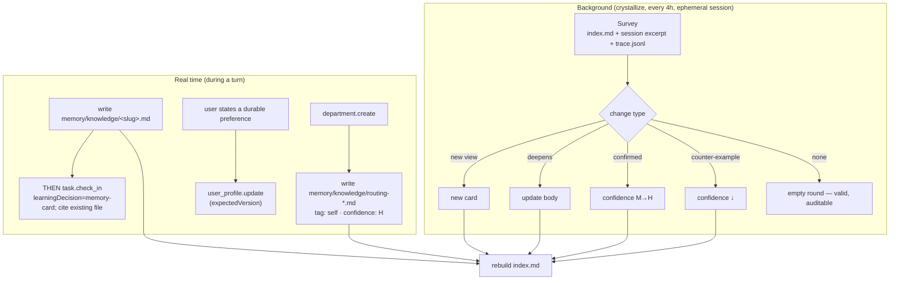
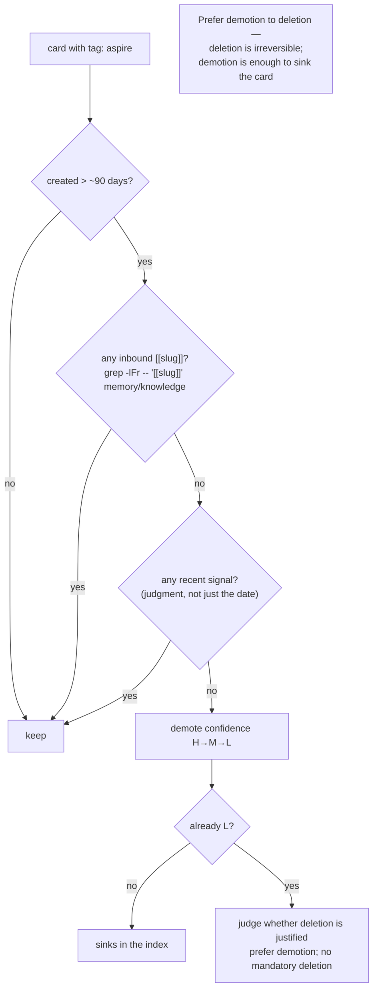
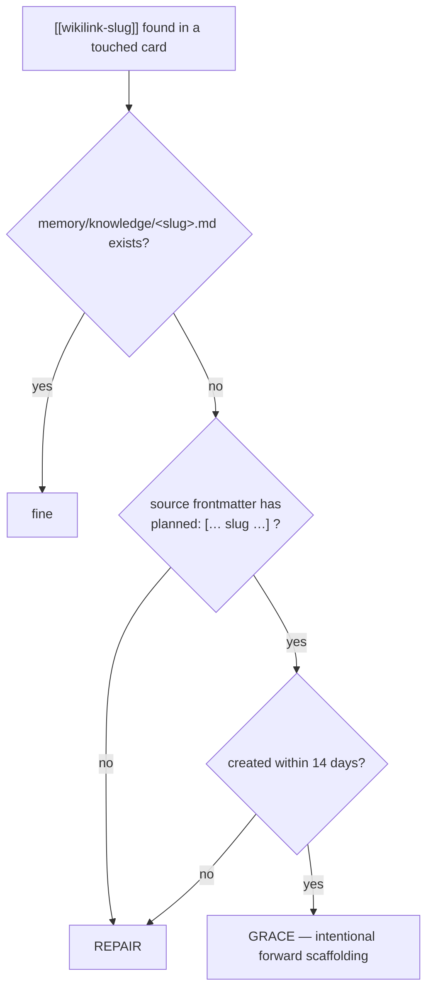
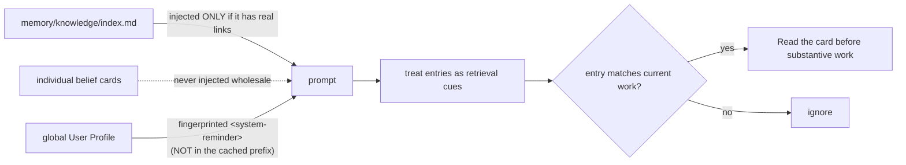
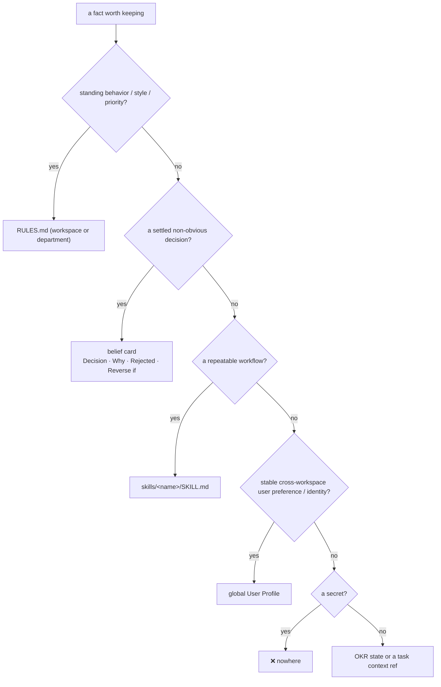

# D13 · Memory Lifecycle

## Write paths

```mermaid
flowchart TB
    subgraph live["Real time (during a turn)"]
        W1["write memory/knowledge/&lt;slug&gt;.md"] --> A["THEN task.check_in<br/>learningDecision=memory-card; cite existing file"]
        B["department.create"] --> W2["write memory/knowledge/routing-*.md<br/>tag: self · confidence: H"]
        C["user states a durable preference"] --> W3["user_profile.update<br/>(expectedVersion)"]
    end
    subgraph bg["Background (crystallize, every 4h, ephemeral session)"]
        D["Survey<br/>index.md + session excerpt + trace.jsonl"] --> E{"change type"}
        E -->|new view| F1["new card"]
        E -->|deepens| F2["update body"]
        E -->|confirmed| F3["confidence M→H"]
        E -->|counter-example| F4["confidence ↓"]
        E -->|none| F5["empty round — valid, auditable"]
    end
    W1 & W2 & F1 & F2 & F3 & F4 --> IDX["rebuild index.md"]
```

## Decay

```mermaid
flowchart TD
    S["card with tag: aspire"] --> T1{"created &gt; ~90 days?"}
    T1 -->|no| KEEP["keep"]
    T1 -->|yes| T2{"any inbound [[slug]]?<br/>grep -lFr -- '[[slug]]' memory/knowledge"}
    T2 -->|yes| KEEP
    T2 -->|no| T3{"any recent signal?<br/>(judgment, not just the date)"}
    T3 -->|yes| KEEP
    T3 -->|no| DEM["demote confidence H→M→L"]
    DEM --> T4{"already L?"}
    T4 -->|no| DONE["sinks in the index"]
    T4 -->|yes| DEL["judge whether deletion is justified<br/>prefer demotion; no mandatory deletion"]
    NOTE["Prefer demotion to deletion —<br/>deletion is irreversible;<br/>demotion is enough to sink the card"]
```

## Wikilink repair

```mermaid
flowchart TD
    L["[[wikilink-slug]] found in a touched card"] --> E{"memory/knowledge/&lt;slug&gt;.md exists?"}
    E -->|yes| OK["fine"]
    E -->|no| P{"source frontmatter has<br/>planned: [… slug …] ?"}
    P -->|no| REP["REPAIR"]
    P -->|yes| A{"created within 14 days?"}
    A -->|yes| GRACE["GRACE — intentional forward scaffolding"]
    A -->|no| REP
```

## Retrieval

```mermaid
flowchart LR
    IDX["memory/knowledge/index.md"] -->|"injected ONLY if it has real links"| P["prompt"]
    P --> CUE["treat entries as retrieval cues"]
    CUE --> M{"entry matches current work?"}
    M -->|yes| READ["Read the card before substantive work"]
    M -->|no| IGN["ignore"]
    CARD["individual belief cards"] -.->|"never injected wholesale"| P
    UP["global User Profile"] -->|"fingerprinted &lt;system-reminder&gt;<br/>(NOT in the cached prefix)"| P
```

## Scope routing

```mermaid
flowchart TD
    F["a fact worth keeping"] --> Q1{"standing behavior / style / priority?"}
    Q1 -->|yes| R1["RULES.md (workspace or department)"]
    Q1 -->|no| Q2{"a settled non-obvious decision?"}
    Q2 -->|yes| R2["belief card<br/>Decision · Why · Rejected · Reverse if"]
    Q2 -->|no| Q3{"a repeatable workflow?"}
    Q3 -->|yes| R3["skills/&lt;name&gt;/SKILL.md"]
    Q3 -->|no| Q4{"stable cross-workspace user preference / identity?"}
    Q4 -->|yes| R4["global User Profile"]
    Q4 -->|no| Q5{"a secret?"}
    Q5 -->|yes| R5["❌ nowhere"]
    Q5 -->|no| R6["OKR state or a task context ref"]
```
