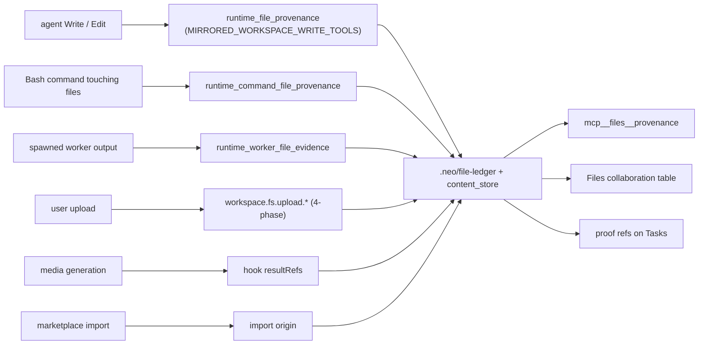
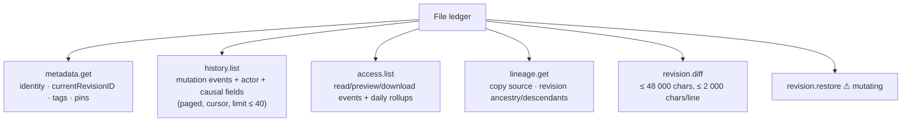
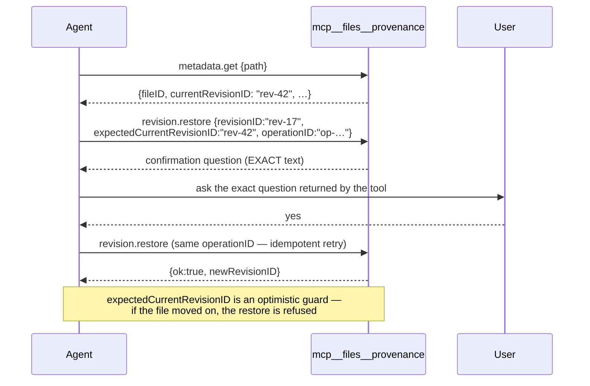
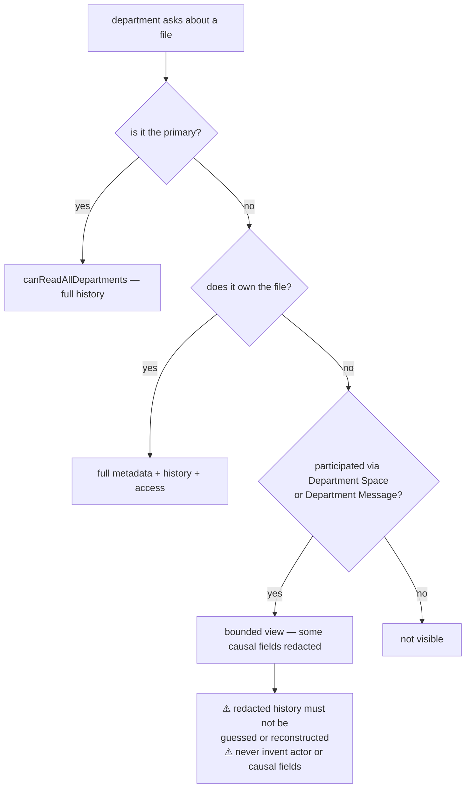

# D14 · File Provenance

## Capture — the host records, not the agent

```mermaid
flowchart LR
    A1["agent Write / Edit"] --> C1["runtime_file_provenance<br/>(MIRRORED_WORKSPACE_WRITE_TOOLS)"]
    A2["Bash command touching files"] --> C2["runtime_command_file_provenance"]
    A3["spawned worker output"] --> C3["runtime_worker_file_evidence"]
    A4["user upload"] --> C4["workspace.fs.upload.* (4-phase)"]
    A5["media generation"] --> C5["hook resultRefs"]
    A6["marketplace import"] --> C6["import origin"]
    C1 & C2 & C3 & C4 & C5 & C6 --> L[".neo/file-ledger + content_store"]
    L --> Q1["mcp__files__provenance"]
    L --> Q2["Files collaboration table"]
    L --> Q3["proof refs on Tasks"]
```

## Query surface

```mermaid
flowchart TB
    L["File ledger"] --> M["metadata.get<br/>identity · currentRevisionID · tags · pins"]
    L --> H["history.list<br/>mutation events + actor + causal fields<br/>(paged, cursor, limit ≤ 40)"]
    L --> A["access.list<br/>read/preview/download events + daily rollups"]
    L --> LI["lineage.get<br/>copy source · revision ancestry/descendants"]
    L --> D["revision.diff<br/>≤ 48 000 chars, ≤ 2 000 chars/line"]
    L --> R["revision.restore ⚠ mutating"]
```

## Restore — the confirmation protocol

```mermaid
sequenceDiagram
    participant A as Agent
    participant T as mcp__files__provenance
    participant U as User
    A->>T: metadata.get {path}
    T-->>A: {fileID, currentRevisionID: "rev-42", …}
    A->>T: revision.restore {revisionID:"rev-17",<br/>expectedCurrentRevisionID:"rev-42", operationID:"op-…"}
    T-->>A: confirmation question (EXACT text)
    A->>U: ask the exact question returned by the tool
    U-->>A: yes
    A->>T: revision.restore (same operationID — idempotent retry)
    T-->>A: {ok:true, newRevisionID}
    Note over A,T: expectedCurrentRevisionID is an optimistic guard —<br/>if the file moved on, the restore is refused
```

## Visibility

```mermaid
flowchart TD
    Q["department asks about a file"] --> P{"is it the primary?"}
    P -->|yes| ALL["canReadAllDepartments — full history"]
    P -->|no| OWN{"does it own the file?"}
    OWN -->|yes| FULL["full metadata + history + access"]
    OWN -->|no| PART{"participated via Department Space<br/>or Department Message?"}
    PART -->|yes| BOUND["bounded view — some causal fields redacted"]
    PART -->|no| NONE["not visible"]
    BOUND --> RULE["⚠ redacted history must not be<br/>guessed or reconstructed<br/>⚠ never invent actor or causal fields"]
```
