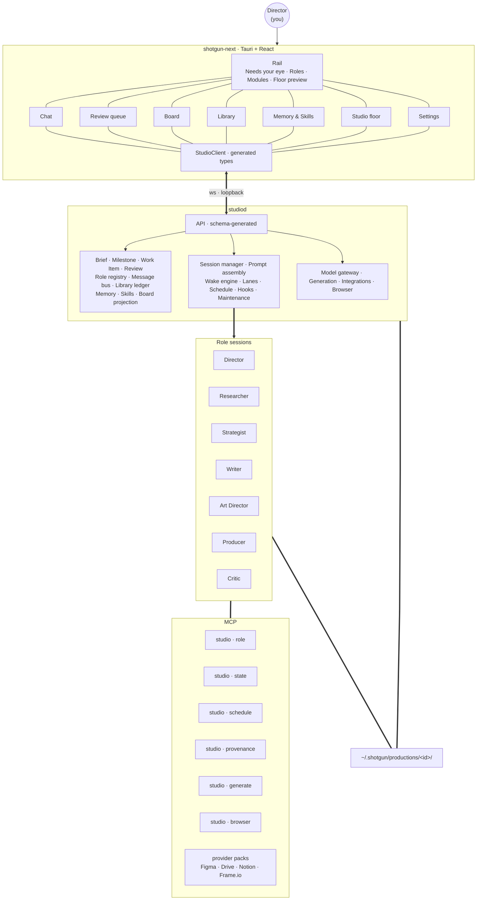
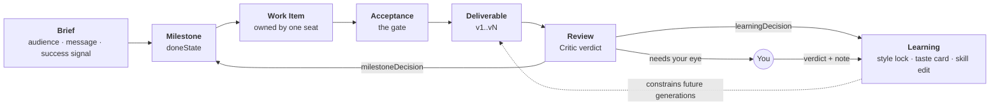
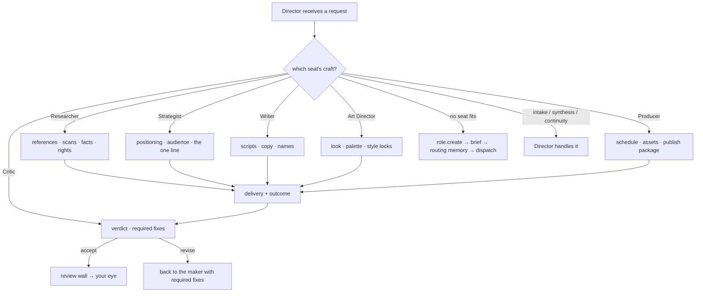
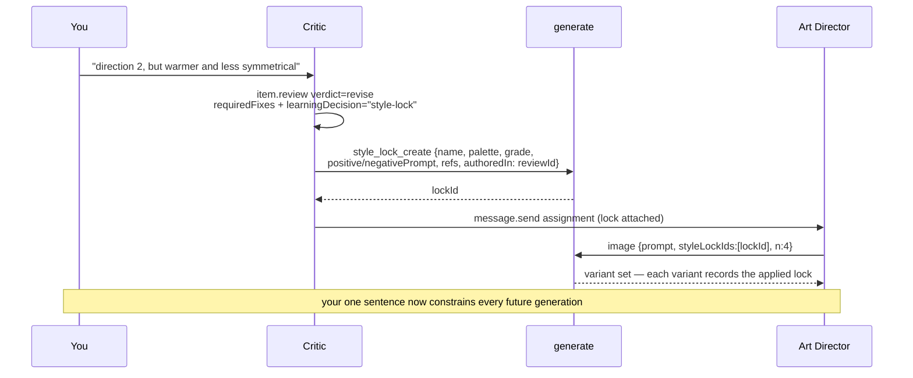
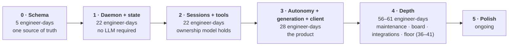

# D15 · shotgun-next Target

## System

## The studio loop

## Role routing

## Taste becomes state

## Phased build

Figures are the provisional engineer-day rows from [shotgun/08](../shotgun/08-build-plan.md)
(133–138 total before polish and contingency), not calendar weeks; the earlier "15 weeks" total
was inconsistent with the floor's own breakdown and has been withdrawn.
