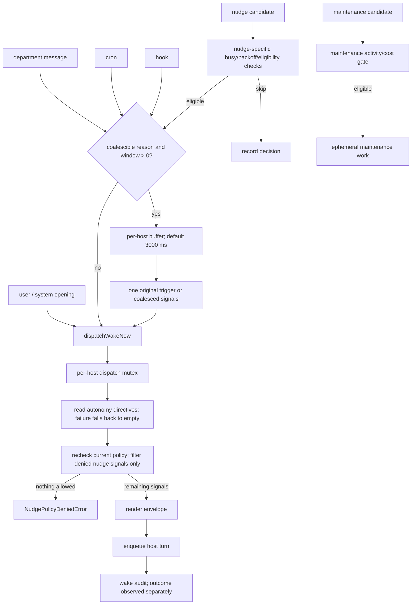
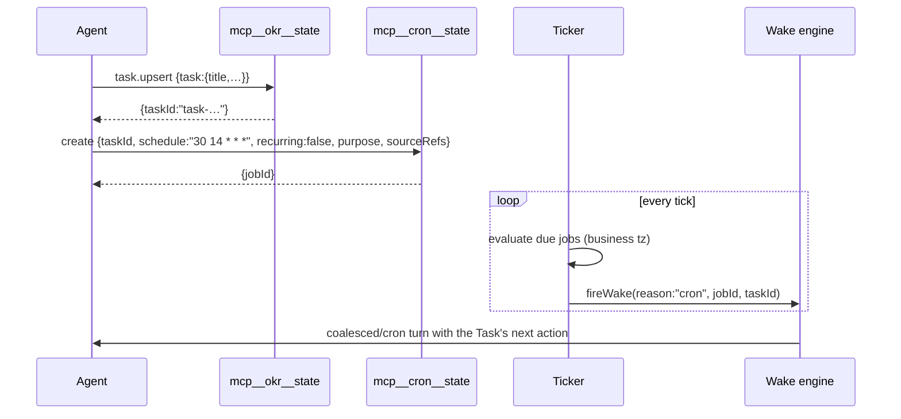

# Autonomy & Scheduling Specification

The subsystem that makes agents act without being asked — and the guardrails that keep it from
being a runaway token furnace.

---

## 1. Why this exists

A chat agent is idle between messages. A *company* must keep moving: deadlines arrive, peers
reply, media renders finish, key results go stale. Matrix implements this as a wake engine with
five independent trigger sources, one coalescing buffer, a per-department lane policy, a
busy-check, a backoff, and a cost gate.



---

## 2. Wake reasons

`WAKE_REASON_REGISTRY` — id, channel, `canWakeNi`, description:

| id | channel | description |
|---|---|---|
| `user` | user | Human-authored chat input. |
| `department_message` | department | A message delivered by another Matrix department. |
| `nudge` | nudge | Autonomy nudge, including periodic, post-turn, and proactive-on ticks. |
| `hook` | hook | Runtime fact hook, such as async media/file completion. |
| `coalesced` | system | Multiple wake signals combined into one action-oriented briefing. |
| `cron` | cron | User-defined scheduled time trigger. |
| `maintenance` | system | Runtime maintenance control turn, currently compact. |
| `internal_generation` | system | Hidden internal structured generation turn. |
| `onboarding` | system | Workspace onboarding opening turn. |
| `acquisition_handover` | system | Workspace acquisition handover opening turn. |
| `department_import_welcome` | system | Department import welcome turn. |

Unknown reasons throw: `assertWakeReason()` fails closed.

---

## 3. Coalescing

```ts
shouldCoalesceWake(t) = wakeCoalescingWindowMs > 0 &&
  t.reason ∈ { cron, hook, nudge, department_message }
```

Implementation detail worth copying: the buffer stores `{trigger, resolve, reject}` per entry,
so every original caller gets an individual promise resolution — and entries whose nudge kind
was denied by lane policy get `reject(NudgePolicyDeniedError)` while the rest resolve normally.

Coalesced trigger shape:

```ts
{ reason: "coalesced",
  windowMs: DEFAULT_WAKE_COALESCING_WINDOW_MS,
  signals: [ …original triggers… ] }
```

The prompt then renders these as **one action-oriented briefing** rather than N separate turns.
This is the difference between "three agents woke me three times" and "here are three things
that happened; pick one."

---

## 4. Nudge lanes

```ts
DISABLED_NUDGE_LANES   = { postTurn:false, periodic:false, proactiveOn:false }
PRIMARY_NUDGE_LANES    = { postTurn:true,  periodic:true,  proactiveOn:true  }
DEPARTMENT_NUDGE_LANES = { postTurn:true,  periodic:false, proactiveOn:false }
```

| Lane | Fires when | Who gets it |
|---|---|---|
| `postTurn` | immediately after a turn completes | all departments (when workspace proactive) |
| `periodic` | on a timer tick | primary only |
| `proactiveOn` | when proactive mode is switched on | primary only |

Resolution order:

1. `workspaceConfig.proactive !== true` → `DISABLED`.
2. Department lifecycle `retired` or `merged` → `DISABLED`.
3. Primary → `PRIMARY`; otherwise → `DEPARTMENT`.

Lanes are held in mutable per-`(workspaceId, deptId)` state with
`peekNudgeLanes` / `setNudgeLanes`, plus a snapshot/restore pair used to **suspend all lanes in
a workspace** (e.g. during archive or bulk maintenance) and restore them afterwards.

`endedWithQuestion` is passed through the dispatch: a turn that ended by asking the user a
question should not be nudged to keep going.

---

## 5. Post-turn nudge

After every turn, the system asks: *did that turn leave something movable?* Inputs include
`nextStepRefs` (`HubNudgeNextStepRefs`, `HubNudgeNextStepSample`) derived from the operating
view. The reason order the nudge uses is identical to the dashboard's Task list order — a
deliberate coupling documented in the `okr-execution` skill:

> "Dashboard Task list and periodic wake share the same operating ref order; treat listed refs
> as the wake reason. Each wake ref carries owner, route, and stop condition. Act through that
> route until the stop condition holds."

**Reason order:**

1. `due_time_trigger` — execute next action, attach proof, update/propose next Task.
2. `blocked_task` — remove, route, or report the smallest real blocker.
3. `proof_check_in_pending` — check proof against criteria, update linked KR, decide learning.
4. `active_task` — keep advancing until proof, check-in, or blocker.
5. `active_key_result_missing_task` — create the smallest movable proof-bearing Task.
6. `active_objective_missing_first_key_result` — create/propose the smallest first KR, then a Task.

This list *is* the autonomy policy. It is short, ordered, and every item names a concrete
artifact. Copy it verbatim in shape.

---

## 6. Cron

### 6.1 Contract

- 5-field cron expressions evaluated using the daemon's local Date operations. Agent/prompt business timezone is resolved separately; see [M11](../modules/M11-cron-scheduler.md#timezone) before assuming the two zones agree.
- `recurring: false` for one-shot.
- **A cron job must reference an existing `taskId`.** The tool description is unambiguous:
  *"Time wakes must attach to a Task and never be free-floating reminders."*
- Built-in `CronCreate/CronDelete/CronList` are **disallowed** for department leads, forcing all
  scheduling through `mcp__cron__state`, which enforces the Task binding.

### 6.2 Flow



Storage: `<ws>/.neo/scheduled_tasks.json` and
`departments/<id>/.neo/scheduled_tasks.json`. Runner + ticker are separate modules
(`user_cron_runner`, `user_cron_ticker`, `runner`, `ticker`) so a slow run can't block the tick
loop. History via `cron.history`; events `cron.job.changed`, `cron.run.status`.

---

## 7. Hooks & WorkRuns

A **hook** is a durable record that some asynchronous external fact will arrive later — a video
render, an image generation, an integration webhook, a long file operation. A **WorkRun** is the
execution instance.

```ts
HubRuntimeHookRecord {
  id, source, event, subjectId, summary,
  progress: HubRuntimeHookProgress,
  retryPolicy: HubRuntimeHookRetryPolicy,
  taskRef?: HubRuntimeHookTaskRef,
  workRun?: HubRuntimeHookWorkRunRef,
  resultRefs?: HubRuntimeHookResultRef[],
  inputSummary?: HubRuntimeHookInputSummary,
  error?
}
```

`dispatchHookWake(ctx, args)` fires `WAKE_REASON.hook` carrying `hookId, source, event,
subjectId, summary, resultRefs?, error?, taskRef?, workRun?, proofRefs?, retry?`.

Storage: `<ws>/.neo/hooks.jsonl` (append-only) + `hooks.latest.json`. UI: `StageCardHookContext`
and `StageHookDetailView` render a hook as a Stage card with live progress.

The chain that matters: **media tool → hook → wake → proof ref → check-in**. An agent that
starts a 3-minute video render does not block; it gets woken when the render lands and files the
result as proof. Reproduce this exactly.

---

## 8. Maintenance scheduler

Separate from user-visible autonomy. Runs **ephemeral sessions** whose output never reaches
chat.

| Job | Default cadence | Effect |
|---|---|---|
| `crystallize` | every 4 h | belief-card consolidation, decay, index rebuild, global profile merge |
| `crystallize-ceo` addendum | with crystallize on the primary | emergence candidates + routing memory |
| compaction (`maintenance` wake) | on demand | context compaction control turn |
| dashboard refresh | daily (configurable) | regenerate `dashboard.json` via LLM |
| content freshness | continuous | `.neo/content_freshness.json` |
| transcript repair | at start | orphan merge + canonical session repair |

Gating: `gate` + `gate_signals` + `activity_probe` compute whether the workspace has moved
enough since the last run. `maintenance.config.get/update` and `maintenance.trigger` expose it.

**Anti-pattern avoided:** maintenance sessions are tagged so their records can be detected
(`<!-- maintenance-runner `) and *stripped* from the canonical transcript. Without this,
background jobs poison the user's conversation history. Build this in from day one.

---

## 9. External signal gate & dependency unblock

- `external_signal_gate` — throttles wakes originating from outside (integration webhooks,
  email) so a chatty external system cannot drive the company.
- `dependency_unblock` — when a Key Result's `dependsOn` clears, the dependent owner is woken.
- `ref_decay` — ages out operating refs so stale items stop generating nudges.

---

## 10. Observability of autonomy

| Artifact | Contents |
|---|---|
| `departments/<id>/.neo/wake-runs/<reason>/…` | one record per dispatched wake |
| `departments/<id>/.neo/nudge-decisions/` | why a nudge fired or was skipped |
| `nudge.decisions.list` endpoint | surfaced in the UI |
| `messages.causal_relation_to_user` | provenance of every cross-department message |
| `HubQueuedAutonomousHold` | autonomous work parked awaiting user input |
| `HubActiveHours` | user-configured active window |

Live install shows the wake-reason directories actually created:
`coalesced`, `department_import_welcome`, `department_message`, `hook`, `internal_generation`.

---

## 11. Implementation checklist for shotgun-next

- [ ] Wake reason registry with `canWake` flag and human description (used in UI).
- [ ] Per-host fire mutex — never two concurrent dispatches to one agent.
- [ ] Coalescing buffer with per-entry promise settlement.
- [ ] Lane policy as data, with snapshot/restore for bulk suspension.
- [ ] Busy predicate shared by nudge, refresh and retire decisions.
- [ ] Backoff timestamp per host.
- [ ] Ordered reason list that is *the same list* the board shows.
- [ ] Cost gate before periodic runs; "no changes needed" is a valid logged outcome.
- [ ] Wake audit directory + decision log, both surfaced in the UI.
- [ ] Maintenance sessions tagged and stripped from user transcripts.
- [ ] Every scheduled trigger must bind to a durable work item.
