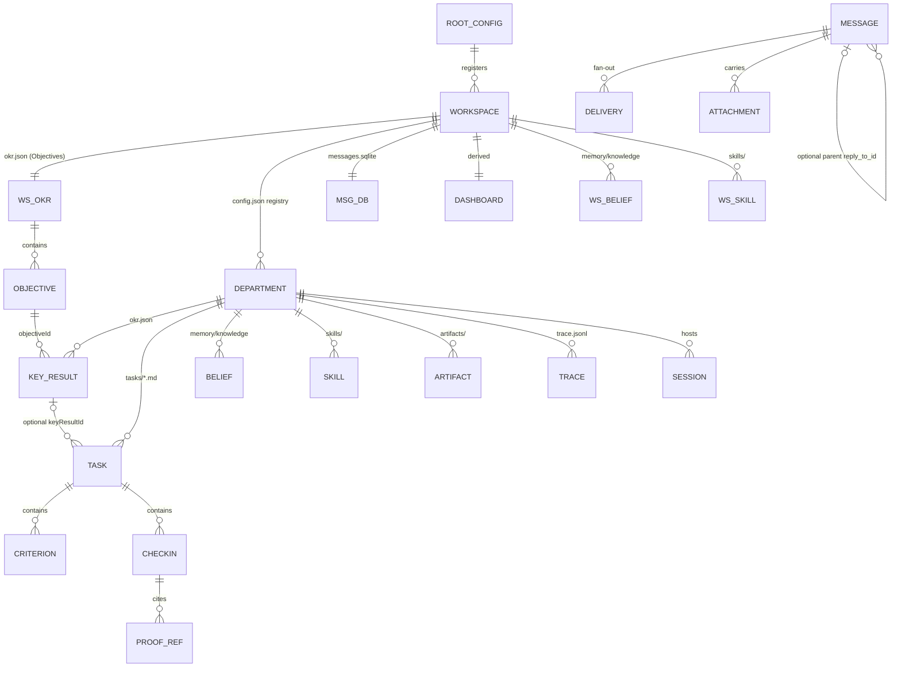
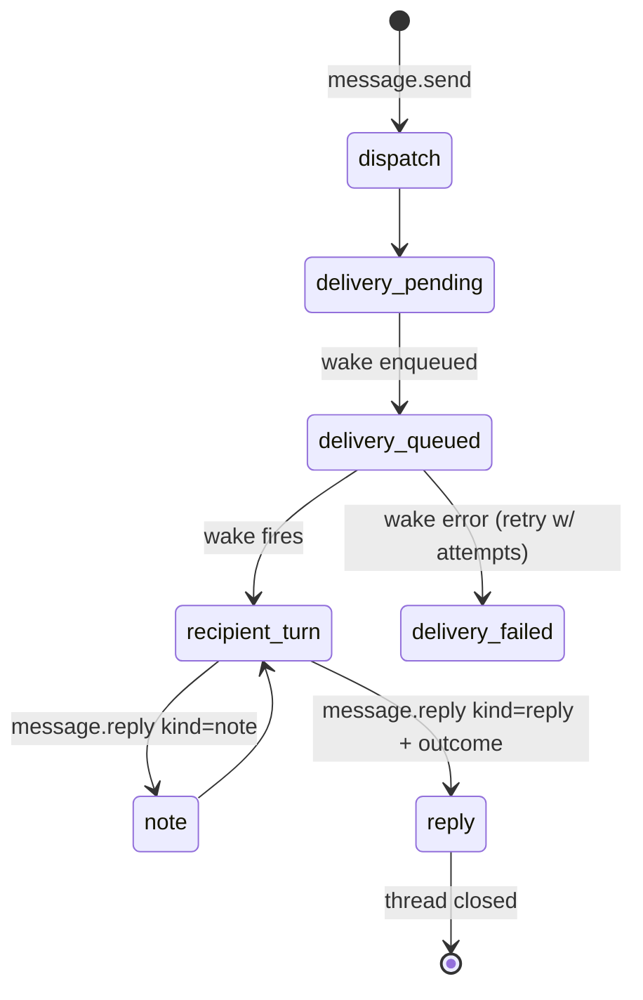

# Data Model Specification

Selected durable entities, storage and writers. The shapes below are explanatory summaries, not verbatim Zod or a complete persistence schema. Exact MCP expressions and handlers are linked from [the generated reference](../_analysis/audit/mcp-reference.md). Historical live examples are not revalidated current state.

---

## 1. Entity relationship



---

## 2. Root registry — `~/.neo/config.json`

```ts
{
  workspaces: {
    [workspaceId: string]: {              // e.g. "ws-qfuzr9nv"
      name: string
      description: string
      path: string                        // ~/.neo/workspaces/<id>
      worldTemplate?: "company"
      createdAt: ISO8601
      updatedAt: ISO8601
      archivedAt?: ISO8601                // archived, not deleted
      onboarding?: {
        objective: string                 // the founding mission, user's own words
        blueprint: {
          cyberpunkAddress: string        // "https://<slug>.hq.matrix.company"
          emailAddressSuggestion: string  // "team@<slug>.agent"
          preferredWorkerRuntimes: ("neo"|"codex"|"claude_code")[]
        }
      }
    }
  }
}
```

Workspace ids are `ws-` + 8 lowercase base36 chars. Every workspace gets a fictional HQ address
and an agent mailbox at creation — identity theatre that makes the company feel real.

---

## 3. Workspace config — `<ws>/config.json`

```ts
{
  name, description, worldTemplate: "company",
  schemaVersion: 5,                        // CURRENT_WORKSPACE_SCHEMA_VERSION
  migrations: […],
  primaryDepartmentId: string,             // the front door
  proactive?: boolean,                     // master switch for autonomy lanes
  createdAt, updatedAt,
  onboarding: {
    objective, blueprint,
    openingSessionId, openingDispatchedAt,
    activationChecklist: { version, createdAt, completedTasks: {…} }
  },
  email?: { address: string },
  marketplaceAcquisition?: AcquisitionContext,
  marketplaceDepartmentImports?: { [deptId]: DepartmentImportContext },
  departments: { [departmentId]: DepartmentRecord }
}
```

### 3.1 DepartmentRecord

```ts
{
  id: string                    // 8 hex chars, e.g. "a2dd8fad"
  name: string                  // display name, e.g. "CEO Office"
  description: string           // operating identity, injected into the prompt
  tags?: string[]               // e.g. ["ceo-office","primary-entrypoint","user-facing"]
  parentDepartmentId?: string   // logical hierarchy; directories stay flat
  taskListId?: string
  proactive?: boolean
  model?: { provider: string, model: string, explicit?: boolean,
            reasoningEffort?: string, serviceTier?: string }
  lifecycle?: { status: "active" | "retired" | "merged", … }
  profile?: {
    charter: string
    capabilities: {
      coding?:   "primary" | "supporting" | "none"
      browser?:  "primary" | "supporting" | "none"
      computer?: "primary" | "supporting" | "none"
      domains: string[]         // e.g. ["intake","planning","coordination","executive"]
    }
    collaborationBoundary: {
      keepLocal: string[]
      handoffToDepartment: string[]
      createChildDepartment: string[]
    }
  }
  createdAt, updatedAt
}
```

Real example (verbatim, live install):

```json
{ "id":"a2dd8fad", "name":"CEO Office",
  "description":"Primary user-facing office for workspace intake, planning, coordination, and executive oversight.",
  "tags":["ceo-office","primary-entrypoint","user-facing"],
  "profile":{
    "charter":"Own workspace intake, planning, coordination, and executive visibility for the whole workspace.",
    "capabilities":{"coding":"supporting","browser":"supporting","computer":"supporting",
                    "domains":["intake","planning","coordination","executive"]},
    "collaborationBoundary":{
      "keepLocal":["Clarifying user intent and defining the operating structure",
                   "Synthesizing status across departments and presenting executive direction",
                   "Lightweight asks that are already clear, belong to this primary department, and can be completed directly in the current turn",
                   "Work one owner can carry without loss of speed or quality, optionally with a same-owner worker"],
      "handoffToDepartment":["When a specialized department is the clear domain owner for execution or review",
                             "When the user asks to tell, ask, coordinate, or start named departments or multiple parallel owners",
                             "Dispatch clear owner work, route review gates for proof or judgment, and escalate work that is blocked, conflicted, or has no clear owner instead of silently self-executing"]}}}
```

**The `profile` block is the agent's job description and it is a data structure, not prose.**
This is the single most reusable idea for shotgun-next.

---

## 4. OKR stores

### 4.1 Workspace `okr.json` — Objectives only

```ts
{ version: 1, updatedAt: ISO|null, objectives: Objective[] }

Objective {
  objectiveId: string
  title: string
  ownerDepartmentId: string
  summary: string
  status: "draft" | "active" | "blocked" | "completed" | "cancelled"
  timeHorizon: string
  health?: "on_track" | "at_risk" | "blocked" | "done" | null
  riskSummary?: string | null
  lastProofAt?: ISO | null
  setAsFocus?: boolean
}
```

Agent MCP Objective writes require the primary department (`canManageObjectiveState`). UI/daemon methods are separate write entry points. `objective.state_patch` accepts only `health`, `riskSummary`, `lastProofAt`; meaning changes use `objective.update`. The MCP handler's completion gate checks open Key Results; a general human-confirmation requirement for every meaning change is prompt guidance, not established by this handler.

### 4.2 Department `okr.json` — Key Results only

```ts
{ version: 1, updatedAt: ISO|null, keyResults: KeyResult[] }

KeyResult {
  keyResultId: string
  objectiveId: string
  ownerDepartmentId: string      // MUST equal the owning store's department
  title: string
  targetState: string            // what "proved" looks like
  status: "draft"|"active"|"at_risk"|"blocked"|"completed"|"cancelled"
  priority: "low" | "normal" | "high"
  deadline?: ISO | null
  effortSize?: "quick" | "deep" | null   // "deep" ⇒ must decompose into Tasks first
  dependsOn?: string[]
  // execution state (patchable via key_result.state_patch)
  progress?: number              // stored 0..1; 50/100 accepted and normalized
  health?: "on_track"|"at_risk"|"blocked"|"done"|null
  confidence?: number | null
  blockers?: string[] | null
  nextAction?: string | null
  proofRefs?: string[] | null
  learningRefs?: string[] | null
  // append-only variants
  appendProofRefs?: string[]
  appendLearningRefs?: string[]
}
```

> "A Key Result's `ownerDepartmentId` matches the department store it is written to;
> child-owned Key Results live in the child's store, never the parent's."

---

## 5. Task packet — `departments/<id>/tasks/<taskId>.md`

Markdown with YAML frontmatter. MCP, daemon UI methods and internal store functions can write it. Agents are instructed to use the managed tool path. The example is illustrative, not a verbatim live record.

```markdown
---
taskId: task-ready-vi-ui          # durable identity; slugified from title, deduped with -2, -3
kind: local                       # local | review | org_change | …
status: running                   # an open criterion prevents completion
title: 监工 ready VI 手册完成并确保品牌视觉与产品 UI 一脉相承
objectiveId: objective-…          # optional — omitted for inbox work
keyResultId: keyResult-…          # optional — both required before it counts as OKR progress
ownerDepartmentId: a2dd8fad
priority: high
createdAt: 2026-06-03T19:21:57.683Z
updatedAt: 2026-06-03T20:39:12.180Z
---
## Brief
<action and why it matters>

## Trigger
{ "type": "manual" | "time" | "department_message", "reason": "…" }

## Criteria
- [satisfied] design-dept-created: 视觉设计与体验系统部已创建并具备明确职责边界
  - proof: memory/knowledge/routing-visual-design-experience-system.md
- [open] A2: Attach the delivered message as proof.

## Context Refs
## Next Action
## Proof Refs
## Learning Refs
## Check-ins
[ { …CheckIn… } ]
```

### 5.1 Enums

```ts
TASK_STATUS       = pending | scheduled | dispatched | running | check_in_pending
                  | blocked | completed | failed | cancelled
TASK_TRIGGER_TYPE = manual | time | department_message
CRITERIA_STATUS   = open | satisfied | blocked | not_applicable
KR_DECISION       = accept | modify | reject
LEARNING_DECISION = ignore | proof-only | memory-card | skill-update | next-task
BLOCKER_CATEGORY  = user_input_missing | department_waiting | external_system_failure
                  | permission_or_credential | business_blocker
```

Transitions into `blocked | completed | failed | cancelled` are check-in-only. The storage terminal set is `completed | failed | cancelled`; `blocked` can resume. Both MCP schemas use the full status enum, and a store guard rejects bypassing check-in (an unchanged existing terminal status is allowed on upsert). Completed/failed/cancelled tasks cannot reopen to a nonterminal state.

### 5.2 Check-in record

```ts
{
  checkInId: "checkin-<yyyymmddhhmmssSSS>-<n>"
  authorDepartmentId: string
  checkedAt: ISO
  status: TaskStatus
  judgment: string                   // one line, who judged what on what basis
  nextAction: string
  keyResultDecision?: "accept"|"modify"|"reject"
  keyResultState?: KeyResultStatePatch     // required when decision = modify
  learningDecision: LearningDecision
  proofRefs: string[]
  learningRefs: string[]
  blockerCategory?: BlockerCategory   // required when status = blocked | failed
}
```

Proof ref convention: *"For local artifacts, prefer existing department/workspace-relative
paths like `artifacts/name.md`; use `file://` only for absolute local file URLs."*

---

## 6. Department message bus — `department-messages/messages.sqlite`

Message-table schema summary consistent with the extracted store definition. The original live database observation was not saved as a separate audit artifact:

```sql
CREATE TABLE messages (
  seq                     INTEGER PRIMARY KEY AUTOINCREMENT,
  id                      TEXT UNIQUE NOT NULL CHECK (length(trim(id)) > 0),
  root_id                 TEXT NOT NULL CHECK (length(trim(root_id)) > 0),
  reply_to_id             TEXT REFERENCES messages(id),
  kind                    TEXT NOT NULL CHECK (kind IN ('dispatch','reply','note')),
  from_department         TEXT NOT NULL CHECK (length(trim(from_department)) > 0),
  topic                   TEXT,
  message                 TEXT NOT NULL CHECK (length(trim(message)) > 0),
  outcome                 TEXT CHECK (outcome IS NULL OR outcome IN ('completed','failed','cancelled')),
  dedupe_key              TEXT UNIQUE CHECK (dedupe_key IS NULL OR length(trim(dedupe_key)) > 0),
  created_at              TEXT NOT NULL CHECK (length(trim(created_at)) > 0),
  causal_relation_to_user TEXT CHECK (causal_relation_to_user IS NULL OR causal_relation_to_user IN (
      'directInstruction','delegatedFromUser','userImport','agentAutonomous',
      'scheduled','systemMaintenance','externalUnknown')),
  causal_department_ids_json TEXT,
  causal_task_ids_json       TEXT,
  source_session_id          TEXT,
  source_turn_id             TEXT,
  source_trigger_message_id  TEXT,
  root_user_message_id       TEXT,
  initiating_user_id         TEXT,
  CHECK (kind <> 'dispatch' OR reply_to_id IS NULL),
  CHECK (outcome IS NULL OR kind = 'reply')
);
CREATE INDEX messages_root_seq_idx  ON messages(root_id, seq);
CREATE INDEX messages_reply_to_idx  ON messages(reply_to_id);

CREATE TABLE deliveries (
  message_id    TEXT NOT NULL REFERENCES messages(id) ON DELETE CASCADE,
  to_department TEXT NOT NULL CHECK (length(trim(to_department)) > 0),
  wake_state    TEXT NOT NULL CHECK (wake_state IN ('pending','queued','failed')),
  wake_attempts INTEGER NOT NULL DEFAULT 0 CHECK (wake_attempts >= 0),
  last_wake_at  TEXT,
  last_error    TEXT,
  PRIMARY KEY (message_id, to_department)
);
CREATE INDEX deliveries_department_idx ON deliveries(to_department, wake_state);

CREATE TABLE attachments (
  message_id TEXT NOT NULL REFERENCES messages(id) ON DELETE CASCADE,
  position   INTEGER NOT NULL CHECK (position >= 0),
  uri        TEXT NOT NULL CHECK (length(trim(uri)) > 0),
  name TEXT, mime TEXT, size INTEGER CHECK (size IS NULL OR size >= 0), sha256 TEXT,
  PRIMARY KEY (message_id, position)
);
```

Design notes worth copying:

- **Message kind is the intent** — `dispatch` opens work, `note` adds silent context,
  `reply`+`outcome` closes it. SQL enforces only its declared checks: it does not require every reply to have an outcome or every note to have a parent; handler validation adds further rules.
- **Delivery is separate from the message** so one dispatch can fan out and each recipient has
  its own retry state.
- Causality columns can be absent/unknown; their existence does not prove complete attribution.
- `dedupe_key` supports duplicate-message suppression when supplied. It is not exactly-once execution or external-side-effect deduplication.

### 6.1 Message lifecycle



---

## 7. Memory

### 7.1 Belief card — `memory/knowledge/<slug>.md`

```markdown
---
title: <what future-you needs to know>
tag: self | aspire | …
confidence: H | M | L
created: YYYY-MM-DD
source: …
planned: [slug-1, slug-2]        # forward scaffolding, 14-day grace
status: hint | candidate | emerged | routed | retired   # for emergence candidates
---
Decision: …
Why: …
Rejected: …
Reverse if: …

Links to [[other-slug]].
```

Structure prescribed by the seed: *"Capture settled non-obvious decisions as belief cards with
Decision, Why, Rejected, and Reverse if. Make the index entry say when to read it."*

### 7.2 Index — `memory/knowledge/index.md`

Derived, rebuilt every crystallize run. **Only meaningful index entries are injected** into
the prompt; default scaffold text is filtered out. Index entries are *retrieval cues*, not
content: "read matching cards before substantive work; ignore unrelated entries."

### 7.3 Scope rules

| Content | Home |
|---|---|
| Standing behavior, style, priorities | `RULES.md` (workspace or department) |
| Settled non-obvious decisions | belief card |
| Repeatable workflows | `skills/` |
| Stable cross-workspace user preferences, identity, handles | **global** User Profile via `mcp__matrix__department user_profile.get/update` |
| Secrets | nowhere on disk in memory files |

Note the deliberate migration: per-workspace `memory/USER.md` is legacy; the global profile is
delivered as a **fingerprinted `<system-reminder>`** so edits don't invalidate the prompt cache.

---

## 8. Skills

```
skills/<skill-name>/SKILL.md      + references/*.md, assets/*
```

`SKILL.md` frontmatter:

```yaml
---
name: okr-execution
description: "Use to … Trigger: … NOT the session-scratch … tools"
category: coordination | workspace | …
symbolName: checkmark.seal        # SF Symbol for the UI
seedVersion: 39                   # managed-skill version for upgrade
---
```

Scopes: `workspace`, `department`, and **managed** (seeded from
`neo-agent-seed/templates/`, upgraded by `seedVersion`).

`buildSkillContext()` exposes only `name + scope + description` in the prompt. Full bodies load
on demand via the `Skill` tool or `/slash-command`. Skills are mounted through a
**skill overlay directory** (`.runtime/skill-overlays`) passed as `--add-dir`, so the agent
sees a merged view without the workspace tree being polluted.

The `description` field is doing retrieval work — note how `okr-execution` spends half its
description telling the model what it is **not** (`TaskCreate`/`TodoWrite`). Copy this.

---

## 9. Derived projections

### 9.1 `dashboard.json`

```ts
{
  version: 2, updatedAt: ISO,
  refresh: { frequency: "daily", enabled: bool, status: "ok"|"failed",
             lastRunAt, nextRunAt, lastError? },
  hero: { title, summary, metrics: [{id,label,value,detail}] },
  cards: [
    { id, title, subtitle?, kind, sourceRefs: string[], … }
  ]
}
```

Card kinds observed: `metricGrid`, `proofFeed`, `learningLoop`, plus section kinds
`At A Glance`, `Results In Motion`, `Needs Action`, `Scheduled Tasks`, `Current Tasks`,
`Proof`, `Learning`, `Activity`, `Work Mix`, `Runtime Cost`.

`sourceRefs` use a typed URI scheme: `department:<id>`, `task:<id>`,
`task:department_message:msg_<uuid>`. Everything on the dashboard can be traced to a fact.

### 9.2 `timeline.json`

Chronological projection of the same facts, produced by `chat_timeline_projector`.

**Intended ownership rule:** agents update source facts through tools; the daemon refreshes projections. Direct shell/file mutation is not universally prevented.
Refresh is an LLM call (it can fail with e.g. `Gateway 402 … insufficient balance`, as seen
in the live file) — so the dashboard degrades gracefully to its last good state.

---

## 10. File ledger & provenance

`.neo/file-ledger` + the File Service back `mcp__files__provenance` and the Files UI.

| Concept | Meaning |
|---|---|
| **Metadata** | identity, `currentRevisionID`, tags, pins |
| **Revision** | content-addressed version; retention policy in `revision_retention` |
| **History** | mutation events with actor + causal fields |
| **Access** | bounded read/preview/download events, rolled up |
| **Lineage** | actual copy source and revision ancestry |
| **Collaboration** | which departments participated with a file |

Visibility is bounded by *Department Space and Department Message participation*; redacted
history must not be guessed. `revision.restore` is the only mutating action and is
confirmation-gated.

---

## 11. Scheduling & hooks state

| File | Contents |
|---|---|
| `<ws>/.neo/scheduled_tasks.json` | workspace-level cron jobs |
| `departments/<id>/.neo/scheduled_tasks.json` | department cron jobs bound to `taskId` |
| `<ws>/.neo/hooks.jsonl` | append-only hook event log |
| `<ws>/.neo/hooks.latest.json` | latest hook state per id |
| `<ws>/.neo/content_freshness.json` | staleness tracking for derived content |
| `departments/<id>/.neo/wake-runs/<reason>/` | per-wake audit records |
| `departments/<id>/.neo/nudge-decisions/` | why a nudge fired or didn't |
| `departments/<id>/.runtime/team.json` | worker/team state |
| `departments/<id>/.runtime/harvester-offset.json` | integration harvest cursor |

Cron schedules use daemon-local JavaScript Date operations, including `getHours`/`setHours` (`43581`). The prompt's business timezone is separately resolved and injected into child environments; equality with the daemon's zone is not guaranteed by setting `MATRIX_AGENT_TIME_ZONE` alone. A managed cron job **must** reference
an existing `taskId` — free-floating reminders are rejected by design.

---

## 12. Agent minds (UI-side persona state)

`~/Library/Application Support/Matrix/agent_minds.<workspaceId>.json`

```ts
{ savedAt: number,
  minds: [ { agentId: UUID, workerId: UUID,
             lastMood: number, lastEnergy: number,
             personality: { role: string, traits: string[],
                            communicationStyle: string,
                            mood: number, energy: number } } ] }
```

Observed default: `role:"Versatile team member who adapts to any challenge"`,
`traits:["reliable","proactive","friendly"]`, `communicationStyle:"clear and supportive"`,
`mood:0.7`, `energy:0.7`.

These names and the historical file shape suggest presentation state. Native implementation was not recovered, so “never reaches the model” is unproven. Separating display persona from model instructions is a shotgun-next design choice.
