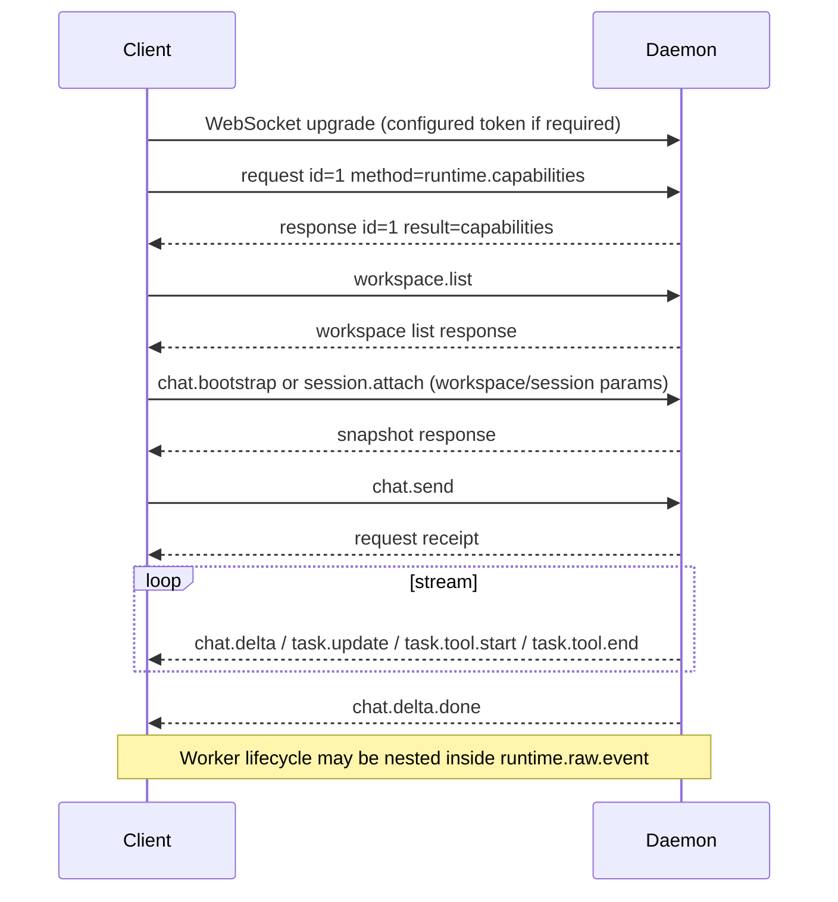

# Daemon Protocol Specification

The complete [232-method / 41-event reference](../_analysis/audit/protocol-reference.md) links every method to its actual handler. The [machine-readable inventory](../_analysis/audit/protocol.json) includes direct parameter reads, which are not complete schemas: helper validation, defaults and dependency availability must also be consulted.

## 1. Transport And Authentication

Default WebSocket: `ws://127.0.0.1:7319/ws`; HTTP shares that server. The UNIX socket also dispatches requests through the handler, not merely start/stop/status commands. Web server idle timeout: 120 seconds.

`NEO_OWNER_TOKEN` validates the Swift parent/lease contract. It is not an API bearer credential. `NEO_DAEMON_WS_TOKEN`, if configured, becomes `wsAuthToken`; upgrade checks `x-neo-daemon-token` or query parameter `daemon_token`. Without that option, this boundary does not demand a token. Origin checks reject remote browser origins and `null`, allow local/Matrix/transcript origins, and allow an absent Origin. Loopback binding is separately checked. See extracted lines 110580–110705 and 150792.

| HTTP route | Guard visible in the server |
|---|---|
| `/ws` | optional configured token and Origin |
| `/workspace-files/<workspace>/download?path=...` | same optional token; path containment; GET/HEAD and Range |
| `/workspace-file-preview/...` | registry-issued preview token and preview path validation |
| `/files/<id>` | registered file ID, expiring after one hour |
| `POST /attachments/upload?workspace=...` | Origin and workspace checks; no daemon-token helper call in this branch |
| `GET /attachments/<workspace>/<id>/<filename>` | Origin, workspace and attachment-root containment; no daemon-token helper call in this branch |

These are static findings, not a live penetration test. One route's guard does not protect every route.

## 2. Frames

Requests include an ID, method and parameters. Responses add a JSON-RPC marker. Events contain both JSON-RPC notification fields and legacy `event/data` keys (`neo-agent.fmt.js:30001`).

```json
{"jsonrpc":"2.0","id":"request-1","method":"workspace.list","params":{}}
```

Success: `{jsonrpc:"2.0", id, result}`. Failure: `{jsonrpc:"2.0", id, error:{code,message,data?}}`.

```json
{"jsonrpc":"2.0","method":"chat.delta","params":{"...":"..."},"event":"chat.delta","data":{"...":"..."}}
```

`isRequest` only checks for an object with `id` and `method`; handlers validate further. Workspace-scoped methods use **`params.workspace`**, not a universal `workspaceId`. Opening the socket does not automatically push `runtime.capabilities`.



## 3. Exact Surface And Corrections

The [generated reference](../_analysis/audit/protocol-reference.md) covers workspace/onboarding/acquisition, departments, file import and worker conflicts, OKR, user profile discovery, queues, sessions, worker installation/auth, providers, cron/hooks/wake history, terminals, wallet/billing, WeChat/Telegram, sync and bench methods.

| Original claim | Shipped contract |
|---|---|
| `objective.state_patch`, `key_result.state_patch` RPC | RPC uses `objective.state.patch`, `key_result.state.patch`; underscore spellings are MCP actions |
| `okr.state` RPC | MCP tool, not a declared daemon method |
| `department.get/update`, `workspace.proactive` RPC | use the actual department/config routes and handler parameters |
| `config.credentials.*` RPC | absent from this method registry |
| `media.image/video/audio` RPC | CLI/MCP surfaces; the declared media RPC is `media.characterAsset.register` |
| `cloudflare.*` RPC | provider operation IDs, not daemon methods |
| `presence.update`, `read.marker`, `nudge.periodic` RPC | absent from this method registry |
| `runtime.stream.events` push event | request method |
| `task.started/completed/failed/reasoning` top-level events | runtime event types, often nested in `runtime.raw.event`; not the 41 declared event constants |

A name may exist at several layers. A string match alone does not prove a callable endpoint.

## 4. Failure And Recovery

The handler rejects invalid/missing workspaces, gates selected methods during shutdown, and optionally uses workspace authorization dependencies. Declared methods may still be disabled by configuration. Bench calls have their own gates.

Request receipts, wake queuing, runtime completion, outcome replies and proof-bearing OKR completion are separate milestones. Reconnect is not evidence of durable replay of every transient event. Refresh authoritative state and query uncertain external writes before retrying.

Swift `Hub*` names are contract clues. Symbols alone cannot recover all Codable fields; the generation question is settled as far as the binary allows — hand-written (function-local `Ack` DTOs, custom `HubChannelValue.init(from:)`, no codegen marker; M27).

### Gateway surface (what sits behind the daemon and the client)

The daemon is not the only network client. The fourth pass recovered every gateway path literal
from both binaries into [`_analysis/audit/gateway-surface.md`](../_analysis/audit/gateway-surface.md):
**45** paths called by the Swift client (billing, subscription, invites, onboarding blueprint,
receivable, integrations, emails, skills catalog, debug reports, update channels, snapshot
publish), **19** called only by the daemon (model calls, media generation, uploads, generation
polling, provider-pack plan/execute, email send, `/sync/op-log`), **13** shared. Hosts: gateway
`https://matrix.agent.space/v1`, Supabase auth/storage behind `https://forward.agent.space`
(the daemon rewrites any `*.supabase.co` URL to this canonical host, `neo-agent.fmt.js:10200`),
cloud edge `https://edge.matrix.build`, snapshots `https://snapshot.matrix.build`, realtime voice
`wss://matrix.agent.space/v1/realtime`. Server behaviour stays **[U]**; the endpoint list is what
a replica must stand up or replace.
