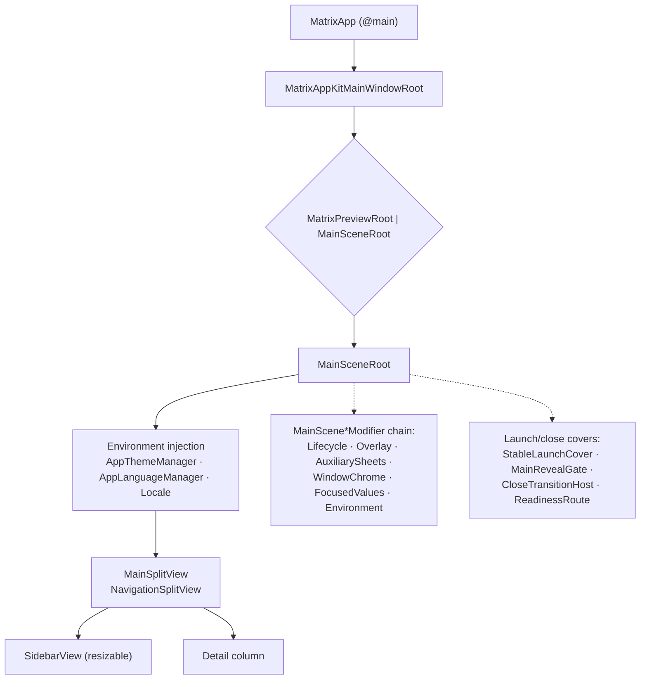
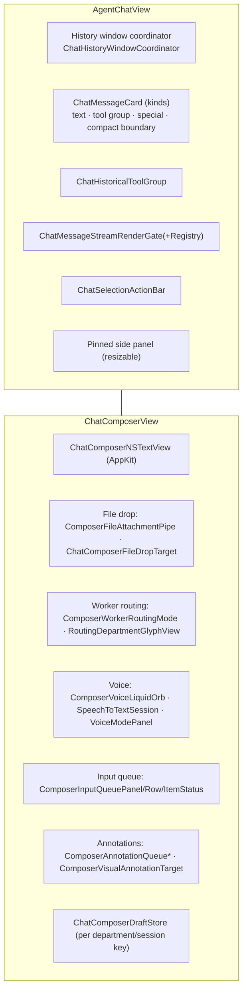
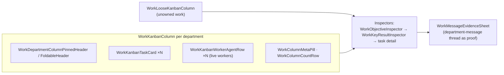
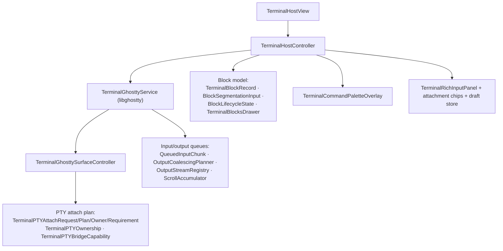

# UI Architecture Specification

The Swift/SwiftUI client: shell, design system, rendering strategy, the seven detail surfaces
(Chat, Work, Dashboard, Files, Terminal, Office, Agent Space) plus the Memory/Skills catalog and
Settings panes. The count matches [docs/01 §4](01-product-model.md), [M27](../modules/M27-swift-app-shell.md)
and [D10](../diagrams/D10-ui-surfaces.md).
Derived from 3 756 top-level Swift type names and shipped resources. The 279 groups include one PUBLIC bucket and private discriminators; they do not establish 279 source files. Component relationships below are inferred unless supported by a cited resource or daemon handler. No native source bodies, screenshot measurements or live UI recordings were supplied with the original dossier.

---

## 1. Shell



The sidebar is **resizable [O]**, not a fixed width. The first draft claimed "288 pt fixed" by
cherry-picking one persisted split-geometry entry. The full distribution of sidebar widths across
all persisted `NSSplitView` states in `com.matrixai.app.plist` is:

```
 27 × 280.0     11 × 288.0     1 × 255.0     1 × 238.0
```

so 280 is the most common observed value and the range spans ~238–288. A single entry looks like
this:

```
"NSSplitView Subview Frames …SidebarNavigationSplitView" = (
    "0,0,288,1047,NO,NO",
    "0,0,1800,1047,NO,NO" )
```

Persisted geometry records what the user left the window at; it establishes neither a default nor
a constraint.

Window management: `MainWindowSizeController`, `MainWindowSizingMode`,
`MainWindowFullSizeContentBridge`, `MainSplitSidebarNativeChromeController` (AppKit bridging to
get native chrome behaviour SwiftUI doesn't expose), plus a
`MainSceneSidebarToggleVisibilityBridge`.

Restoration keys (`com.matrixai.app.plist`):

```
Matrix.WindowRestore.ActiveWorkspaceID.v1      = "ws-qfuzr9nv"
Matrix.WindowRestore.SidebarSelection.v1       = "agentRemote:a2dd8fad"
Matrix.WorkspaceRestore.LastActiveWorkspaceID.v1
Matrix.SelectedDepartmentIDsByWorkspace.v1
Matrix.SidebarModuleBadgeSeenItemKeys.v1
Matrix.DepartmentSidebarPreviews.v1
Matrix.ChatComposerWorkerRoutingPreferences.v1
Matrix.AgentAliases.v1
Matrix.Onboarding.v1.<uuid>
```

Sidebar selection is a typed string (`agentRemote:<deptId>`), which makes deep links and
`matrix://` URL handling trivial.

---

## 2. Design system

The supplied top-level list contains 71 `MatrixDesign*` names (nested types use a different counting scope):

| Area | Types |
|---|---|
| Surfaces | `MatrixDesignCard`, `MatrixDesignContainer`, `MatrixDesignButtonGlassSurface`, `MatrixDesignBadge` |
| Floating panels | `MatrixDesignFloatingPanel{Window,Presenter,Modifier,Surface,Configuration,Anchor,ContentController,HostedContent,AdaptiveScrollView,AnimationView}` |
| Files iconography | `MatrixDesignFileIcon/Row/Shape/Type/RowThumbnail`, `MatrixDesignFolder{Icon,FrontLayer,BackLayer,PaperLayer,Adornment,BottomShear,AnimationPhase,ContentState}` |
| Layout | `MatrixDesignFlowLayout`, `MatrixDesignDividerContainer`, `MatrixDesignFoldableStatusContainer` |
| Motion | `MatrixDesignContinuousMotionActiveKey`, `MatrixDeferredFadeIn` |
| Workers | `MatrixDesignCompactWorkerCard` |

The folder icon alone is built from four composited layers plus a shear and an animation
phase. These names suggest layered icon rendering; the earlier use of a Ready workspace VI manual as evidence of Matrix's design intent was unrelated and is withdrawn.

Typography ships `ABCLaica` (Book/Medium/Regular Italic) and `InstrumentSerif-Regular`.
Theming: `AppThemeManager` + 500+ bundled terminal color schemes doubling as app accent themes.

---

## 3. Chat surface



Engineering decisions worth noting:

- **Streaming is gated, not naive.** `MarkdownStreamBuffer`, `MarkdownStreamRenderGate`,
  `MarkdownStreamRevealState` and their registries mean partial markdown is parsed once,
  cached (`MarkdownParseCache`), and revealed progressively is a plausible interpretation, not a recovered implementation. Parse frequency and performance still need native tracing.
- **The text view is AppKit.** `ChatComposerNSTextView` + `ComposerAcceptingFirstMouseHostingView`
  + `ComposerClickFocusCatcher` — SwiftUI's `TextEditor` isn't good enough for mentions,
  attachments, IME, and first-mouse behaviour.
- **Queued input is a first-class concept.** You can queue several messages; each has a status;
  `chat.queue.steer` lets you redirect a queued turn.
- **Worker routing lives in the composer.** You choose which runtime/worker the next message
  targets (`ComposerWorkerTarget`, `ComposerWorkerMentionCache`,
  `ChatComposerWorkerRoutingPreferenceStore`), with `@mention` aliases
  (`AGENT_MENTION_ALIASES = {agent, lead, lead-agent, leadagent, neo}` plus `claude_code`,
  `codex`).
- **Annotations**: you can visually annotate an artifact or screenshot and queue it as context.

Rendering stack: native `MarkdownRenderer` for bubbles + a WebView bundle
(`TranscriptWebView`, with KaTeX, highlight.js, handlebars, mermaid/jison) for full transcripts,
and `MarkdownArtifactViewer` / `MarkdownDocumentExporter` (PDF/HTML/print) for documents.

---

## 4. Work board



`WorkControlFlowSummary` (+ segments, variants, styles) renders the control-flow of a task —
which is the visual answer to "what is this agent actually doing?". `WorkEvidencePreviewCard`
and `WorkEvidenceReferenceList` render proof refs inline.

`WorkGuide*` is a separate onboarding constellation diagram explaining the hierarchy
(`WorkGuideConstellationNode`, `WorkGuideHierarchyNodeView`, `WorkGuideMeaningRail`,
`WorkGuideTakeawayChip`, `WorkGuideWorkerCluster`).

---

## 5. Files

225 types — the largest non-Office cluster. It is a full document-management application:

| Capability | Types |
|---|---|
| Column / list / large-icon browsing | `FilesBrowserDirectoryColumn*`, `FilesBrowserDirectoryList`, `FilesBrowserDirectoryLargeIcon*` |
| Navigation history | `FilesBrowserDirectoryNavigationHistory/Location` |
| Drag & drop (container, folder, column targets) | `FilesBrowser*DropTarget/DropDestinationModifier` |
| Batch mutation & transfer | `FilesBrowserBatchMutation(+Type)`, `FilesBrowserBatchTransfer` |
| **Collaboration table** | `FilesBrowserCollaboration*` — synchronized rows/dividers, pinned header, viewport, indexing view |
| Previews | `DepartmentFileRowQuickLookThumbnail`, `DepartmentFileRowKingfisherImage`, `MarkdownFilePreviewPanel` |
| Scope switching | `DepartmentFileScopeSwitcher`, `DepartmentArtifactFileScope` |

The **collaboration table** is the differentiator: a synchronized multi-column view showing,
per file, which departments touched it, when, and how — backed by
`workspace.fs.collaboration.*` and the provenance ledger. The "who made this file and why"
question is answerable in the UI, not just in the model.

---

## 6. Memory & Skills — the "library"

Both are presented as **books on a shelf**:

- `MemoryBookCover`, `MemoryBookCoverAtmosphere`, `MemoryBookCoverMiniature`,
  `MemoryCatalogCard`, `MemoryDetailHero`, `MemoryDetailAtmosphericBackground`
- `SkillBookCover`, `SkillShelfCardBody`, `SkillVisualsGenerator`, plus the 3D asset
  `skill-shelf.glb` used in the office

Catalog → detail → file editor is a consistent three-step (`*CatalogContent`, `*DetailSheet`,
`*FileEditorSheet`). Skills additionally support **folder import**
(`SkillFolderImportSheet` scans candidate roots for `SKILL.md`) and a **skill marketplace**
(`SkillMarketplaceView`, `SkillMarketplaceImportController`).

`SkillVisualsGenerator` generates cover art per skill — a small touch that makes a directory of
Markdown feel like a library. Worth copying: it costs one image call and transforms the mental
model of "config files" into "the studio's knowledge".

---

## 7. Terminal

A real terminal, not a log view. 141 types.



- **Ghostty runtime** is embedded (`Resources/GhosttyRuntime/{ghostty,terminfo}`), with shell
  integration for bash/zsh/fish/elvish and 500+ themes.
- **Blocks**: output is segmented into command blocks with lifecycle state and search — i.e.
  Warp-style semantic terminal.
- **PTY ownership** is explicit: a terminal surface can be owned by the user, by a worker
  (`WorkerTUITerminalView`, `WorkerNativeTUILaunchMode`), or attached/detached between them.
  This is how you watch a Claude Code worker's TUI live and then take over.
- IME-aware input (`TerminalIMEAwareTerminalView`, `TerminalMarkedTextOverlay`) — necessary
  given the CJK user base.

---

## 8. Marketplace (Agent Space)

`AgentSpace*` (88 top-level names in the supplied list) + `DepartmentMarketplace*`. Publish-related symbols include
**evidence attachments** — links, images, files — with drafts and upload DTOs
(`AgentSpaceEvidence{Link,Image,Attachment}{,DTO,Draft,UploadDTO}`), plus
`AgentSpaceCompositionMetrics` (how much of a department is skills vs memory vs tasks).

Blueprint suggestion during workspace creation is also here:
`AgentSpaceBlueprint{Mission,Name,Department}Option`, `AgentSpaceBlueprintSuggestionStage`.

---

## 9. Cross-cutting rendering strategy

| Content | Renderer | Why |
|---|---|---|
| Chat bubbles | native SwiftUI `MarkdownRenderer` | latency, selection, streaming gates |
| Full transcripts | `TranscriptWebView` (WKWebView bundle) | KaTeX, syntax highlighting, complex layout |
| Whiteboard | `WhiteboardWebView` (tldraw) | mature canvas, `MatrixTldrawLicenseKey` in Info.plist |
| Documents / export | `MarkdownDocumentExportWebViewLoader` → PDF/HTML/print | fidelity |
| Code preview | `codemirror-preview.js` (707 KB) | editor affordances |
| Office | Metal (`OfficeMetalRenderer`) | custom 3D; demand-driven render loop with idle pause, runtime `targetFPS` + dynamic resolution + MetalFX (`docs/08` §2.1) — no fixed frame rate |
| Images | Kingfisher | caching |

Four renderers is a lot, but each is chosen for a real reason. For shotgun-next, the minimum
viable set is: native markdown for chat, one WebView for rich documents + canvas, and the 3D
view if you build the studio floor.

---

## 10. Settings

`Settings*`, `AIAccess*`, `WorkerAgent*`, `AgentCapabilities*`, `Composio*`, `Payout*`,
`Subscription*`, `About*`. Notable panes:

- **AI Access** — default model, per-department model, external access rows (BYOK), provider
  connect/OAuth, OpenRouter model search.
- **Worker Agents** — install/uninstall Claude Code & Codex, sign-in (device code flow:
  `runtime.sign_in.provide_code`), billing mode per runtime, model per worker,
  `WorkerModelRoutingGraph` — an animated diagram of how a request routes from dispatcher to
  worker to model.
- **Agent Capabilities** — toggles for browser use, computer use, etc.
- **Integrations** — Composio installs.
- **Cloud sync** — `WorkspaceCloudSyncPane`, conflict rebuild sheet.

`WorkerModelArchitecturePanel` + `WorkerModelArchitectureExplainer` render the routing
architecture *as a settings pane*. The app repeatedly chooses "show the architecture" over
"hide the architecture", which is the right call for a product where the user is a founder.
