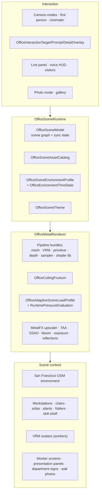
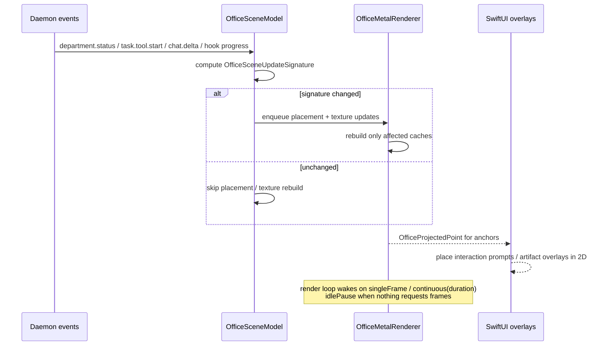

# The Office — 3D World Specification

264 Swift types, a custom Metal renderer, VRM avatars, an OpenStreetMap-derived San Francisco
environment, spatial audio, and LiveKit voice. This is Matrix's signature surface and the
single hardest component to reproduce.

**Evidence boundary:** symbols, resource files and shader names establish a substantial native 3D subsystem. They do not reveal complete Swift/Metal bodies, pass ordering, quality thresholds, measured frame rate or feature availability. The scene connections and interaction descriptions below are architectural hypotheses, not a pixel-accurate reconstruction spec.

---

## 1. What it is

A real-time 3D office you can inhabit. Each **department is a room**; each **worker is an
animated character** at a workstation whose monitor shows its live terminal/transcript output;
department artifacts appear as folders you can open; skills sit on a shelf; whiteboards are
editable; and the building stands in a low-poly San Francisco with the Transamerica Pyramid,
street trees, bay traffic and a day/night sky.



---

## 2. Renderer

### 2.1 Metal shader entry points (`default.metallib`)

```
office_vertex / office_fragment                  base geometry
office_fragment_legacy                           legacy fallback fragment (base)
office_mesh_vertex / office_mesh_fragment        GLB/USDZ meshes
office_mesh_vertex_instanced                     instanced mesh variant
office_mesh_fragment_legacy                      legacy fallback fragment (meshes)
office_mesh_shadow_vertex                        shadow pass (meshes)
office_mesh_shadow_vertex_instanced              shadow pass (instanced meshes)
office_vrm_vertex / office_vrm_shadow_vertex     skinned VRM characters
office_shadow_vertex                             shadow pass (primitives)
office_fullscreen_vertex / _far_vertex           fullscreen passes
office_environment_background_fragment           environment/sky background
office_baked_sky_fragment                        baked sky
office_ssao_fragment                             screen-space ambient occlusion
office_taa_fragment                              temporal anti-aliasing
office_bloom_extract_fragment / _kernel          bloom extraction
office_blur_fragment / _kernel                   separable blur
office_composite_fragment                        final composite
office_exposure_kernel                           auto-exposure
office_reflection_resolve_kernel                 reflections
office_reactive_mask_kernel                      reactive mask (for TAA/upscale)
city_terrain_vertex / _fragment                  city ground
farm_terrain_vertex / _fragment                  "farm" environment ground
farm_grass_vertex / _fragment                    instanced grass
```

32 distinct `office_* / city_* / farm_*` entry-point names
(`strings default.metallib | grep -E '^(office|city|farm)_[a-z_]+$' | sort -u | wc -l`). The
`_legacy` and `_instanced` variants indicate a fallback path for older GPUs and an instanced
mesh path; pass *execution* order is still **[I]**, but the fourth pass recovered the
renderer's stored-property metadata from the main binary, which pins the **pass inventory and
the texture data-flow** (Swift field metadata preserves declaration order; `strings Matrix`
lines 178460–178483):

```
pipeline states (declaration order)         textures they produce / consume
legacyOpaque · legacyTransparent            → sceneColor · sceneDepth · sceneNormal · sceneVelocity
opaque · transparent · shadow               shadow → shadowDepthTexture (consumed by opaque)
ssao → aoTexture · aoBlur → aoBlurTexture   (needs sceneDepth/sceneNormal)
blur (+ blurCompute)
taa → taaHistoryTexture · taaResolvedTexture (needs sceneVelocity, previousViewProjectionMatrix)
bloomExtract (+ bloomExtractCompute) → bloomTextureA…D (4 mips)
environmentBackground · bakedSky → bakedSkyTexture
composite · photoCaptureComposite            (aoCompositeStrength / reflectionIntensity from office_post_processing.json)
reflectionResolveCompute → reflectionTexture (SSR; `ssrEnabled`)
reactiveMaskCompute → reactiveMaskTexture    (MetalFX temporal input)
exposureCompute → exposureTexture
cityTerrain · farmTerrain · farmGrass
```

Data dependencies therefore force: shadow → opaque/transparent (+ VRM) → SSAO → AO blur →
composite → TAA → bloom → exposure → MetalFX upscale → present; SSR resolve and sky sit between
the geometry pass and composite. Only the relative placement of bloom vs. TAA and where exposure
is sampled remain genuinely open.

**Render loop is demand-driven [V]:** log strings `officeRenderLoop wake reason=singleFrame`,
`officeRenderLoop wake reason=continuous duration=`, `officeRenderLoop idlePause`,
`frameSkipped waitingForInFlightGPU`, and fields `idlePauseDeadline`/`idlePauseWorkItem`,
`presentationRenderLoopSuppressed`. The view does **not** run a fixed 60 Hz `MTKView` loop; it
sleeps until a wake reason arrives and draws continuously only for a bounded duration.

**Frame rate is a runtime variable, not a constant [V]:** census fields `targetFPS`,
`dynamicResolutionScale`, `drawableScale`, `internalRenderSize`/`outputDrawableSize`,
`preferredMaxFramesPerSecondOverride`, `smoothedFrameInterval`, `cpuFrameMS`/`gpuFrameMS`; the
`renderCensus` log line reports `mode= cam= cpu_ms= gpu_ms= pressure= scale=` plus asset and
instance counts. `MetalFX` modes are `disabled | temporal | spatialFallback`
(`OfficeMetalFXMode`), with `metalFXDeviceSupport`/`metalFXAvailable` resolved at runtime.
Per-frame feature flags: `advancedPathEnabled taaEnabled aoEnabled bloomEnabled wideBloomEnabled
ssrEnabled reactiveMaskEnabled dynamicSkyEnabled cityLODEnabled firstPersonEnabled metalFXEnabled`.

A built-in **baseline capture** exists: `office-render-baseline` with `shadow_cascades=`,
`transparent_sort=`, `city_lod_radius=`, `slowest_pass_ms=`, triggered by
`requestPhotoFrameCapture(baselinePreset:)` with presets `medium` / `cinematic`. Startup tracing
is gated by `MATRIX_OFFICE_STARTUP_TRACE` / `MATRIX_OFFICE_STARTUP_TRACE_DISABLE`
(`Matrix/OfficeStartupTracing.swift`); sky time can be pinned with `NEO_OFFICE_SKY_MINUTE_OF_DAY`
or the `office.sky.manualTimeEnabled` / `office.sky.manualMinuteOfDay` defaults.

Dev asset configuration is loaded by `OfficeDevelopmentAssetRegistry` from a manifest
(`NEO_OFFICE_DEV_MANIFEST`) with separate *lighting*, *motion*, *scene materials*, *material
overrides* and *post* configs (`OfficeRenderLookConfigurationLoader`); the shipped post config is
`office_post_processing.json` (light/dark appearance: fog, AO composite strength, contact shadow,
reflection intensity, bloom intensity and wide-bloom weight).

Uniform/binding names suggest physically based lighting and post-processing, but do not establish a deferred render pipeline or pass order:
`baseColorMap`, `emissiveMap`, `aoMap`, `brdfTexture`, `environmentTexture`, `anisotropy`,
`bloomParams`, `blurParams`, `cinematicParams`, `atmosphereParams`, `fogParams`,
`currentViewProjectionMatrix` (TAA reprojection), `departmentCarpetTexture`,
`focusedWorkerScreenTexture`, `focusedPanelTexture`.

Two of those are the interesting ones: **`focusedWorkerScreenTexture`** and
**`focusedPanelTexture`** — live app content rendered into the 3D scene as textures.

### 2.2 Quality & adaptivity

```
OfficeRenderQualityProfile / OfficeRenderQualityTier
OfficeAdaptiveSceneLoadProfile      → adaptiveLoadLevel: Int fed into environment generation
OfficeMetalRendererGPUPressure
OfficeMetalRendererRuntimePressureEvaluation
OfficeMetalFXMode / OfficeMetalFXUpscaler        (MetalFX spatial/temporal upscaling)
OfficeSkyQuality / OfficeSkyTimePreset
OfficeRenderDiagnosticsSnapshot / OfficeRenderPassTimingSummary / OfficeRendererDiagnosticsHUD
OfficeRendererWarmupStage / OfficeMetalRendererPreparedStartupResources
OfficeStartupStallProbe
```

The renderer measures GPU pressure and *degrades the scene*, not just the resolution: the
`adaptiveLoadLevel` parameter is threaded into
`appendSanFranciscoOSMCoreEnvironment(...)` and controls how much city gets built.

Caching is aggressive and keyed:
`OfficeStaticSceneCacheKey`, `OfficeRetainedStaticEnvironmentCache`,
`OfficeSanFranciscoCityResourceCache` (+ `CityResourceCacheKey`, `CityResourceBuildRequest`),
`OfficeDepartmentSignCacheKey/Entry`, `OfficePixelTextMaskCacheKey`,
`OfficeVacantWorkstationCacheKey/SlotKey/AgentKey`,
`OfficePresentationPanelTextureSignature/Detail`, `OfficeWorkerScreenTextureSignature/Detail`.

Texture *signatures* are the key idea: a worker's monitor texture is only re-rendered when the
signature of its content changes, not per frame.

---

## 3. Environment

### 3.1 San Francisco from OpenStreetMap

`sf_downtown_osm_environment.json` (924 KB) → `OfficeSanFranciscoOSMEnvironment.Dataset` →
`appendSanFranciscoOSMCoreEnvironment(...)`, whose signature (recovered from the demangled
symbol) is a complete description of the generator:

```swift
appendSanFranciscoOSMCoreEnvironment(
  _ dataset: OfficeSanFranciscoOSMEnvironment.Dataset,
  center: SIMD3<Float>, cityGridYaw: Float, streetLevelY: Float,
  cityRadius: Float, outerCityRadius: Float,
  towerReserveX: Float, towerReserveZ: Float,
  environmentScale: Float, detailScale: Float,
  isLightAppearance: Bool, adaptiveLoadLevel: Int,
  cityGroundMaterial: (color: SIMD4<Float>, emissive: SIMD4<Float>,
                       roughness: Float, metallic: Float, alpha: Float),
  buildingPalette: [SIMD4<Float>], windowGlow: SIMD4<Float>,
  fogMixTarget: SIMD4<Float>, fogGeometryScale: Float,
  intoOpaque: inout [OfficeGPUInstance],
  intoOpaqueCylinder: inout [OfficeGPUInstance],
  includesCityBuildings: Bool,
  intoTransamericaPyramidPlacements: inout [...],
  intoCityTreePlacements: inout [...]) -> ()
```

Plus `appendSanFranciscoWaterfront(...)` with `buildingWaterOccupancyScore`,
`shorelineWaterScore` closures and a `MarinePlacement` generator for **bay marine traffic**.
Cached filters (`CachedShorelineBandFilter`, `CachedWaterBodyFilter`) memoize the expensive
geometric queries.

### 3.2 Assets

| Asset | Use |
|---|---|
| `Transamerica Pyramid.usdz` (2.2 MB) | landmark |
| `City_pack_3.usdz` (22.7 MB) | city buildings |
| `City_Low_Poly_Street_Trees.usdz` | street trees |
| `Parametric_Workstation_Desk.glb`, `Parametric_Office_Chair.glb`, `Office_Chair.usdz` | workstations |
| `Conference_Table_Rectangular_6m.usdz` | boardroom |
| `Outdoors_Sofa.usdz` (5.1 MB) | lounge |
| `Indoor_Plant_02_Fbx.usdz`, `Rhyzome_Plant.usdz`, `bush.glb`, `succulent.glb`, `blue-tree.glb`, `silver-tree.glb` | greenery (`PlantVariant/Anchor/Placement`) |
| `folder-single.glb` | department artifact folders |
| `skill-shelf.glb` | skills as physical books |
| `ice-cluster.glb`, `tall-prism.glb` | decor |
| `Knight.glb`, `Mage.glb` | built-in characters |
| `claude.gltf`, `codex.gltf` | runtime-branded avatars |
| `qwantani_dusk_2_puresky_2k.hdr` (4.6 MB) | IBL environment map |
| `office_post_processing.json` | post-FX config |

Loading: `OfficeEmbeddedGLTFAssetLoader`, `OfficeAssetPipeline` (with texture expansion to
RGBA and alpha-preserving recolor), `OfficeMeshAsset`, `OfficeLoadedScene/MeshNode`,
`OfficeSubmeshMaterial`, `OfficeMaterialAlphaMode`.

### 3.3 Time, weather, audio

```
OfficeEnvironmentTimeState · OfficeSkyTimePreset
OfficeEnvironmentAudioController / Emitter / SceneState / Settings
OfficeEnvironmentAudioActivitySignature     ← ambience reacts to real agent activity
```

The ambience is driven by an **activity signature** — a busy company literally sounds busier.

---

## 4. Characters

### 4.1 VRM pipeline (custom, from scratch)

```
OfficeVRMDocument · OfficeVRMDocumentParser · OfficeVRMParsedFile · OfficeVRMParseError
OfficeVRMHumanoidBone · OfficeVRMHumanoidMap · OfficeVRMCharacterSkeleton
OfficeVRMJointMatrixRange          (GPU skinning ranges)
OfficeVRMPrimitiveAsset · OfficeVRMPrimitiveMorphPlan · OfficeVRMMorphTargetAsset
OfficeVRMExpressionSet             (blendshape expressions)
OfficeVRMCharacterAsset · OfficeVRMCharacterRuntime · OfficeVRMCharacterPlacement
OfficeVRMAvatarCatalogItem/MemoryCache/Error · OfficeVRMAvatarSelection
OfficeAnimationClip
```

VRM-related parser, skeleton, morph and expression types are present, together with `office_vrm_vertex`. The parser's field metadata (`strings Matrix` 178170–178250) reads **both** VRM 0.x
(`exporterVersion · specVersion · humanBones · blendShapeMaster · blendShapeGroups ·
materialProperties · firstPerson`) and VRM 1.0 (`VRMC_vrm` in `extensionsUsed`) structures, plus
the glTF core (`accessors · bufferViews · pbrMetallicRoughness · alphaMode · alphaCutoff …`) and
error cases `malformedBinary · unsupported · missing · outOfBounds`. No third-party glTF/VRM
library name (UniVRM, three-vrm, GLTFKit) appears in the string table or the recovered
source-file list, so the "custom, from scratch" reading stands **[V]**; MToon-specific shading
(`shader · renderQueue · floatProperties · vectorProperties · textureProperties · keywordMap ·
tagMap`) is parsed but rendered through the generic `office_vrm_*` entry points. Avatar
selection is suggested by `OfficeAvatarPickerPanel` / `OfficeAvatarCatalogTile`; the avatar
gallery links to `opensourceavatars.com` and the `ToxSam/open-source-avatars` GitHub dataset.

Built-ins: `OfficeBuiltinCharacterCard`, `OfficeBuiltinWorkerCharacter`,
`OfficeWorkerCharacterModelKind`, `OfficeWorkerCharacterMaterialRole`,
`OfficeMetalRendererWorkerCharacterPalette`, `OfficeWorkerVariationProfile` — so multiple
workers of the same model are visually distinguishable.

### 4.2 Behaviour

```
OfficeWorkerSceneState / SceneAction / SceneActionKind / ResolvedWorkerActionKind
OfficeWorkerNavigation / ResolvedNavigation / Waypoint / TravelMode / SeatMode
OfficeWorkerAnchor · OfficeResolvedAnchor
OfficeWorkerConversation / ConversationFocus / ConversationSnapshot
OfficeBoardroomMeetingState
OfficeLeadAgentSceneState / SceneAction / SceneSource
OfficeAvatarReactionKind / Request / Sound / ClickState
OfficeFirstPersonState / CollisionBlocker / PoolArea
```

Agents **walk** (navigation with waypoints and travel modes), **sit** (seat modes, vacant
workstation allocation), **talk to each other** (conversations with focus), and **hold
boardroom meetings**. Department messages become visible traffic: `DepartmentMessageFlightIcon`,
`DepartmentMessageSidebarFlight`, `DepartmentMessageTransferPulse/Direction`.

Clicking an avatar triggers a reaction with a sound. There is a **pool area**. This is a game,
and it is deliberate.

---

## 5. Live app content inside the scene

| In-world object | Backing content |
|---|---|
| Worker monitor | `OfficeWorkerScreenTextureSignature/Detail` → live transcript/TUI output |
| Presentation panel | `OfficePresentationPanelTextureSignature/Detail`, `OfficePresentationTranscriptCacheEntry` |
| Department sign | `OfficeDepartmentSignCacheKey/Entry`, `OfficeDepartmentCornerSignTextLine/Role` |
| Department folders | `OfficeMetalRendererFolderPlacement`, `OfficeDepartmentFolderMaterialKind`, `OfficeDepartmentArtifactsSpatialOverlay` |
| Skill gallery | `OfficeMetalRendererSkillGalleryPlacement` |
| Whiteboard | `OfficeWhiteboardEditorView` → tldraw WebView |
| Wall photos | `OfficeWallPhotoService`, `OfficeWallPhotoSceneEditorView`, `ProjectedWallPhotoFrame`, resize handles, hit surfaces |
| Pixel text | `OfficePixelTextMaskFontStyle` (low-res in-world labels) |

`OfficeDepartmentArtifactsOverlayProjection` + `OfficeProjectedPoint` project 3D world positions
into 2D SwiftUI overlay space — that is how a 3D folder opens a real SwiftUI file panel.

---

## 6. Camera & modes

```
OfficeCameraMode / CameraModeCluster / CameraModeSegmentButton
OfficeMetalCameraController · OfficeCinematicCameraProfile
OfficeFirstPersonModeButton / OfficeFirstPersonState
Office3DPresentationMode · OfficePresentationModeLifecycle
OfficeImmersiveModeButton / ImmersiveExitButton / ImmersiveWindowFrameController
OfficeInteractiveMTKView · OfficeMetalView · OfficeOverlayView · OfficeContainerView
```

Modes: orbit/overview, **first person** (with collision blockers), cinematic,
presentation, immersive (frameless window).

### 6.1 Photo mode

A complete in-app camera: `OfficePhotoModeState/Overlay`, `OfficePhotoViewfinder`,
`OfficePhotoAimingOverlay`, `OfficePhotoControlButton/Indicator`,
`OfficePhotoGenerationControlBar`, `OfficePhotoRenderService/RenderResult`,
`OfficePhotoGalleryOverlay/Item/Thumbnail/Preview`, plus generating/failed/loading overlays.
Captured frames (`OfficeCapturedFrame`) can be **AI-processed** (the generation control bar +
`OfficePhotoProcessingBackdrop`) and hung on the office walls.

---

## 7. Live sessions & voice

```
OfficeLiveButton · OfficeLivePanelView · OfficeLiveParticipantRow · OfficeLiveStatusPill
OfficeLivePlayDeck / PlayAction / PlayActionLabel / InteractionKind
OfficeLiveVisitorSceneBanner / SceneContext · OfficeVisitorSnapshot
OfficeVoiceSceneHUD · OfficeVoiceHUDButton · OfficeVoiceSceneSignature
OfficeLocalLiveInteraction · OfficeLocalInteractionKind
```

Backed by `LiveKitWebRTC.framework` + `RustLiveKitUniFFI.framework` (LiveKit Swift SDK with a
Rust core over UniFFI) and `ElevenLabs.bundle`.

### 7.1 Voice (one user ↔ one agent) — two providers **[V]**

```
NEO_VOICE_PROVIDER / MATRIX_VOICE_PROVIDER            selects the provider
  "elevenlabs" → ElevenLabs Conversational-AI agent
       NEO_/MATRIX_/ELEVENLABS_AGENT_ID · NEO_/MATRIX_ELEVENLABS_ENVIRONMENT   (blank in Info.plist)
       transport: the ElevenLabs Swift SDK's WebRTCConnectionManager over LiveKit
       client tool exposed to the agent: `call_neo_intelligence(user_request)`
  otherwise   → OpenAI-style realtime over the Matrix Gateway
       NEO_REALTIME_WS_URL / MATRIX_REALTIME_WS_URL
       default wss://matrix.agent.space/v1/realtime?model=gpt-realtime-2
Matrix/RealtimeVoiceClient.swift · Matrix/VoiceCallSession.swift (VoiceCallPhase, CallContext)
Matrix/ElevenLabsVoiceClient.swift · Matrix/TextToSpeechService.swift
Matrix/SpeechRecognitionService.swift · Matrix/ComposerSpeechToTextSession.swift
```

The ElevenLabs agent prompt text is embedded in the binary: *"Answer directly for greetings,
simple explanations … Use client tool `call_neo_intelligence` only when the request needs Matrix
live state, project files, tools, workers, tasks, external/current lookup, or durable actions.
Pass `user_request` as the latest clear utterance."* — so the voice layer is a thin
speech front-end that delegates anything stateful to `neo-intelligence` through one tool.

**LiveKit's only identifiable consumer is this SDK.** The recovered client source-file list
(`_analysis/audit/swift-source-files.txt`) has no `*LiveKit*` file of its own, and the daemon
bundle contains zero `livekit` references.

### 7.2 Live workspaces (multi-user visit) — present, gated **[V structure / U enablement]**

```
Matrix/WorkspaceLiveSession … types:
  WorkspaceLiveRoom        snapshotVersion · hostUserID · sceneDescriptor · descriptorVersion ·
                           maxParticipants · expiresAt · revokedAt · createdAt · updatedAt · inviteURL
  WorkspaceLiveJoinRequest / JoinResponse / DeepLinkRequest / DeepLinkIntent
  WorkspaceLiveParticipantPresence   userID · displayName · avatarColor · sequence
  WorkspaceLiveInteractionEvent      boardID · senderID · whiteboard · sentAtMs
  WorkspaceLiveWhiteboardDescriptor · WorkspaceLivePhotoFrameDescriptor
                           (storageBucket · storagePath · signedImageURL · signedPreviewURL …)
  WorkspaceLiveSceneDescriptor
UI: "Join 3D Workspace by URL" menu item → WorkspaceLiveJoinURLSheet
    deep link  matrix://live/join/<live-token>   (recent links kept 8 h, token redacted)
    states     invalidURL · signedOut · signedOutPending · liveUnavailable
    strings    "Live workspaces are unavailable in this build."
               "Sign in to Matrix before joining a live workspace."
```

What this settles: the visit feature is a **host-published scene descriptor + presence + shared
whiteboard**, keyed by a revocable, expiring invite token, and it requires a signed-in Matrix
account. The room record carries **Supabase Storage** fields and no LiveKit `serverUrl`/
`participantToken`; the client links Supabase `Realtime` (Phoenix `presence_state`/
`presence_diff`), so presence most plausibly rides Supabase Realtime rather than a LiveKit room
**[I]**. Whether the gate is open for a given account is decided by the remote
`MatrixReleaseGate`/`PublicConfig` (`platform · minVersion · forceUpdate · message ·
discordInviteURL · inviteFlowMode`) and stays **[U]** from the bundle. The daemon side is limited
to `focus.broadcast` / `activity.broadcast`; there is no `presence.update` and no live-room RPC.

Replica consequence: budget a small Realtime/presence service and a signed-URL asset store, not
a WebRTC SFU, unless voice-among-visitors is actually a requirement — nothing here shows it.

---

## 8. Scene ↔ state synchronization



`OfficeSceneSyncState`, `OfficeSceneUpdateSignature`, and the `OfficeContainer*Events` families
(`ApplicationActivity`, `Lifecycle`, `Live`, `MountLifecycle`, `Renderer`, `Scene`) form a
narrow, explicit bridge between app state and scene state.

The signature gate itself is still inferred from type names, but the GPU-side consequence is now
established (§2.1): the render loop is demand-driven with an explicit idle pause, so unchanged
application state *and* an idle camera do lead to zero frames. Camera motion, avatar animation
and temporal effects request `continuous` wakes with a bounded duration.

---

## 9. Cost of reproduction

| Layer | Effort | Substitutable? |
|---|---|---|
| VRM parser + GPU skinning | very high | **Yes** — use an off-the-shelf engine (three.js/R3F, Godot, RealityKit) |
| Metal renderer + post-FX | very high | **Yes** — engine gives you this |
| OSM city generation | high | **Yes** — a stylised abstract set is better for a *studio* anyway |
| Room/desk/anchor allocation | medium | No — this is the actual product logic |
| Worker behaviour state machine | medium | No — this is the product logic |
| Live content-as-texture | medium | No — this is the magic |
| Scene update signatures | low | No — but trivial to reimplement |

**Recommendation for shotgun-next:** do not write a renderer. Build the studio floor in
React-Three-Fiber (web) or RealityKit/SceneKit (native) and spend all the effort on the
*behaviour* layer — anchors, navigation, conversations, live screens, and the signature-based
update gate. Those are what make it feel alive; the triangles are commodity.
