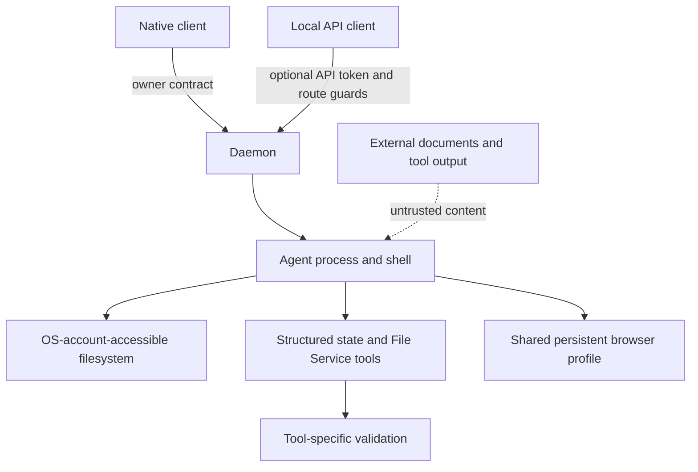

# Security And Trust Model

Static boundary audit of the pinned local bundle. This does not claim live containment testing, account acceptance or security certification.

## 1. Process And Network Boundaries

Loopback is the default; `NEO_DAEMON_ALLOW_NON_LOOPBACK=1` permits other hosts. `NEO_OWNER_TOKEN` validates parent/lease ownership, not API-client authorization. Optional `NEO_DAEMON_WS_TOKEN` guards WebSocket upgrade and selected HTTP paths. See [route-by-route details](05-daemon-protocol.md).

**Consequence of the optional token [V].** `wsAuthToken` is sourced from
`NEO_DAEMON_WS_TOKEN` (`neo-agent.fmt.js:150792`) and every guard is conditional on it:
`if (!wsAuthToken) return null` / `if (wsAuthToken) { ...check... }` (`:110678`, `:110691`).
`isAllowedOrigin` additionally returns **`true` for a missing `Origin` header**.

The shipped desktop configuration is now settled, from three independent directions:

1. **The client cannot set the token.** A byte-level scan of `Matrix.app/Contents/MacOS/Matrix`
   (UTF-8 and UTF-16) finds zero occurrences of `NEO_DAEMON_WS_TOKEN`; the full list of
   `NEO_*`/`MATRIX_*` keys the client reads (98 keys, `_analysis/audit/client-env-keys.txt`)
   does not include it.
2. **The client cannot present a token.** The only credential channels the daemon accepts are
   the `x-neo-daemon-token` header and the `daemon_token` query parameter (`:110679`, `:110692`);
   neither string exists in the client binary.
3. **The client spawns the daemon itself** with `daemon run --owner-pid=<pid> --host=127.0.0.1
   --owner-mode=swift_child --owner-lease-path=…` (client strings; `neo-agent.fmt.js:151595`,
   `:152019`),
   and the live `daemon.log` shows every start as `authMode: "loopback-bind"` (15 starts on this
   machine).

So **the shipped desktop build serves `/ws` unauthenticated**, protected only by the loopback
bind and the Origin check (missing `Origin` allowed; `matrix:`/`transcript:` schemes and
loopback hosts allowed). Any local process on the machine can drive the daemon. The token path
exists only for operators who export the variable before launching `neo` by hand.

The app is not App-Sandboxed. Department queries request `bypassPermissions` and extra directories. This is not proof of filesystem containment. Arbitrary shell execution runs under the OS account unless separately isolated.

## 2. Controls And Limits

| Control | Evidence and limit |
|---|---|
| File Service paths | `resolveWorkspaceFilePath` at line 14783 validates lexical/real paths and symlinks within a workspace. It governs this service, not all tools/processes. |
| Protected internal names | `MANAGED_INTERNAL_PATHS` at 14872: `.neo/file-ledger`, `.upload-tmp`, `.neo/worker-overlays`, plus revision-restore staging names. Not all config/OKR/tasks. |
| Runtime Edit rules | `/.neo/**` and `~/.neo/**` also construct/recognize session allow rules (`neo-intelligence.fmt.js:467193,493128`). They are not blanket prohibitions. |
| Department deletion | ID echo at the management boundary; deliberate-action guard, not independent human authentication. |
| Destructive-work gate | regex over selected text and recent chat (`neo-agent.fmt.js:125054`); heuristic, not a universal shell-operation detector. |
| Revision restore | current-revision guard, operation identity and recent-chat confirmation (`128749,128997`); not an operation-bound signed approval token. |
| Cron policy | built-in cron removed from lead configuration; the replacement MCP requires a Task. Shell execution is a separate boundary. |
| Provenance visibility | MCP filters ownership/participation; it does not remove the same agent's OS file access. |
| Provider writes | catalog risk `read` routes to execute; other risks route to plan (`86325`). Other external write paths require separate checks. |
| Runtime downloads | manifest digest verification and optional ad-hoc signing; ad-hoc signing does not verify the publisher. |

“Do not hand-edit managed state”, “never ask for secrets”, and ownership routing remain prompt instructions. Tool authority controls structured mutations; it does not prevent a lead doing another role's work through Bash.

## 3. Credentials

Stores need individual analysis. Do not label all credentials encrypted or all plaintext.

WeChat `saveState` passes credentials to `writeStoredState`, which writes JSON (`145067,145663`). Nearby AES-128-ECB functions protect media payloads (`145615`), not that credential file. No credential values were read or copied in this audit. A mode-0600 write in one component does not prove a universal file-mode or Keychain policy.

Payment/merchant statements in T06/M23 are the shipped client's product contract, not independently verified backend, financial or legal behavior.

## 4. Content And Browser Trust

Peer assignments remain subordinate to existing authority; quoted source content is untrusted. Imported skill and memory files can affect prompts. A handoff digest does not establish trust in every file, but missing Swift implementation also prevents concluding that the importer never verifies content.

The browser guide describes shared physical pages and login state beneath virtual environments. Its platform-detection warnings are shipped guidance, not independently verified platform facts.

## 5. shotgun-next Requirements

These are proposed requirements, not implemented behavior:

- Keep authoritative state in daemon-controlled storage with enforced isolation from agent processes. Readable packet projections may live in the workspace; structured mutations go through the daemon.
- Test Bash/PowerShell, external workers, symlinks, hard links, rename/unlink, browser downloads and integration outputs. `deniedWrites` is not an observed SDK field and has no effect without an implementation that consumes it.
- Do **not** substitute a path-scoped `permissions.deny` rule for that boundary. Verified rule
  semantics **[V]**: the deny check in `TWK` (`neo-intelligence.fmt.js:441309`) runs *before* the
  `bypassPermissions` mode check, so a **blanket tool-level** deny (`"deny": ["Write"]`) is
  genuinely enforced even under bypass — but the matcher `KI0` (`:441147`) returns `false` for any
  rule carrying a pattern (`if (q.ruleValue.ruleContent !== undefined) return false`), and `lFK`
  (`:433633`) skips them the same way. No consumer enforcing a path-scoped `Write(...)`/`Edit(...)`
  deny was found. Path protection therefore comes from withholding the tool or from an
  out-of-SDK boundary, not from a deny pattern.
- Authenticate sensitive routes consistently; derive actor identity from the connection/session and bind approval to an operation and current inputs.
- Preserve uncertain external writes as unknown until queried. An idempotency field helps only when the provider honors it.
- Use OS credential storage where practical; review imports before granting execution or prompt authority.
- Verify visibility filtering, operational authorization and OS containment separately.
