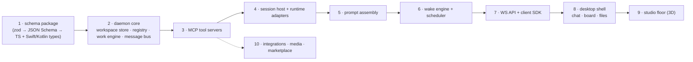

# Build, Packaging & Distribution

How Matrix is assembled and shipped — and exactly how this teardown was produced.

---

## 1. Bundle layout

```
Matrix.app/                                             894 MB
└── Contents/
    ├── Info.plist                  com.matrixai.app · 1.0.6 (148) · matrix:// · macOS 14.6+
    ├── MacOS/Matrix                166 MB  Mach-O arm64 (Swift 6, Xcode 17F113, SDK macosx26.5)
    ├── Frameworks/
    │   ├── LiveKitWebRTC.framework        28.7 MB
    │   ├── RustLiveKitUniFFI.framework
    │   └── Sparkle.framework
    ├── Resources/
    │   ├── neo-agent               65 MB   Bun single-file executable
    │   ├── neo-intelligence        78 MB   Bun single-file executable
    │   ├── matrix-browser/
    │   │   ├── matrix-browser-server   61 MB  Bun exe (loads main.js)
    │   │   ├── matrix-browser-mcp      545 KB Rust supervisor
    │   │   ├── main.js                 4.3 MB Playwright-based server
    │   │   ├── node_modules/{playwright,playwright-core,chromium-bidi}
    │   │   └── cloakbrowser/Matrix Browser.app   Chromium 145.0.7632.109
    │   ├── neo-agent-seed/         prompts · templates · integration-packs · scripts
    │   ├── GhosttyRuntime/         ghostty + terminfo + shell-integration + themes
    │   ├── vendor/ripgrep/arm64-darwin/rg
    │   ├── *.bundle                SPM resource bundles (10)
    │   ├── *.lproj                 12 locales
    │   ├── 3D assets               *.glb *.usdz *.hdr *.gltf
    │   ├── default.metallib        compiled Metal shaders
    │   ├── Assets.car              21.5 MB
    │   ├── ~500 terminal themes    (Ghostty theme files, 475 B each)
    │   ├── version.json · runtime-versions.json · office_post_processing.json
    │   ├── sf_downtown_osm_environment.json   924 KB
    │   ├── codemirror-preview.js   707 KB
    │   ├── brand.mp4 · fonts (ABCLaica, InstrumentSerif)
    │   └── .zshenv · bash-preexec.sh · ghostty.bash
    └── _CodeSignature/
```

### 1.1 SPM resource bundles

Exactly ten `*.bundle` directories ship in `Contents/Resources`: `TranscriptWebView`,
`MarkdownView`, `WhiteboardWebView`, `Highlightr`, `Kingfisher`, `SwiftTerm`, `LiveKit`,
`SwiftProtobuf`, `swift-crypto` (`Crypto`), `ElevenLabs` — the app is assembled from Swift
packages, several of which ship web bundles built by Vite (`assets/*-<hash>.js`,
`bundle-version.txt`). (Ghostty, Sparkle, LiveKitWebRTC and RustLiveKitUniFFI are frameworks
under `Contents/Frameworks`, not resource bundles.)

### 1.2 What the main binary says about its own build **[V]**

The Swift compiler embeds `#fileID`/`#filePath` literals wherever a source file uses
assertions, `fatalError`, `os_log` call-site metadata or `Bundle.module`. `strings -n 6
Contents/MacOS/Matrix` therefore leaks a partial source map:

- **Build machine and layout:** three absolute paths survive —
  `/Users/runner/work/matrix/matrix/apps/hq/mac/build/DerivedData/SourcePackages/checkouts/…`.
  So the app is built on a **GitHub Actions macOS runner** from a **monorepo** whose desktop
  target lives at `apps/hq/mac` (the "HQ" app), with SwiftPM checkouts resolved into
  `build/DerivedData`.
- **255 first-party source files** (`Matrix/*.swift`), recovered into
  [`_analysis/audit/swift-source-files.txt`](../_analysis/audit/swift-source-files.txt). This
  is a lower bound (files without diagnostics leave no trace) but it names the real seams:
  `DaemonSupervisor`, `HubService`, `AuthService` + `KeychainSessionStore` + `AuthRefreshFileLock`,
  `OfficeMetalFXUpscaler`, `OfficeSceneModel`, `OfficeAssetPipeline`, `OfficeStartupTracing`,
  `WorkspaceFileImportPipeline`, `WorkspaceCloudSyncPane`, `WorkspaceSnapshotShareService`,
  `SubdomainService`, `RealtimeVoiceClient`, `VoiceCallSession`, `ElevenLabsVoiceClient`,
  `MandatoryUpdatePolicyService`, `UpdateChannelAccessService`, `InviteCodeAccessService`,
  `TerminalGhostty*`, `PTYProcess`, `ChatTranscriptPerfProbe`, `WebContentCrashRecovery`.
- **Third-party Swift packages actually linked** (by file-path prefix): `supabase-swift`
  (Auth, PostgREST, Realtime, Storage, Supabase), `swift-clocks`, `swift-dependencies`,
  `xctest-dynamic-overlay` / `IssueReporting`, `swift-markdown`, `MarkdownView`, `Highlightr`,
  `Kingfisher`, `SwiftTerm`, `Loupe` (layout-debug guides), `LiveKit` + `LiveKitUniFFI`,
  `ElevenLabs`, `SwiftProtobuf`, `swift-crypto`, `HTTPTypes`, plus Ghostty (with Dear ImGui
  debug strings) and Sparkle as frameworks. **Supabase is the account backend** — the client
  reads `NEO_SUPABASE_URL` / `NEO_SUPABASE_ANON_KEY`, and the daemon canonicalises any
  `*.supabase.co` host to `https://forward.agent.space`.
- **98 environment keys** the client consults, in
  [`_analysis/audit/client-env-keys.txt`](../_analysis/audit/client-env-keys.txt): runtime
  overrides (`MATRIX_CLAUDE_CODE_*`, `MATRIX_CODEX_*`, `NEO_CODE_USE_{BEDROCK,VERTEX,FOUNDRY}`),
  perf/trace switches (`MATRIX_CHAT_PERF_DEBUG`, `MATRIX_TRANSCRIPT_BENCH_*`,
  `MATRIX_OFFICE_STARTUP_TRACE`), dev URLs (`MATRIX_TRANSCRIPT_DEV_URL`,
  `MATRIX_WHITEBOARD_DEV_URL`, `MATRIX_BROWSER_DIST_DIR`), feature keys
  (`MATRIX_TLDRAW_LICENSE_KEY`, `MATRIX_SNAPSHOT_PUBLISH_TOKEN`, `MATRIX_ALLOW_MULTIPLE_INSTANCES`),
  and voice/marketplace/gateway endpoints. Notably absent: `NEO_DAEMON_WS_TOKEN`,
  `MATRIX_SYNC_OUTBOX` — the two switches that would turn on WS auth and cloud sync.

---

## 2. Version manifests

`Resources/version.json`:

```json
{ "version":"1.0.6", "build":"148", "channelLabel":"",
  "builtAt":"2026-08-20T13:35:56Z",
  "components":{
    "neo-agent":       {"version":"0.1.60","sha":"76894dbbb"},
    "neo-intelligence":{"version":"0.1.60","sha":"76894dbbb"},
    "matrix-browser":  {"version":"0.1.0","sha":"76894dbbb"} } }
```

`Resources/runtime-versions.json` — the external-runtime manifest used by the installer
(url + sha256 + binary subpath + `needsAdhocResign`). See
[runtime spec §6](02-runtime-architecture.md#6-agent-runtime-abstraction).

The manifests share a SHA and embedded paths suggest a common build workspace. This is evidence for coordinated builds, not recovery of the original repository layout or all build inputs:

```
apps/harness/src/daemon/runtime-prompt-context.ts
apps/harness/seed/prompts/workspace-schema.md
../hq/mac/build/resources/neo-intelligence-bundle.js
src/main.rs                                (matrix-browser-mcp)
```

So the repo is roughly `apps/harness` (neo-agent), the neo-intelligence bundle, `hq/mac`
(the Swift app), and a Rust crate — with the Swift build step vendoring the JS artifacts.

---

## 3. Compilation targets

| Component | Toolchain | Notes |
|---|---|---|
| Matrix | Swift 6 / Xcode 2660 (17F113), SDK macosx26.5, target arm64 | Hardened Runtime; `NSQuitAlwaysKeepsWindows` |
| neo-agent / neo-intelligence / matrix-browser-server | **Bun** `--compile` | `__BUN` Mach-O section, JavaScriptCore (`__jsc_int`, `__jsc_opcodes`, `__wtf_config`) |
| matrix-browser-mcp | Rust (rustc `8bab26f4f…`) | `src/main.rs`, panics with `matrix-browser-supervisor:` prefix |
| Metal shaders | `metal` → `default.metallib` | 32 `office_*` entry-point names (`strings` on the metallib) |
| Web bundles | Vite | transcript / whiteboard / codemirror |

**Bun `--compile` is the right call for a component like this**: single file, no Node install,
fast start, and the JS is still recoverable (as this teardown shows — do not treat it as
obfuscation).

---

## 4. Distribution

```
Sparkle appcast   https://download.matrix.build/mac/appcast.xml
Release notes     https://download.matrix.build/mac/history.html
Signature         EdDSA, SUPublicEDKey i9KwWamgG5pgI3A3oOsYttjDPlC7G+7JEeDpKvbAFxg=
Check interval    86400 s, automatic
```

Two independent update channels:

1. **App** — Sparkle, signed, whole bundle.
2. **Agent runtimes** — downloaded on demand from npm/GitHub, SHA-256 verified, installed to
   `~/.neo/runtimes/<kind>/current`, ad-hoc re-signed where needed.

Channel 2 means Claude Code and Codex can be updated without shipping a new app.

---

## 5. Reproducing this teardown

The audit includes a read-only parser for the copied binaries (it writes only audit outputs):

```bash
node _analysis/audit/verify-extraction.cjs
node _analysis/audit/extract-evidence.cjs
node _analysis/audit/extract-runtime-tools.cjs
node _analysis/audit/validate-docs.cjs
```

Run these from the dossier root. The scripts use local Node and documented local parser/browser dependencies; no Matrix daemon or agent is started. The validation script uses a temporary headless Edge profile and serves only local Mermaid assets, with remote requests blocked.

`verify-extraction.cjs` reads Mach-O load commands to locate `__BUN,__bun`, verifies the saved section bytes, locates the shebang, and stops the entry at its first NUL terminator. It decodes strict UTF-8 and parses both clean and formatted entries. The earlier `b[i:].decode(...,"replace")` recipe retained the binary module table and produced invalid JS; do not reuse it. Original carved `.js` files are preserved as evidence; corrected entries are `_analysis/audit/*.clean.js`.

The normalized syntax-tree comparison passes for both components after accounting for formatting changes to import order, single-statement blocks and expression-free template literals. This checks extraction/formatting integrity, not runtime correctness or source rebuildability. See [extraction-validation.json](../_analysis/audit/extraction-validation.json).

For symbols and resources, read the copied bundle using `nm`, `xcrun swift-demangle`, `otool` and `plutil`. Do not infer function bodies from type descriptors. Version and hash results are recorded in [inventory.json](../_analysis/audit/inventory.json).

Commands that launch an installed binary can initialize user data or contact services; they are not inherently read-only. Reading live `~/.neo` files may expose credentials and user history and is not required to repeat this static audit.

### 5.1 Notes / gotchas

- `swift-demangle` is at `/Library/Developer/CommandLineTools/usr/bin/swift-demangle`; reach it
  with `xcrun swift-demangle`, it is not on `PATH`.
- `neo-intelligence` is minified (mangled identifiers) but all **strings, prompts, tool
  descriptions and schemas are intact** — grep for prose, not for symbols.
- `neo-agent` is **not** minified: function names, module names, comments in template literals
  and full prompt text survive. This is where 90 % of the architecture lives.
- Private-discriminator grouping gives symbol clusters; the 279 groups include a PUBLIC bucket spanning multiple files, so it is not a 279-file source layout.
- `timeout` is not available on stock macOS zsh; use a different bound if you script long runs.

---

## 6. Rough build order for a clone



Steps 1–7 are the product. Steps 8–9 are the experience. Step 10 is the business.
This order is a proposed dependency sequence. A shipped binary and symbol inventory cannot establish Matrix's historical implementation order or compare source maintainability between languages.
