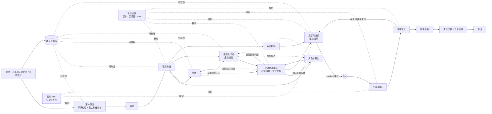

# 03 · 工作流与阶段推进

最后更新：R3（2026-09-17）
本轮变化：核心原则加第 4 条（上下文区隔靠任务单对齐）；依赖图加入资源库与导演合并裁决节点；新增"导演合并裁决节点"一节；待定项更新。

## 核心原则

1. **[用户]** 像 ComfyUI 那样的节点式工作流，但**不让用户手动连线**：按流程自发展开下一步，并给用户对应 agent 的沟通入口，确保每一步足够准确再进入下一步。
2. **[用户 + R1]** 9 条线不能同时射出。用户倾向**同时出现但部分先冻结**（而非分波射出）。
3. **[R1 结论]** 上游修订后下游标"需复核"，不整套推倒（沿用 skill 的 `based_on / status` 约定）。
4. **[用户 R3]** 子 agent 上下文互相区隔；靠第一张纸上对齐好的**工种任务单**给每个子 agent 一个粗略方向，事情才能往同一个方向发展。补充对齐载体：上游 ready 工件、项目资源库、项目风格档案（见 02）。

## 依赖图（只做生成的版本）

**[建议]** 边的含义是"下游节点的解冻条件"。美术 / 角色 / 摄影三者之间是虚线（互相引用但不阻塞），可以并行解冻，各自在文档里标注对方的版本号；三者的冲突不在各自节点内解决，而是集中到合并裁决节点（D-18）。资源库的虚线表示"可取用"，用户点名了制片、导演、美术，图中按建议把角色、摄影、编译也连上（Q-20）。

## 导演合并裁决节点（D-18）

**[用户 R3]** 美术 / 角色 / 摄影三者 ready 后、进入编译前，需要一个"导演合并裁决"节点。

**[建议]** 节点定义：

- **解冻条件**：美术、角色与服化、摄影与灯光三个节点均 `passed`（工件 ready）。
- **输入**：三份 ready 工件 + 导演分镜（自己的上游）+ 资源库 + 风格档案。
- **工作内容**（沿用导演 skill 的交接约定）：
  1. 逐镜核对三份设计是否指向同一空间、同一身份、同一光色意图；找出冲突。
  2. 每条冲突按四句写：**冲突是什么 → 各自保护什么 → 最小兼容方案 → 谁裁决**。
  3. 导演能裁的直接裁；涉及用户明确锁定项的，通过确认需求工具交给用户。
  4. 需要某工种改的，**退回具体问题**给该节点（该节点转 `stale`，带具体段落与要求），不在裁决节点里替它改——对应 skill 的"回到有权改变它的位置修复"。
- **输出工件**：`design-lock`（设计定稿）——一份合并后的、编译节点可以直接消费的定案，`based_on` 指向三份设计 + 分镜的具体 revision；附冲突清单及每条的裁决结果。
- **推进**：move on 后 `design-lock` ready → 编译节点解冻。若有退回，编译保持 frozen，等被退回的工种重新 passed 后裁决节点自动重跑核对（thawing）。
- **可选**：skill 里的"多岗逐镜审稿"表（各岗对镜头 1..N 一行结论）适合在这个节点触发；是否默认开启见 Q-21。

这个节点的存在也回答了 R1 的一个隐含问题：编译节点的输入从"三份可能矛盾的设计"变成"一份定稿"，编译 agent 不再需要自行调和冲突。

## 节点状态机

**[用户]** 解冻需要加载动画，因为上游数据加载和下游处理与生成都需要时间。

**[建议]** 状态：

| 状态 | 视觉 | 含义 |
|---|---|---|
| `frozen` | 磨砂玻璃，不可进入，可 hover 看"等待：编剧 ready" | 上游未 ready |
| `thawing` | 霜层消退动画，进度可见 | 上游已 ready；agent 正在读上游工件、建上下文、写开场（首稿或首轮提问） |
| `ready` | 透明，有未读标记 | agent 开场完成，等用户进入 |
| `active` | 展开为纸 + 聊天 | 用户正在与该节点交流 |
| `confirming` | 出现确认需求卡片 | agent 已调用确认需求工具，等用户 yes / no / input |
| `held` | 纸占满、聊天收起、边缘有 hold 标记 | 用户暂时封存，可回来继续 |
| `passed` | 纸略缩、带勾 | 用户 move on；工件 `status = ready`，下游可解冻 |
| `stale` | 纸上有"需复核"标记与受影响段落高亮 | 上游在其 ready 之后又修订 |
| `superseded` | 灰化、可展开历史 | 被分支或刷新覆盖取代 |

`thawing` 的时长真实反映工作：读文件、调用模型、可能还有小生成（例如角色定妆参考图）。动画不应是假进度，应绑定实际事件（已读 N 份工件 / 正在起草 / 已完成）。

## 确认需求工具

**[用户]** agent 认为信息足够时，调用一个"确认需求工具"，让用户 **yes / no / input something**，选择提交还是继续聊天勾兑。

**[建议]** 工具语义：

- 输入（agent 给）：`summary`（agent 对本节点将要交付内容的一段概括）、`assumptions[]`（可撤回的假设）、`open_points[]`（仍想问的点，≤3）。
- 用户动作：
  - **yes** → 工件进入 `ready` 候选，节点进入 `passed` 前的最后一步（若有 critic 轮，先跑 critic）。
  - **no** → 回到聊天，agent 得到"用户不接受"的信号，需要问清哪里不对。
  - **input** → 用户填补充文字，agent 继续勾兑后可再次调用。
- 每次调用与用户回答都记录（见 05 数据模型 · 确认记录）。
- 运行时映射：codex app-server 的 `dynamicTools` + `item/tool/call`，或内置 `item/tool/requestUserInput`（1–3 个短问题），见 06。

## hold 与 move on

**[用户 R1]** 聊天框上缘有 hold 与 move on。

**[建议]**

- **hold**：收起聊天，纸占满；节点进 `held`；agent 会话保留（上下文胶囊写盘）；用户可拖进度条去别的节点。
- **move on**：
  1. 若还没通过确认需求工具 → 先触发它。
  2. 若上游中有 `draft`（未 ready）的依赖 → 提示"以草稿为基础继续？"，允许继续但在工件的 `based_on` 里记录草稿版本。
  3. 若有 critic 轮 → 跑 critic，结论进纸的边栏；critic 有 P0 级问题时 move on 按钮变为"仍然推进（记录）"。
  4. 工件 `status = ready`，`revision +1`；下游满足解冻条件的节点进入 `thawing`。

## 回到前面的节点：分支 vs 刷新覆盖

**[用户]** 在历史文档位置给用户一个按钮，选择 **branch** 或 **从当前节点开始刷新覆盖**。

**[建议]** 两者语义：

| 操作 | 对本节点 | 对下游 | 对历史 |
|---|---|---|---|
| **branch** | fork 出一个新节点副本（含聊天历史），原节点保留 | 新分支的下游全部是新的 `frozen` 节点；原分支下游不受影响 | 历史任务里出现一棵分支树，两条线都可继续 |
| **refresh-overwrite** | 在原节点上开新一轮修订（`revision +1`），旧版 `superseded` 但可查看 | 所有直接与间接下游标 `stale`（需复核），并列出受影响段落；用户逐个复核或一键"按新上游重跑" | 单线，旧版本在版本历史里 |

- **[用户 R2-11]** 历史任务 = 一整条工作流程结果轮次内的内容，多次 branch 也在同一个历史任务里。
- **[建议]** 需复核的粒度：按 skill 的说法"标明需复核的具体段"，需要工件里有可引用的段落 / 镜头 ID（分镜表按镜头 ID，剧本按场次，美术按场景卡）。第一版可以先做到"整份工件标 stale + 列出上游变化摘要"，段落级后续加。
- 运行时映射：codex `thread/fork`（可指定 `lastTurnId` 截断）对应 branch；`thread/revert` 或在同 thread 上开新 turn 对应 refresh-overwrite。见 06。

## 生成阶段的循环

**[R1 + 用户 R2-7/10]**

1. 提示词编译节点输出生成清单；`validate_prompt.py` 退出码 0 才解锁 fire；制片 HUD 给估算。
2. fire 可分批（按场次 / 按镜头组）。
3. 每个生成单元落地为一个 Take（`take-log.csv` 结构）；审片节点给结论（过 / 保 / 修 / 废）与"下次只改一项"。
4. 返工回编译节点，只改被反馈的字段，生成 Take v2 落同一槽位。
5. 剪辑组装：按剪辑方案排列 Take，换 Take、调 in/out。
6. 声音定稿：按实际时间轴调整；音乐生成服务出音乐；配音 / 音效已在视频生成提示里。
7. 导出成片 + 工程文件。

## 待定

- Q-03 critic 轮是 move on 的必经步骤还是可选。
- Q-04 分批 fire 的默认粒度。
- Q-21 合并裁决节点是否默认执行多岗逐镜审稿。
