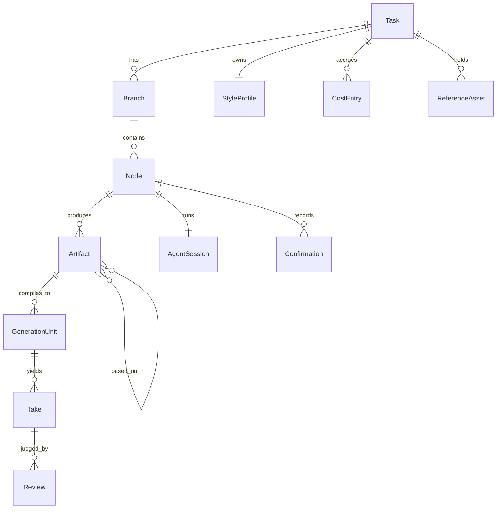

# 05 · 数据模型（草稿）

最后更新：R3（2026-09-17）
本轮变化：Node 的 `node_type` 加入 `brief`（第一张纸）与 `merge`（合并裁决）；新增 TaskSheet（工种任务单）与 Returned（退回请求）；ReferenceAsset 扩为项目资源库并写明取用角色。仍全部为 **[建议]**。

## 实体一览



## Task（历史任务）

- **[用户 R2-11]** 一整条工作流程结果轮次内的内容；多次 branch 也在同一个 Task 里。
- 字段：`task_id`、标题、创建时间、原始需求文本、参考素材引用、工作流模板版本、分支树根、状态（进行中 / 有成片 / 归档）。
- 磁盘：一个项目目录，媒体文件不进数据库。

## Branch（分支）

- 由某个 Node 上的 branch 操作产生；记录 `forked_from_node_id`、`forked_at_revision`。
- 分支共享上游节点，拥有自己的下游节点集合。

## Node（节点）

- `node_id`、`branch_id`、`role`（编剧 / 导演 / 美术 / …）、`stage`（阶段序号）、`node_type`（`brief` 第一张纸 / `craft` 创作 / `merge` 合并裁决 / `compile` 编译 / `review` 审片 / `assemble` 组装 / `sound_final` 声音定稿）、`state`（03 的状态机）、`depends_on[]`（上游 node_id + 要求的最低 status）、`skills[]`（加载的 skill 路径）、`agent_session_ref`、`task_sheet_ref`（本节点的工种任务单）。
- 节点开场输入（thawing 时组装，02 的对齐原则）：`task_sheet` + `depends_on` 的 ready 工件 + 资源库索引 + 风格档案。不含其他节点的聊天。

## TaskSheet（工种任务单，D-16）

- 第一张纸上每个工种一行，用户 yes 后固化；每个节点 thawing 时作为开场输入。
- 字段：`role`、`what`（做什么）、`inputs[]`（依赖谁的什么工件）、`expected_output`（产出与格式）、`user_locks[]`（本工种要守住的用户锁定项）、`revision`（纸的修订号）。
- 用户在纸上改某一行 → 该行 `revision +1`；若对应节点已 thawing / active，节点收到"任务单更新"通知并在聊天里提示。

## Returned（退回请求）

- 由合并裁决节点（或任何有权退回的节点）发给上游工种节点：`from_node_id`、`to_node_id`、`artifact_id`、`sections[]`（具体段落 / 镜头 ID）、`issue`（冲突四句）、`required`（要求）、`status`（open / resolved）。
- 收到方节点转 `stale`，纸上高亮对应段落；resolved 后发出方节点自动重跑核对。

## AgentSession（会话）

- 运行时线程 ID（codex `thread.id` 或其他）、cwd、加载的 skill roots、开始 / 最近活动时间、上下文胶囊（skill 的"上下文胶囊"格式，hold 时写盘）。

## Artifact（工件）

沿用 skill 包约定，直接可用：

| 字段 | 来源 | 说明 |
|---|---|---|
| `project_id` | skill | = task_id |
| `artifact_id` | skill | 稳定 ID，如 `script`, `storyboard`, `art-scene-cards`, `gen-manifest` |
| `revision` | skill | 整数递增 |
| `based_on[]` | skill | `{artifact_id, revision}` 列表，即上游依赖版本 |
| `owner` | skill | 角色 |
| `status` | skill | `draft / ready / superseded`；shotgun 追加 `stale`（需复核）作为派生状态 |
| `open_questions[]` | skill | 仍影响下游的问题 |
| `changes[]` | skill | 改了哪些 ID、谁受影响 |
| 正文 | — | Markdown；分镜 / 场景卡等带可引用 ID（镜头 ID、场次、场景卡 ID） |
| `sections[]` | shotgun | 可引用段落索引，用于段落级需复核 |

## Confirmation（确认记录）

- `node_id`、时间、agent 给的 `summary / assumptions / open_points`、用户动作（yes / no / input）、用户输入文本、对应的 artifact revision。

## GenerationUnit（生成单元）

- 来自提示词编译节点；对应 `video-prompt-skeleton.txt` 的一个单元：镜头 ID 或镜头组、提示词版本、参考资产与职责、目标 provider 与当期参数、`validate_prompt.py` 结果、估算成本。
- 对应 `prompt-version-log.csv` 一行。

## Take

- 对应 `take-log.csv` 一行：镜头 ID、Take ID、生成日期、模型与版本、参数、提示词版本、输出文件、可用区间、结论（过 / 保 / 修 / 废）、症状与时间码、根因假设、下次只改一项、实际成本。
- 同一镜头的多个 Take 是 **variants**（可比较、可选中），不是线性 revision。

## Review（审片 / critic 结论）

- 适用于 Take（生成审片）与 Artifact（工种 critic）。字段：级别（P0 / P1 / P2）、可观察症状、影响、修法、验收条件、结论来源（agent 自审 / critic 轮 / 用户）。

## StyleProfile（项目风格档案）

- 直接用 `project-style-profile.json`（status: candidate / confirmed / model_specific / deprecated；department 用 VVF 角色词）。写入时机：用户在聊天里说"以后都这样"→ agent 记 candidate；用户确认 → confirmed。

## CostEntry（成本账）

- **[用户 R2-1]** 预算 = token + 生图 + 生音乐 + 生视频。
- 字段：时间、`node_id`、类型（agent_token / image_gen / video_gen / music_gen）、provider、模型、用量单位与数量、单价（带日期）、金额、估算 / 实际。
- 价格表单独维护，带 `valid_as_of`。

## ReferenceAsset（项目资源库，D-17）

- **[用户 R3]** 初步沟通阶段引导注入；存在项目中；制片、导演、美术都能拿到；需要的地方都能调用。
- 字段：`asset_id`、类型（参考图 / 参考片 / 品牌规范 / 产品图 / 字体 / logo / 其他）、文件路径、用户说明、注入时刻（哪个节点、哪轮）、`frame_description`（帧描述规范读图结果，可延后生成）、`tags[]`、`used_by[]`（引用它的节点与生成单元）、在生成单元中的单一职责（编译节点分配）。
- 读取权限：**[用户]** 制片 / 导演 / 美术；**[建议]** 角色与服化、摄影、编译、审片也应可读（Q-20）。写入权限：用户（投放）、编译节点（写职责分配）、任何节点可追加 `frame_description`。
- 资源库是全任务共享的，不随 branch 分叉；分支只在 `used_by` 上有差异。

## 磁盘布局（建议）

```
<task_id>/
├── task.json
├── library/                    项目资源库：用户素材 + 读图结果 + library.json 索引
├── brief/                      第一张纸：task-sheets.r<N>.json + brief.r<N>.md
├── branches/<branch_id>/
│   └── nodes/<node_id>/
│       ├── node.json
│       ├── artifacts/<artifact_id>.r<N>.md
│       ├── returned.jsonl      收到 / 发出的退回请求
│       ├── confirmations.jsonl
│       ├── session/            上下文胶囊、运行时线程 ID
│       └── skills -> ../../../../skills/<role>   (符号链接或 skill roots 配置)
├── generation/
│   ├── manifest.r<N>.json      生成清单
│   ├── takes/<shot_id>/<take_id>.mp4 + .json
│   └── prompt-version-log.csv · take-log.csv · continuity-ledger.csv
├── style-profile.json
├── costs.jsonl · price-table.json
└── edit/                       剪辑工程（引擎格式）+ 导出（mp4 / otio / fcpxml / xml）
```

## 待定

- Q-09 段落级需复核第一版是否做。
- Q-10 成本归因粒度（节点 / turn）。
