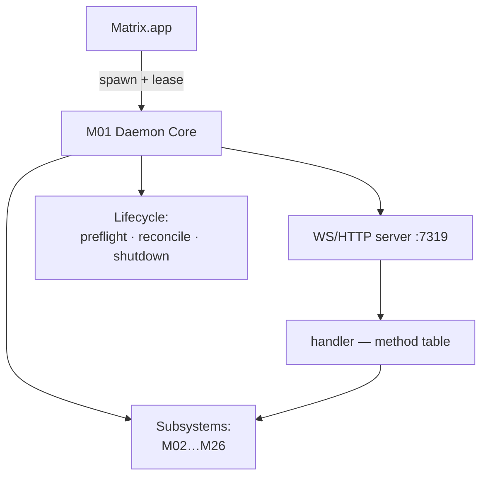
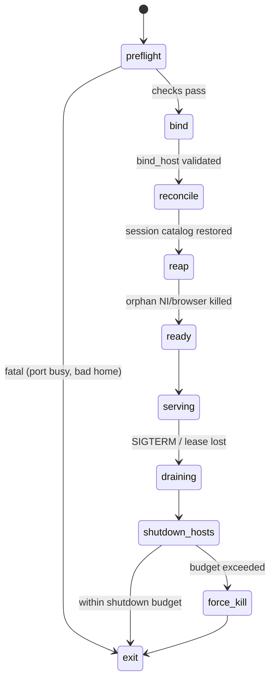

# M01 · Harness Daemon Core

**Source modules:** `cli`, `app_server`, `server`–`server4`, `handler`, `protocol`, `contract`,
`paths`, `bind_host`, `token`, `ws_trace`, `sidecar`, `controller`, `process_identity`,
`owner_contract`, `lease`, `reconcile`, `preflight`, `shutdown_budget`, `shutdown_hosts`,
`reapOrphanNi`, `reapOrphanBrowser`, `logger`, `file_lock`

---

## Purpose

Own the process. Everything else in the daemon is a subsystem it starts, supervises and
shuts down. It is also the single network surface.

## Position

## Public surface

- **CLI**: `neo daemon run|status|logs|doctor`, `neo department …`, `neo media …`,
  `neo email …`, `neo info`, `neo init <workspace>`
- **Contract**: `neo info` emits host/port/wsPath/paths/env/apiKeyEnv (see runtime spec §2.1)
- **Transport**: WebSocket `/ws`, UNIX socket `neo.sock`, HTTP with Range for file streaming

## Lifecycle

- **preflight** — validate `NEO_HOME`, migrate config, verify seed dir, check runtime installs
- **reconcile** — rebuild the live session catalog from disk; `canonical_chat_session_repair`
  fixes sessions whose transcript forked
- **lease** — `owner.json` + `supervisor.lock`; losing the lease is a shutdown trigger
- **shutdown_budget** — a wall-clock bound; hosts exceeding it are killed by process group

## Failure modes

| Failure | Handling |
|---|---|
| Port 7319 busy | preflight fails with a diagnosable error; `neo daemon doctor` reports it |
| Non-loopback bind requested | hard refusal unless `NEO_DAEMON_ALLOW_NON_LOOPBACK=1` |
| Owner process dies | lease lost → graceful drain |
| Crash with live agents | next start's `reapOrphanNi` / `reapOrphanBrowser` cleans up |
| Concurrent writers to a JSON store | store-specific locking; `writeFileAtomic` writes temp then renames, with no fsync in this helper; do not infer multi-file transactions or power-loss durability |
| Client disconnect mid-turn | disconnect removes the socket. Recovery is by re-reading state (`chat.bootstrap`/`chat.history` with `before/after/around`, `session.history`, `session.live`), **not** by event replay: the only sequence-numbered store is `EventJournal` (`neo-agent.fmt.js:116397`), an **in-memory `Map<streamId, event[]>`** with per-stream `seq`, served by `runtime.stream.events {streamId, afterSeq, limit, tail}` and lost on daemon exit. Broadcast frames (`serializeEvent`, `:30024`) carry no sequence number. A replica that wants reconnect-replay must add a durable, sequenced journal — Matrix does not have one **[V]** |

## Logging

pino, pretty-printed in dev, JSON in production, to `~/.neo/daemon/daemon.log` with rotation.
Per-subsystem child loggers (`createLogger("session-host")`, `"api-server"`,
`"matrix-workspace-mcp"`, `"daemon-runtime"`, …) — ~50 named loggers.

Optional `ws_trace` records every frame to a file for protocol debugging. Ship this.

## Reuse in shotgun-next

**Copy wholesale.** The shape — a supervised local daemon owning all state, a single loopback
WS surface, explicit preflight/reconcile/shutdown phases, orphan reaping, atomic JSON writes —
is exactly right and costs little.

Change: define the method table from a schema so the client SDK is generated, not hand-written.
