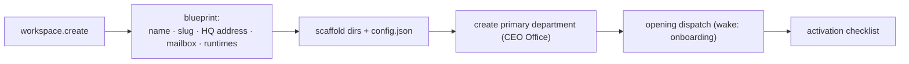

# M02 · Workspace Store

**Source modules:** `init`, `config`, `store`, `store2`–`store7`, `types`, `paths`,
`workspace_config_snapshot`, `storage_cleanup`, `content_store`, `conflict_store`,
`legacy_department_associations`, `brand_slug`, `runtime_stable_references`

---

## Purpose

Create, load, migrate, repair and archive workspaces; own the on-disk contract.

## Data owned

- `~/.neo/config.json` — the workspace registry
- `<ws>/config.json` — workspace manifest (`schemaVersion: 5`, migrations list)
- `<ws>/.env` — workspace environment, loaded via `loadWorkspaceEnv()` into agent sessions
- Directory scaffolding for workspace and departments

## Key operations



- `ensureDepartmentScaffold(root, {id,name})` — idempotent; runs on every prompt build, so a
  hand-deleted directory self-heals
- `getWorkspacePaths()` / `getDepartmentPaths()` — the single source of path truth
- Archive (`archivedAt`) rather than delete; `workspace.restore` reverses it
- `storage_cleanup` — prunes `tmp/`, stale attachments, expired revisions

## Migrations

`CURRENT_WORKSPACE_SCHEMA_VERSION = 5`, with a `migrations` array recorded in the manifest.
Observed legacy handling: `migrated-ws-*` ids, `legacy_department_associations`,
`HubLegacyWorkspaceUserProfileRecord` (per-workspace `memory/USER.md` → global profile).

**Lesson:** they shipped five schema versions in months. Build the migration list into the
manifest from v1.

## Blueprint generation

Every workspace gets identity theatre at creation:

```json
{ "cyberpunkAddress": "https://ready.hq.matrix.company",
  "emailAddressSuggestion": "team@ready.agent",
  "preferredWorkerRuntimes": ["neo","codex","claude_code"] }
```

Cheap, and it does a lot of work for the "this is a real company" feeling.

## Reuse in shotgun-next

Copy the pattern; rename the concepts (Workspace → Studio / Production). Keep:

- registry-of-workspaces separate from workspace-manifest
- `schemaVersion` + migration log from day one
- idempotent scaffolding invoked on every context build
- archive-not-delete
- a `.env` per workspace injected into agent sessions
