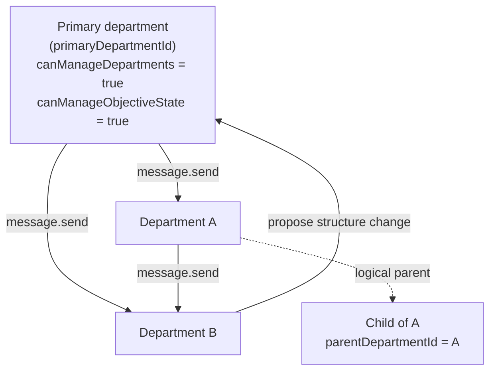

# M03 · Department Registry

**Source modules:** `config` (departments section), `matrix_workspace_mcp`,
`runtime_department_hosts`, `agent_context`, `department_management` (managed skill)

---

## Purpose

Own the org chart: who exists, what they own, who they report to, and whether they are alive.

## Data model

See [data model §3.1](../docs/04-data-model.md#31-departmentrecord). The essential part is that
a department's **job description is structured data**:

```ts
profile: {
  charter: string
  capabilities: { coding|browser|computer: "primary"|"supporting"|"none", domains: string[] }
  collaborationBoundary: {
    keepLocal: string[]            // what this owner does itself
    handoffToDepartment: string[]  // when to route out
    createChildDepartment: string[]// when to form a new owner
  }
}
```

Both the prompt (`buildDepartmentProfileContext`, `buildDepartmentTopologyContext`) and the UI
(`HubDepartmentProfile`, `DepartmentSidePanel`) read the same structure.

## Topology rules



- Directories are **flat**: `departments/<id>/`. Hierarchy is *logical* via
  `parentDepartmentId` only. This avoids path churn on reorg — copy it.
- Only the primary may `department.create/update/delete`.
- Non-primary departments **propose** structure changes via `message.send`.

## Lifecycle

```
active ──► retired    ordinary end of work; history preserved
active ──► merged     absorbed by another owner
any    ──► deleted    hard delete, requires confirmDepartmentId echo
```

> "Use `department.update` lifecycle retired/merged for ordinary department evolution;
> `department.delete` is hard deletion only."

Retired/merged departments get `DISABLED_NUDGE_LANES` — they stop waking but stay readable.

## Creation policy

The decision ladder from the `department-management` skill:

1. Work falls within an existing department's responsibility → `message.send` to that owner.
2. It doesn't → create the smallest set of owners now; **one clear ask is enough**.
3. Vague ambition → a Task under whichever owner is responsible.

After creating: write a **routing memory card** at
`memory/knowledge/routing-*.md` (`tag: self`, `confidence: H`) stating the routing condition,
the target department, what the primary keeps local, and what context to include in the first
message. Then record a structure-change Task with storage kind `org_change`.

> "Name departments for user workflows and responsibilities, not tools, file formats, or
> implementation details."

## Naming discipline

Observed in the wild — good and bad:

| Name | Verdict |
|---|---|
| `CEO Office` | good — a role |
| `量化选股引擎部` (Quant Stock Selection Engine Dept) | good — a domain |
| `UGC Forge Department` | acceptable — a workflow |
| `技术支援部` (Tech Support Dept) | good |

## Reuse in shotgun-next

Keep everything, rename `Department` → `Role` (or `Seat`). The `collaborationBoundary` triple
is the highest-value idea in the whole registry: it turns "stay in your lane" from a prompt
plea into a queryable, editable, UI-renderable contract.
