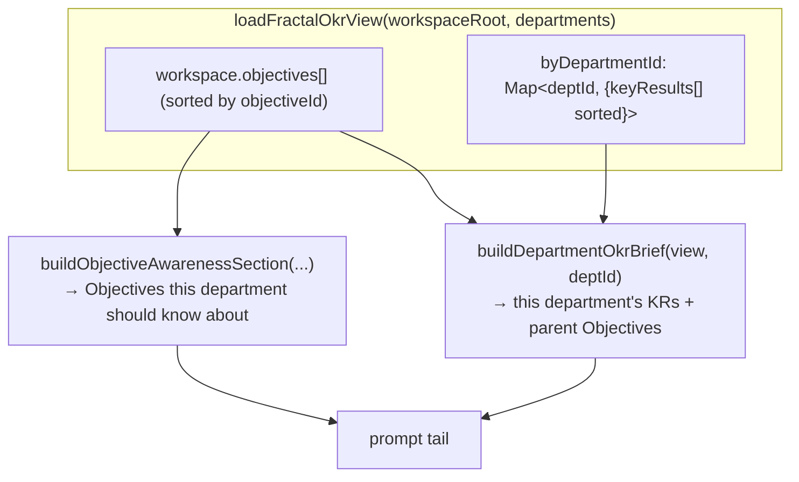

# M04 · OKR Engine

**Source modules:** `okr_workspace_mcp`, `mutations`, `store3`, `task_link`, `objective_awareness`,
`key_result_acquisition`, `reader`, `okr_snapshot`, `endpoint_registry` (parsers)

---

## Purpose

The single write surface for direction and measurable progress. Enforces the split between
workspace strategy (Objectives) and department execution (Key Results).

## Stores

| Store | Contents | Writer |
|---|---|---|
| `<ws>/okr.json` | Objectives only | primary department |
| `departments/<id>/okr.json` | Key Results owned by that department | that department (or primary, delegating) |

Invariant, checked on write: *a Key Result's `ownerDepartmentId` equals the store it lives in.*

## Fractal view



Deterministic sorting matters: it keeps the injected brief byte-stable between turns when
nothing changed, which protects the cache.

## Actions

```
DEPARTMENT_ACTIONS = state.get · key_result.create · key_result.update
                     key_result.state_patch · task.upsert · task.check_in
PRIMARY_ACTIONS    = DEPARTMENT_ACTIONS + objective.create · objective.update
                     · objective.state_patch
```

Aliases are normalized (`state|get|read → state.get`, `task.create|task.update → task.upsert`,
`objective.patch → objective.state_patch`, …). Unsupported actions return the allowed list plus
a `next` hint. **Error messages teach the schema** — this is why the model recovers from a bad
call in one retry instead of five.

## Patch semantics

```
objective.state_patch  ⊂ { health, riskSummary, lastProofAt }
key_result.state_patch ⊂ { status, progress, health, blockers, confidence, nextAction,
                           proofRefs, learningRefs, appendProofRefs, appendLearningRefs }
```

- `progress` stored 0..1; `50` / `100` accepted and normalized (`>1 && <=100 → /100`).
- Append variants exist so a check-in can add proof without re-sending the whole array.
- Meaning changes (title, summary, owner, horizon) use `*.update`. Human confirmation for strategy changes is prompt guidance; the inspected Objective handler enforces primary authority and a completion/open-KR gate, not universal human approval of every edit.

## Guards

- `requirePrimary(deps)` → *"Objective actions are only available from the primary department"*
- `resolveTargetDepartment()` → a non-primary cannot mutate another department's state
- `checkDestructiveWorkspaceDataWrite()` → text describing a destructive file/data operation
  requires recent explicit user confirmation
- `withMutationNotification()` → after a successful persist, notify (`afterMutation`) so the
  dashboard/nudge can refresh. **A throwing notifier never fails the mutation** — it logs and
  still returns `ok:true`. Correct ordering.

## Health & status vocabularies

```
Objective.status  draft | active | blocked | completed | cancelled
KeyResult.status  draft | active | at_risk | blocked | completed | cancelled
health            on_track | at_risk | blocked | done
priority          low | normal | high
effortSize        quick | deep        ("deep" ⇒ must decompose before executing)
```

## Reuse in shotgun-next

Keep the engine; change the nouns:

| Matrix | shotgun-next |
|---|---|
| Objective | **Brief** — what the client/founder wants |
| Key Result | **Milestone** — an observable deliverable state |
| Task | **Work Item** |
| targetState | **definition of done** |
| effortSize: deep | **needs a breakdown pass** |

Keep: the two-store split, the owner invariant, action aliasing with teaching errors, patch vs
update separation, append-only proof arrays, and post-mutation notification that can't fail the
write.
