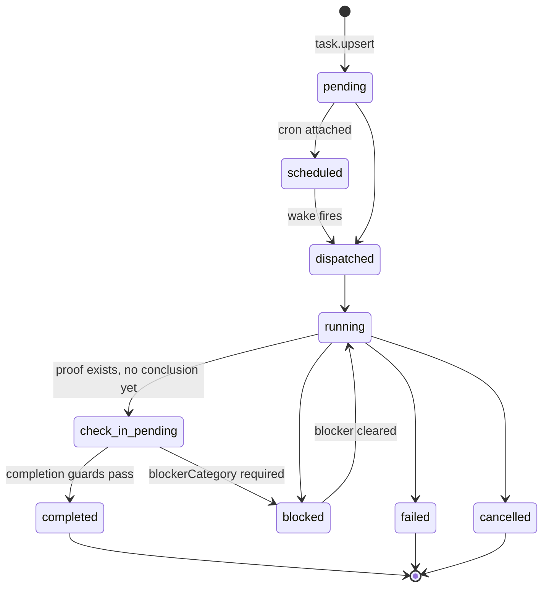

# M05 · Task Engine

**Source modules:** `tasks`, `task_input`, `task_output_preview`, `local_task_index`,
`task_link`, `task_detail_transcript_source`, `proof_pins`, `delivery_proof`, `task_snapshot`,
`task_notification_xml`, `okr-execution` (managed skill)

---

## Purpose

Durable, owned, proof-gated units of work. The Task is the atom the whole system schedules,
nudges, proves and reports on.

## The two-task problem (solved explicitly)

Matrix ships **two** task systems and spends a whole section of the `okr-execution` skill
separating them:

| | OKR Task | Session scratch |
|---|---|---|
| Tools | `mcp__okr__state` `task.upsert` / `task.check_in` | `TaskCreate/Get/Update/List`, `TodoWrite` |
| Storage | `departments/<id>/tasks/*.md` | `TaskCreate/Get/Update/List` use runtime `tasks/<listId>/<id>.json`; TodoWrite is a separate conversation planning surface |
| Survives session | **yes** | task-list files can persist; list selection depends on environment/team/session identity |
| Has owner / proof / check-ins | yes | no |
| Appears on board & wakes | yes | no |

> "Never let a `TaskCreate` scratch item stand in for an OKR Task — that produces a 'ghost
> task' that looks done but vanishes with the session."

The shipped skill calls the built-ins ephemeral, but runtime code contradicts that physical-storage claim (`neo-intelligence.fmt.js:203232`). The useful distinction is ownership/proof/OKR integration, not RAM versus disk.

## Packet format

Markdown + YAML frontmatter, sections fixed. See
[data model §5](../docs/04-data-model.md#5-task-packet--departmentstasksmd) for the
full shape and a real example.

Markdown makes packets inspectable and diffable. Direct file writes are technically possible but are not an endorsed fallback: shipped prompts require tool-managed state to remain behind its owning tools. Recovery must preserve validation and audit records.

## State machine



**Only `task.check_in` writes terminal states.** `task.upsert` can create or revise an open
packet and nothing else. This one rule prevents the most common agent lie: marking work done
without evidence.

## Criteria

```md
## Criteria
- [open] A1: Deliver the reminder to the user at or after the due time.
- [satisfied] A2: Attach the delivered message as proof.
  - proof: artifacts/report.md
```

Statuses: `open | satisfied | blocked | not_applicable`. Completion requires nonempty criteria, no open/blocked criteria, at least one satisfied criterion, and proof on every satisfied criterion. `not_applicable` is permitted. Review-kind Tasks also require `reviewState=approved`. Completed/failed/cancelled Tasks cannot reopen to a nonterminal state; blocked Tasks may resume. These checks validate references and declared state, not the substantive truth of a deliverable.

Timing discipline, which is subtle and good:

> "A repeated Task is complete for the slice whose criteria can be truthfully proven now;
> preparation may create drafts or queues, but it does not complete future slices. When no
> external timing constraint exists, continuation should keep going."

## Proof

> "Placeholder values (`TBD`, bracketed text, empty owners, 'pending partner input', draft-only
> assumptions) count as blockers, never proof, unless the Criteria explicitly asked for a blank
> template."

Proof ref forms: workspace/department-relative path (preferred), `file://` absolute URL, HTTP
URL, message id, task output id, worker activity id.

`proof_pins` lets specific refs be pinned; `delivery_proof` records that a message/deliverable
actually reached its recipient.

## Check-in procedure (7 steps, from the skill)

1. Attach proof refs.
2. Set `check_in_pending` if proof exists but no conclusion yet.
3. Mark criteria `satisfied | blocked | not_applicable`.
4. Write the Check-in: `authorDepartmentId`, one-line `judgment`, `status`, `nextAction`,
   `proofRefs`, learning refs.
5. If linked, choose `keyResultDecision`: `accept` the auto-suggestion, `modify` with an
   explicit `keyResultState`, or `reject` with a clear judgment.
6. If blocked/failed/cancelled/wrong: record the smallest viable change — split, reroute,
   change owner, adjust criteria, alternative Task.
7. Choose `learningDecision`. For `memory-card` / `skill-update`, **write the destination file
   first** and put the path in `learningRefs`.

Step 5 applies to KR-linked tasks. Learning decisions are conditionally validated when learning refs are written; the Zod fields themselves are optional. Do not confuse schema optionality, handler requirements and prompt guidance.

## Verifier loop

> "If criteria have a verifier such as a test, script, checklist, visual diff, browser proof,
> metric, or reviewer reply, run the verifier loop: inspect the actual state, change the
> narrowest mutable surface, run or check the verifier, attach the result as proof, keep
> improving until satisfied, blocked, out of budget, or stopped by a real timing boundary."

## When *not* to create a Task

> "A one-off ask you can satisfy now and that leaves no follow-up does NOT need the Task loop —
> even when it takes several tool calls or a fanned-out worker run; just do the work and reply."

Without this rule, agents create ceremony for trivia. It belongs in the skill description, not
buried in the body.

## Reuse in shotgun-next

Copy the engine almost unchanged. Rename `Task` → `Work Item`, `Criteria` → `Acceptance`,
`Check-in` → `Review`. Keep: Markdown packets, terminal-state monopoly for check-in, the
placeholder-is-a-blocker rule, the learning decision enum, and the explicit "don't make a task
for trivia" carve-out.
