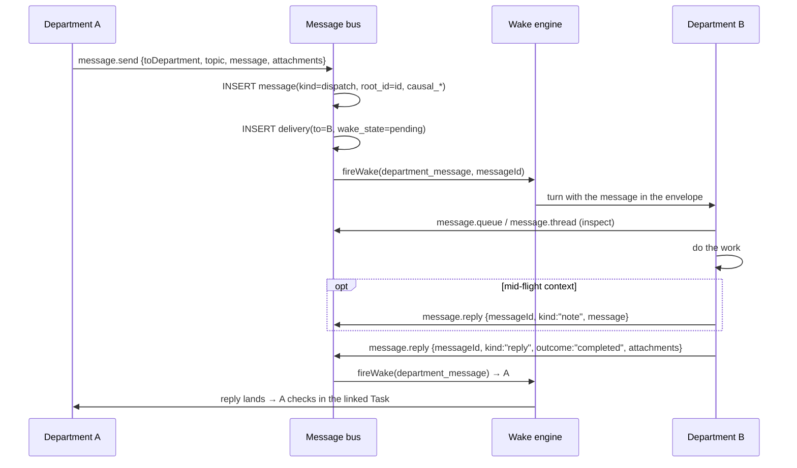

# M06 · Department Messaging

**Source modules:** `department_message`, `runtime_department_messages`, `inbox`, `outbox`,
`message_projection`, `department_message_snapshot`, `conflicts`, `chat_routing`,
`caller_from_actor`, `turn_durability`

---

## Purpose

The cross-owner channel. Everything that moves work between departments goes through here, and
nothing else does.

## Storage

SQLite at `<ws>/department-messages/messages.sqlite` (WAL mode). Full schema in
[data model §6](../docs/04-data-model.md#6-department-message-bus--department-messagesmessagessqlite).

Three tables: `messages`, `deliveries`, `attachments`. The CHECK constraints encode the protocol:

```sql
CHECK (kind IN ('dispatch','reply','note'))
CHECK (outcome IS NULL OR outcome IN ('completed','failed','cancelled'))
CHECK (kind <> 'dispatch' OR reply_to_id IS NULL)   -- a dispatch can't be a reply
CHECK (outcome IS NULL OR kind = 'reply')           -- only replies carry outcome
```

## Protocol



## Actions (via `mcp__matrix__department`)

| Action | Minimal args | Notes |
|---|---|---|
| `message.send` | `action, message, toDepartment, topic?, attachments?` | **never** send `kind`, `outcome`, `messageId`, `department`, `query`, `sessionId`, `includeBodyFor` |
| `message.reply` (reply) | `action, messageId, message, outcome, attachments?` | recipient inferred from `messageId` |
| `message.reply` (note) | `action, messageId, kind:"note", message` | no `outcome` |
| `message.queue` | `department?` | pending work |
| `message.thread` | `messageId, includeBodyFor?` | compact context; one exact body on request |

The tool description enumerates the minimal argument set per action and explicitly lists fields
**not** to send. This is a strong technique for reducing malformed calls — the live trace shows
early validation failures against exactly these fields, and the description grew in response.

## Design rules encoded in the tool description

- *"Department message bodies are stored losslessly. Substantial deliverables land in a Markdown
  file in the shared workspace, with a concise summary in the message body and the file path in
  attachments."*
- *"A business result lands once `message.reply kind='reply'` with `outcome` closes the thread."*
- *"Keep department tool calls minimal: omit optional fields instead of sending empty strings,
  empty arrays, or placeholders."*
- A dispatch that expects action should include: **the task, owner, context refs, expected
  output, proof expectation, and blocker/stop condition.**

## Delivery reliability

`deliveries` is separate from `messages` so:

- one dispatch fans out to N recipients with independent state,
- `wake_state ∈ {pending, queued, failed}` + `wake_attempts` + `last_error` give retry with
  visible failure,
- `dedupe_key` makes re-delivery idempotent.

## Chat reads

`chat.read_recent` and `chat.search` let a department read *another department's* conversation
with the user. Implementation (`createDepartmentChatReaderForMcp`):

- resolves the target session (canonical chat session, or by `sessionId`),
- hydrates lazily (`ensureSessionStateHydrated`),
- for search, scans up to `max(limit, 200)` messages and filters on lowercased substring,
- caps `limit` to `[1, 50]`.

The prompt rule: *"When the user refers to prior conversation with another department, infer the
exact department name/id from Department Topology, then call `chat.read_recent` or `chat.search`
before answering."*

## Conflicts

`conflicts` + the prompt's conflict rule: when user instructions to multiple departments collide
on the same artifact, promise or decision, the exact conflict is surfaced to the primary
department; local work stays cheap and reversible until the ruling lands.

## Reuse in shotgun-next

**Copy this module almost verbatim.** It is the best-designed piece in the system.

Renames: `dispatch` → `assignment`, `note` → `comment`, `reply` → `delivery`. Keep the
three-kind vocabulary, the CHECK constraints, the split deliveries table, the causal columns,
and the "summary in the message, deliverable in a file" rule.
