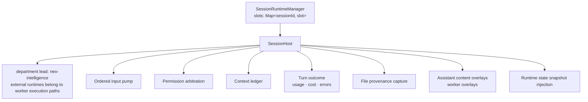

# M07 · Session Host

**Source modules:** `session_host`, `session_host_lifecycle`, `session_host_permissions`,
`session_host_query_runtime`, `session_host_turn_outcome`, `session_host_support`,
`session_host_model_routing`, `session_runtime_manager`, `runtime_session_orchestrator`,
`runtime_department_hosts`, `ordered_input_pump`, `context_ledger`, `context_window`,
`context_overflow`, `session_model_selection`, `ni_lifecycle_policy`, `tool_lifecycle`,
`user_input_delivery`, `assistant_content_overlays`, `worker_overlay_store`

---

## Purpose

Own one agent process and everything that happens inside one turn.

## Responsibilities



## Host state (`getState()`)

```ts
{ hostState: "starting"|"running"|"idle"|…,
  hasActiveTurn: bool, queuedTurns: number,
  activeTaskCount: number, pendingPermissionCount: number,
  streamMode: "requesting"|"thinking"|"responding"|"tool_input"|"tool_use"|"compacting"|…,
  phase: "running"|"queued"|"delegated"|"waiting_for_permission"|…,
  nudgeBackoffUntil: number }
```

Consumed by: nudge gating, context refresh gating, idle retirement, the UI's presence dots and
the 3D office's worker animation state.

## Quiet policy

```ts
QUEUE_SENSITIVE_PURPOSES        = { idle_retire, background_dispatch }
STREAM_PHASE_SENSITIVE_PURPOSES = { idle_retire, context_refresh, background_dispatch }
isNiLifecycleQuiet(state, purpose)
```

Three purposes, three different definitions of "quiet". Generalising to one boolean would break
either responsiveness or safety — a good lesson.

## Turn stall watchdogs

| Situation | Timeout | Constant |
|---|---|---|
| Visible turn in `requesting` | 120 s | `DEFAULT_VISIBLE_REQUESTING_TURN_STALL_MS` |
| Long-context visible turn | 180 s | `DEFAULT_LONG_CONTEXT_VISIBLE_REQUESTING_TURN_STALL_MS` |
| Background turn | 300 s | `DEFAULT_BACKGROUND_REQUESTING_TURN_STALL_MS` |
| Compaction | 180 s | `DEFAULT_COMPACTING_TURN_STALL_MS` |
| Fast read-only tools | separate | `FAST_TOOL_STREAM_INACTIVITY_WATCHDOG_TOOLS = {read,grep,glob,ls}` |

Retries on transient API errors: `[0, 1000, 3000] ms`.

Emitted to the client as `runtime.raw.event` frames with `rawType: "session.turn_failure"` /
`"session.turn_stream_inactivity"` (`neo-agent.fmt.js:139639`, `:139675`) so the UI can say
something honest instead of spinning forever. They are raw-event subtypes, not entries in the
41-event registry.

## Prompt refresh

```
refreshPromptContext(context, {reason, policy}) → applied | deferred | not_running | cancelled
```

`HOT_PROMPT_CONTEXT_QUERY_OPTION_KEYS` = `{instructions, systemPrompt, appendSystemPrompt,
model, permissionMode}` are eligible for hot adoption. Replacement reasons instead include environment, working directory, incompatible MCP surface and non-hot options. With `policy:"defer"`, a busy host schedules for its
next quiet window; `refreshRunningWorkspaceIntegrations` uses exactly this and returns
`{applied, deferred, notRunning, failed}` counts.

## Diagnostics filtering

```
INTERNAL_CONVERSATION_DIAGNOSTIC_ERROR_PATTERNS = [
  /\[ede_diagnostic\]/i, /\bensureToolResultPairing\b/,
  /\bMessage structure:\s*\[\d+\]\s+(?:user|assistant)/i,
  /\btool_use\/tool_result pairing mismatch detected\b/i ]
```

Internal runtime diagnostics are recognised and kept out of the user's chat. Ship an equivalent
filter — runtime plumbing errors leaking into a "colleague's" message destroys the illusion
faster than anything else.

## Content overlays

`assistant_content_overlays` and `worker_overlay_store` let the daemon *augment* what the user
sees over the raw model stream — worker attribution, file evidence, provenance chips — without
mutating the transcript. `RECENT_WORK_TRACE_SECTION_RE` surgically replaces the injected
"Recent Work Trace" section rather than rebuilding the whole prompt.

## Mirrored writes

```
MIRRORED_WORKSPACE_WRITE_TOOLS = { "Write" }
```

Writes performed by the agent are mirrored into the file ledger so provenance is captured even
though the agent used a plain file tool.

## Reuse in shotgun-next

Copy: the state shape, the three-purpose quiet policy, the watchdog table, the hot-key refresh
list, the diagnostics filter, and mirrored writes for provenance.

Simplify: one runtime adapter interface (`start / send / interrupt / refresh / close / events`)
with implementations per backend, instead of the branchy env-var approach Matrix uses.
