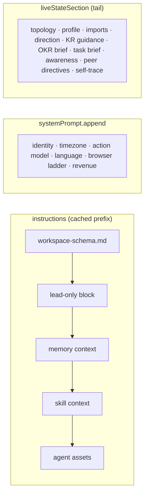

# M08 · Prompt Assembly

**Source modules:** `runtime_prompt_context`, `runtime_state_snapshot`, `agent_context`,
`objective_awareness`, `key_result_acquisition`, `response_language`, `transcript_excerpt`,
`user_profile`, `slash_command_messages`, `synthetic_user_message`, `literal_escape_guard`

---

## Purpose

Turn "a department, right now" into a model-ready context — without invalidating the prompt
cache.

Full narrative in [docs/06-prompt-architecture.md](../docs/06-prompt-architecture.md). This
page covers the module's mechanics.

## Entry point

```ts
buildDepartmentPromptContext({ workspace, departmentId, sessionId?, nowMs?, … })
  → { dir, workspaceDir, departmentId, departmentPaths, departmentDisplayName,
      departmentConfig, model, modelProvider, proactive,
      memoryContext, skillOverlayDir, instructions,
      liveStateSection, mcpServerSpecs, sharedQueryOptions }
```

It is called from four places: session creation, wake dispatch, integration refresh, and
session fork/rename — always with the same signature.

## Assembly order



Joined with `\n\n---\n\n`, empties dropped, each section trimmed.

## The cache contract

| Changes | Effect |
|---|---|
| `instructions`, `systemPrompt`, `appendSystemPrompt`, `model`, `permissionMode` | eligible for hot adoption; these keys alone are excluded from replacement reasons |
| `env`, working directory, incompatible MCP surface, non-hot options | may require process replacement, deferred while busy |
| OKR, tasks, topology, traces, profile in `liveStateSection` | refreshed as tail state; distinct from SDK query options |

Consequence for implementers: **anything volatile must be excluded from `instructions`.**
The memory context deliberately filters default scaffold text so an empty workspace doesn't
produce a different (and then changing) prefix.

## Sub-builders

| Builder | Output |
|---|---|
| `buildWorkspaceMemoryContext` | authored `RULES.md` (workspace+department), Mission intake, non-empty memory indexes — scaffold text filtered |
| `buildSkillContext` | `name + scope + description` list; creates the overlay root |
| `buildDepartmentTopologyContext` | the org map with charters and domains |
| `buildDepartmentProfileContext` | this department's charter/capabilities/boundaries |
| `deriveDepartmentDirectionState` → `buildDepartmentDirectionFacts` | current direction, pending parent dispatch |
| `buildKeyResultDirectionGuidance` | the next KR-level move |
| `buildDepartmentOkrBrief` / `buildDepartmentTaskBrief` | owned KRs; open tasks with ⏳ markers |
| `buildObjectiveAwarenessSection` | workspace Objectives this owner should know about |
| `buildRecentPeerUserDirectiveContext` | what the user recently told *other* departments |
| `buildSelfTraceBrief` | last 5 `trace.jsonl` entries |
| `buildSystemPrimerSection` | primer incl. nudge lanes |
| `buildOperatingActionModelContext` | the do-it-now → worker → department → OKR ladder |
| `loadAgentAssetsSection` | available assets incl. connected integration providers |

## Skill overlay

```
extraArgs: { "add-dir": skillContext.overlayRoot }
settings.permissions.additionalDirectories = [workspaceDir, overlayRoot]
```

`departments/<id>/.runtime/skill-overlays` (+ `skill-stable`) presents workspace + department +
managed skills as one mounted tree without polluting the workspace. Copy this: it cleanly solves
skill precedence and keeps `skills/` human-editable.

## Conditional sections

Everything branches on two booleans and one flag:

- `hasExecutiveWriteScope` (= is primary) → State Authority, Architecture Judgment, Persona
- `browserUsePluginEnabled` → browser ladder vs "plugin disabled" message
- `nudgeLanes` → primer wording and proactive cadence guidance

Plus marketplace import / acquisition handover contexts when present.

## Timezone handling

```
agentTimeZone = resolveMatrixAgentTimeZone(process.env)
INFRASTRUCTURE_UTC_TIME_ZONES = { UTC, Etc/UTC, Etc/GMT, GMT }   // treated as "not configured"
```

Resolution checks explicit workspace/agent/business timezone variables, then non-UTC `TZ`, then the host zone, then UTC/system fallback (`129241`). Only the last case is described as unconfigured in the prompt. This child/prompt policy must not be confused with cron's daemon-local Date evaluation.

## Reuse in shotgun-next

Copy the whole structure. The three things that matter most:

1. **Static prefix / volatile tail split** — biggest cost lever in the system.
2. **Conditional authority sections** — the same code builds a director's prompt and a
   contributor's prompt.
3. **Peer-directive context** — cheap, and it stops the studio contradicting itself.
