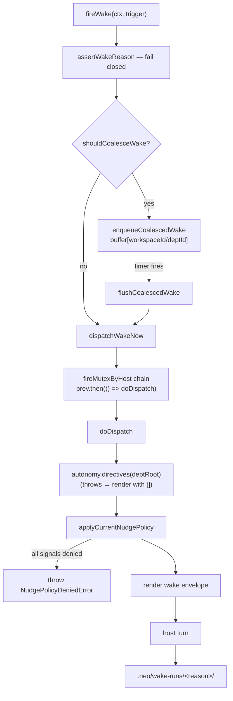

# M09 · Wake Engine

**Source modules:** `fire`, `wake`, `types2`, `hook`, `wake_scheduler`, `wake_counter`,
`external_signal_gate`, `dependency_unblock`, `runtime_nudge_dispatch`, `nudge`

---

## Purpose

Decide when an agent runs, and turn heterogeneous triggers into one coherent turn.

Full narrative in [docs/03-autonomy-and-scheduling.md](../docs/03-autonomy-and-scheduling.md).

## API

```ts
fireWake(ctx, trigger, options?) → { turnId, outcome?, policyDeniedWakeIds? }
ctx     = { workspaceId, deptId, deptRoot, host }
trigger = { reason: WakeReason, …reason-specific fields }
```

Specialised dispatchers wrap it: `dispatchNudgeWake`, `dispatchHookWake`, cron runner,
department-message delivery, onboarding/handover/import openers.

## Internal flow



Two details worth copying:

1. **The fire mutex is a promise chain per host**, with `.catch(() => {})` on the stored tail so
   one failure doesn't poison the chain.
2. **`autonomy.directives()` failing is not fatal** — it logs and renders the envelope with an
   empty directive list. Autonomy metadata must never block the turn.

## Coalescing semantics

Each buffered entry keeps its own `{resolve, reject}`. On flush:

- 1 entry → dispatch the original trigger.
- N entries → dispatch `{reason:"coalesced", windowMs, signals:[...]}`.
- Entries whose nudge kind was denied get `reject(NudgePolicyDeniedError)`; the rest get the
  shared `{turnId, outcome}`.

So a caller awaiting `fireWake` always learns the truth about *its* trigger even though the turn
was shared.

## Policy application

```ts
applyCurrentNudgePolicy(ctx, trigger):
  nudge      → denied? throw NudgePolicyDeniedError([wakeId])
  coalesced  → filter out denied nudge signals;
               if none remain → throw; else dispatch the filtered trigger
  otherwise  → pass through
```

Lane policy is applied **at dispatch time**, not at enqueue time — so toggling proactive mode
correctly affects already-buffered signals.

## Envelope rendering

The wake envelope is a synthetic user-role message describing why the agent woke. For
`coalesced` it is explicitly *"an action-oriented briefing"* rather than a list of events.
`task_notification_xml` and `synthetic_user_message` build these.

## Gates

| Gate | Purpose |
|---|---|
| lane policy | is this nudge kind enabled for this department |
| busy check | `isDepartmentNudgeBusy` — don't nudge a working agent |
| backoff | `nudgeBackoffUntil` per host |
| activity gate (`gate`, `gate_signals`, `activity_probe`) | is a periodic run worth paying for |
| `external_signal_gate` | throttle externally-originated wakes |
| `ref_decay` | age out stale operating refs |
| workspace archived | `isWorkspaceArchived` → `"disabled"` |

## Reuse in shotgun-next

Copy the whole module. It is small, self-contained, and it is the difference between "agents
that respond" and "a studio that runs".

Minimum viable version: reason registry + per-host mutex + coalescing buffer + lane policy +
busy check + audit records.
