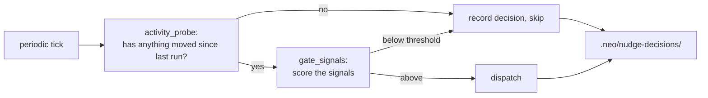

# M10 · Autonomy & Nudge

**Source modules:** `autonomy`, `focus`, `policy`, `registry`, `nudge`,
`runtime_nudge_dispatch`, `next_steps`, `operational_next_step`, `activity_probe`, `gate`,
`gate_signals`, `ref_decay`, `quiet_note_buffer`, `aggregator`, `audit`, `history`

---

## Purpose

Decide *what a department should do next when nobody asked*, and whether that is worth doing.

## Lanes

```ts
DISABLED   = { postTurn:false, periodic:false, proactiveOn:false }
PRIMARY    = { postTurn:true,  periodic:true,  proactiveOn:true  }
DEPARTMENT = { postTurn:true,  periodic:false, proactiveOn:false }
```

Only the primary gets a heartbeat. Everyone else only reacts. That asymmetry is what keeps a
12-department workspace from producing 12 idle wakeups per tick.

State: a mutable per-`(workspaceId, deptId)` record with `lanes`, plus
`snapshotAndDisableWorkspaceLanes()` / `restoreWorkspaceLanes(snapshot)` for bulk suspension.

## Next-step derivation

The ordered reason list — shared with the dashboard's task list:

```
1. due_time_trigger                          execute next action, attach proof, next Task
2. blocked_task                              remove/route/report the smallest real blocker
3. proof_check_in_pending                    check proof vs criteria, update KR, decide learning
4. active_task                               advance until proof, check-in, or blocker
5. active_key_result_missing_task            create the smallest movable proof-bearing Task
6. active_objective_missing_first_key_result create/propose the first KR, then a Task
```

Each ref carries **owner, route, and stop condition**:

> "Act through that route until the stop condition holds."

Surfaced to the client as `HubNudgeNextStepRefs` / `HubNudgeNextStepSample`.

## Post-turn nudge

Fired after every completed turn. Inputs include `endedWithQuestion` — a turn that ended by
asking the user is **not** nudged onward. Without that flag, agents interrupt their own
questions.

## Activity gate



Both outcomes are logged. `nudge.decisions.list` exposes the log; the sidebar shows states like
*"Cooling down after quiet checks"*.

## Focus

`focus` + `focus.broadcast` + `HubService.broadcastFocus(focusedDepartmentId, workspace)` —
which department the user is looking at. Used to prioritise event delivery, bias nudge
selection toward what the user cares about, and drive presence in the 3D office.

## Quiet note buffer

`quiet_note_buffer` accumulates low-value observations during quiet periods and flushes them as
one note instead of N wakes. Same philosophy as coalescing, applied to content.

## Reuse in shotgun-next

Copy: lanes (with the primary/non-primary asymmetry), the ordered next-step list shared with the
board, `endedWithQuestion`, the activity gate with logged skip decisions, and focus broadcast.

Adapt the reason list to creative work:

```
1. due_review            a deliverable is awaiting critique
2. blocked_item          missing input/asset/decision
3. review_pending        work delivered, no verdict yet
4. active_item           keep producing
5. milestone_no_item     a milestone has no movable work item
6. brief_no_milestone    a brief has no first milestone
```
