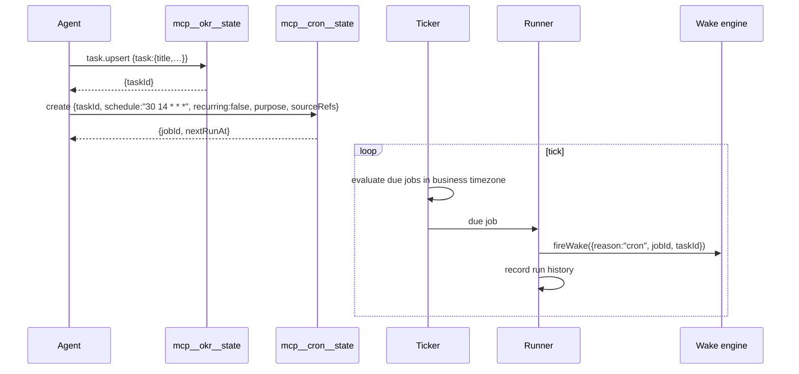

# M11 · Cron Scheduler

**Source modules:** `cron`, `cron_expression`, `user_cron_mcp`, `user_cron_runner`,
`user_cron_ticker`, `runner`, `ticker`, `schedule_input`, `manager2`, `tracker`

---

## Purpose

Deterministic time triggers — and only for work that already exists.

## The rule

> "Manage deterministic time triggers for **existing Tasks**. … Time wakes must attach to a Task
> and never be free-floating reminders."

Enforced two ways:

1. `mcp__cron__state` validates `taskId` against the department's task store.
2. The built-in `CronCreate` / `CronDelete` / `CronList` tools are placed in
   `disallowedTools`, so there is no unconstrained path.

This is the single most copyable pattern in the system: **disable the unconstrained built-in,
expose a constrained replacement.**

## Flow



Ticker and runner are separate so a slow run never delays evaluation.

## Actions

```
create | update | delete | list
```

Schedule input: 5-field cron string; `recurring: false` for one-shot; `purpose` and `sourceRefs`
for provenance; optional `keyResultId`.

## Storage & events

- `<ws>/.neo/scheduled_tasks.json`, `departments/<id>/.neo/scheduled_tasks.json`
- Endpoints: `cron.list/create/update/delete/trigger/history`
- Events: `cron.job.changed`, `cron.run.status`
- DTOs: `HubCronJobRecord`, `HubCronRunRecord`, `HubCronHistoryResponse`

`cron.trigger` fires a job immediately — essential for testing and for "run it now" in the UI.
`BENCH_MODE=1` additionally exposes `bench.cron.trigger` with an injectable clock
(`BENCH_CLOCK_SOCK`). Build a deterministic clock seam from day one.

## Timezone

The scheduler uses local JavaScript Date accessors in the daemon (`computeNextCronRun`, line 43581). Prompt business time is separately resolved and applied to the child environment. Do not assume setting `MATRIX_AGENT_TIME_ZONE` changes daemon evaluation; align the daemon TZ explicitly and test DST, midnight windows, missed one-shots and restarts.

## Reuse in shotgun-next

Copy exactly, including the Task-binding requirement, the disallowed built-ins, the
ticker/runner split, `trigger` for manual fire, and the injectable clock.
