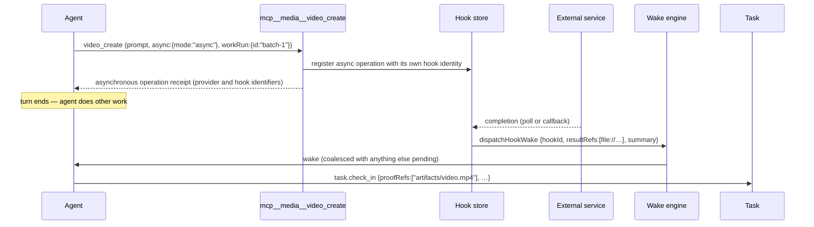

# M12 · Hooks & WorkRuns

**Source modules:** `hook`, `handler` (hook endpoints), `tracker`, `endpoint_registry`,
`runtime_file_provenance`, `runtime_command_file_provenance`, `runtime_worker_file_evidence`

---

## Purpose

Represent facts that will arrive later, so an agent never blocks on a slow external operation
and never loses its result.

## Model

```
Hook     a durable record that an async fact is pending (media render, integration event,
         long file op, external webhook)
WorkRun  the execution instance behind it
```

```ts
HubRuntimeHookRecord {
  id, source, event, subjectId, summary,
  progress: HubRuntimeHookProgress,
  retryPolicy: HubRuntimeHookRetryPolicy,
  taskRef?: HubRuntimeHookTaskRef,
  workRun?: HubRuntimeHookWorkRunRef,
  resultRefs?: HubRuntimeHookResultRef[],
  inputSummary?: HubRuntimeHookInputSummary,
  error?
}
```

## The chain



The skill states it as a rule: *"Background task completion notifications with output files are
proof refs; check in the linked Task against the output path, or create the smallest next Task
when none exists."*

## Storage & surfaces

- `<ws>/.neo/hooks.jsonl` plus `.neo/hooks.latest.json`; see `hookStorePath` and the index-path helper at extracted lines 37825 and 38012.
- Endpoints `hook.work.list`, `hooks.list`, `hooks.update`; event `hook.work.changed`
- UI: `StageCardHookContext`, `StageCardHookProgress`, `StageHookDetailView`,
  `StageCardHookResultRef`, `StageCardHookRetryPolicy` — a hook is a live Stage card

## Provenance capture

Three sibling modules capture evidence *without the agent having to report it*:

| Module | Captures |
|---|---|
| `runtime_file_provenance` | files the agent's file tools touched |
| `runtime_command_file_provenance` | files touched by shell commands |
| `runtime_worker_file_evidence` | files produced by spawned workers |

Capture is best-effort and source-dependent. Arbitrary shell writes and external workers can escape attribution; unknown actors must stay unknown. A registered hook is not itself proof of successful output or durable recovery after restart.

## Reuse in shotgun-next

Copy. In a creative studio the async operations are *more* dominant than in Matrix: image and
video generation, renders, exports, uploads. Every one of them should be a hook with a task
ref, not a blocking tool call.

Design rule to carry over: **an async tool returns an id immediately and the result arrives as
a wake.** Never `await` a 3-minute render inside a turn.
