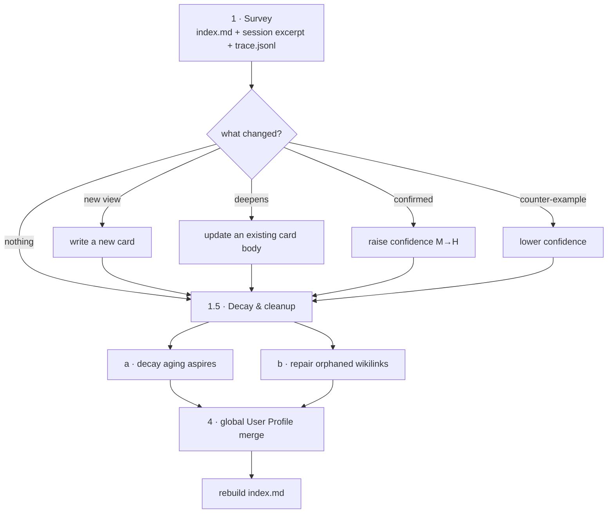

# M13 · Maintenance & Crystallize

**Source modules:** `maintenance_runner`, `maintenance_scheduler`, `maintenance_config`,
`refresh_runner`, `refresh`, `refresh_session`, `orphan_transcript_merge`,
`canonical_chat_session_repair`, `transcript_contract`, `transcript_history`, `context_ledger`
**Seed prompts:** `prompts/crystallize.md` (444 lines), `prompts/crystallize-ceo.md` (50 lines)

---

## Purpose

Background upkeep that makes the company get better rather than just bigger: memory
consolidation, context compaction, dashboard refresh, transcript repair.

## Job table

| Job | Cadence | Session | Writes |
|---|---|---|---|
| `crystallize` | every 4 h (default) | ephemeral, separate id | belief cards, `index.md`, global User Profile |
| `crystallize-ceo` addendum | with crystallize on the primary | same | emergence candidates, routing cards |
| compaction | on demand | `maintenance` wake on the live session | context only |
| dashboard refresh | daily (configurable) | ephemeral + LLM | `dashboard.generated.json` → `dashboard.json` |
| transcript repair | at daemon start | none | canonical `.jsonl` files |
| content freshness | continuous | none | `.neo/content_freshness.json` |

Config: `maintenance.config.get/update`, `maintenance.trigger`, `dashboard.config.*`,
`dashboard.refresh.run`.

## Ephemeral session contract

> "This task runs in an **ephemeral maintenance session** … The maintenance session has its own
> session id — it does NOT share the user's canonical chat transcript, and nothing you emit here
> appears in the user's chat. **All effects must land on disk**; nothing else survives."

Enforcement: maintenance records are tagged `<!-- maintenance-runner ` and stripped by
`orphan_transcript_merge` (`isMaintenanceTainted`) so they never pollute the canonical
transcript. Orphan files whose first user record is maintenance-tainted are skipped entirely.

## Crystallize workflow

### Decay rules (agency-driven, not mechanical)

Demote a `tag: aspire` card when **all three** hold:

- `created` more than ~90 days ago
- no inbound `[[slug]]` anywhere: `grep -lFr -- "[[${SLUG}]]" memory/knowledge`
- no recent supporting signal from current work; this is a judgment rule in the prompt, not an automatic age-based deletion rule

> "The 90-day threshold is a starting filter — a 60-day card with zero signal is just as
> decayable; a 100-day card someone just brought up today is not. Use judgment."
>
> "**Prefer demotion to deletion** — deletion is irreversible; demotion is enough to sink the
> card in the index."

Deletion, if chosen, first writes `source: decayed (no signal in 90d)` into frontmatter.

### Wikilink repair with planned-orphan grace

A `[[link]]` to a non-existent card is normally repaired — **unless** the source card's
frontmatter has `planned: [that-slug]` and `created` is within 14 days. Forward scaffolding is
legitimate; stale dangling links are not.

The prompt ships literal shell snippets for both checks, which is a good technique: give the
model an exact command rather than a description of the check.

### Empty rounds

> "'No changes needed' is a valid, auditable outcome."
>
> "The scheduler's activity gate has already decided that this run is worth paying for — you are
> not at liberty to 'skip the whole thing' to save tokens."

Note the division of labour: **the scheduler owns cost, the model owns judgment.**

## Crystallize-CEO addendum

Runs only on the primary. Extra job: keep the org chart honest.

- Look for repeated workflows, work the primary keeps doing that isn't intake/planning/
  coordination, and requests that should have routed elsewhere.
- **Enough evidence**: two similar turns with a reusable workflow, *or* one project outside
  every existing department's responsibility.
- **Not enough**: shared medium without repeated intent, simple reminders, high-stakes advice,
  unsafe intent.
- Track candidates as belief cards with `tag: aspire` and
  `status: hint|candidate|emerged|routed|retired`, each with dated proof and explicit
  confidence-moving conditions.
- Maintain `routing-*.md` cards so the primary knows when to hand off.
- Calibrate down when a pattern stops appearing or a better owner exists; recommend merge /
  retire / reroute / dormant.

> "Crystallize is a maintenance pass: solidify proof, maintain emergence candidates, repair
> routing memory, and surface the next likely move."

## Transcript repair

`orphan_transcript_merge.mergeOneSession(descriptor)`:

1. Locate the project dir from `predictTranscriptPath(sessionId, cwd)`.
2. Collect `.jsonl` files that are neither the canonical file nor owned by a sibling session.
3. Drop maintenance-tainted records from the canonical file.
4. Build `seenUuids` and `seenSemanticKeys` (type + timestamp + role + messageId + normalized
   content) from what remains.
5. Carry over orphan records that match neither key, rewriting `sessionId`.
6. Rename merged orphan files.

Semantic dedupe matters because a forked runtime re-emits the same messages with new UUIDs.

## Reuse in shotgun-next

Copy the whole module. Specifically:

- ephemeral maintenance sessions with tagged, strippable records
- scheduler owns cost, model owns judgment
- demotion over deletion, with explicit reversal criteria
- planned-orphan grace for forward links
- **the CEO addendum** — a background job that proposes org structure from observed behaviour
  is the single most distinctive capability in Matrix
