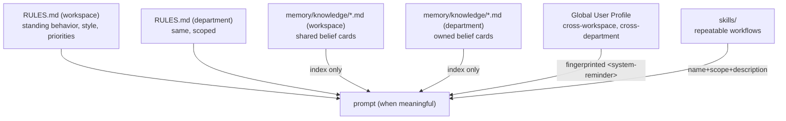

# M14 · Memory System

**Source modules:** `beliefs`, `user_profile`, `user_profile_discovery`, `markdown_frontmatter`,
`memory.list` endpoint, `AUTOMEM_*` env policy
**Seed:** `scripts/merge-user-md.sh`

---

## Purpose

Durable knowledge that survives sessions, scoped correctly, and cheap to retrieve.

## Four stores



Routing rule from the seed:

| Content | Home |
|---|---|
| Standing behavior, style, priorities | `RULES.md` |
| Settled non-obvious decisions | belief card |
| Repeatable workflows | skill |
| Stable cross-workspace user preferences, identity, handles | global User Profile |
| Secrets | nowhere |

## Belief card format

```markdown
---
title: <what future-you needs to know>
tag: self | aspire
confidence: H | M | L
created: YYYY-MM-DD
planned: [slug-a, slug-b]
status: hint | candidate | emerged | routed | retired
source: …
---
Decision: …
Why: …
Rejected: …
Reverse if: …

See also [[other-slug]].
```

`Reverse if:` is the best field here — it makes the card falsifiable, which is what lets
crystallize decay it honestly.

## Retrieval model

Only the **index** is injected, and only when it contains real card links (scaffold text is
filtered). The prompt frames index entries as retrieval cues:

> "Treat index entries as retrieval cues: read matching cards before substantive work; ignore
> unrelated entries."

So: cheap always-on index, on-demand full cards. Same two-tier pattern as skills and tools.

## Global User Profile

- Agent-facing access uses `mcp__matrix__department` `user_profile.get/update`; daemon `userProfile.*` methods and maintenance/discovery paths also exist
- Delivered as a **fingerprinted `<system-reminder>`** by the SessionHost, *not* baked into the
  cached prefix — so profile edits don't invalidate the cache
- Path exposed as `$GLOBAL_USER_PROFILE_MD` for maintenance writes only
- Merge helper: `MERGE_USER_MD_SCRIPT = <seed>/scripts/merge-user-md.sh`
- `expectedVersion` compares a content hash before write; the read/compare/rename helper does not itself lock concurrent writers, so it is not a proven atomic compare-and-swap
- Legacy per-workspace `memory/USER.md` is migrated (`HubLegacyWorkspaceUserProfileRecord`)

Scope guard in the tool description:

> "Do not write project facts, workspace facts, credentials, or transient observations there."

## Auto-memory suppression

```
NEO_CODE_DISABLE_AUTO_MEMORY = 1
NEO_COWORK_MEMORY_PATH_OVERRIDE = departments/<id>/memory/
AUTOMEM_EXCLUDE_STARTSWITH = "knowledge/,knowledge\"
AUTOMEM_EXCLUDE_EQUALS = "log.jsonl"
```

The embedded runtime has its own memory feature; the harness turns it off and owns memory at the
company level. Otherwise you get two memories that disagree.

## UI

Memory is presented as a **library of books** (`MemoryBookCover`, `MemoryCatalogCard`,
`MemoryDetailHero`, `MemoryFileEditorSheet`) with categories and full editing.
Endpoint: `memory.list`.

Making memory *visible and editable* is what turns it from a hidden liability into a feature the
user can teach.

## Reuse in shotgun-next

Copy: the four-store split, the card format (especially `Reverse if:`), index-as-retrieval-cue,
the fingerprinted system-reminder delivery for the user profile, and auto-memory suppression in
the embedded runtime.

Studio adaptation: add a **taste/style card** type — locked references, brand constraints,
"never do X" notes — that is treated as higher-confidence and is surfaced in every creative
role's prompt rather than retrieved on demand.
