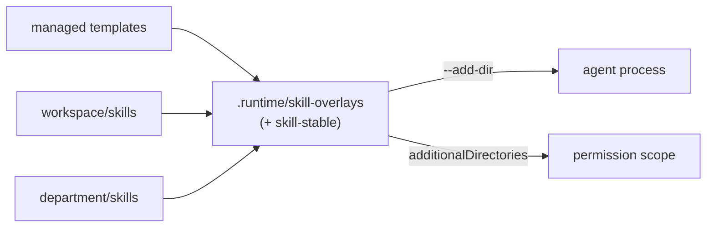

# M15 · Skills System

**Source modules:** `skill_catalog`, `loader`, `installs`, `native`, `find-skills` (managed
skill), `skill-creator` (managed skill), `.runtime/skill-overlays`
**Seed templates:** 9 named skills, 2 supporting references, and 1 legacy architecture template in `neo-agent-seed/templates/`

---

## Purpose

Repeatable workflows as versioned, discoverable, editable Markdown — the studio's operating
manuals.

## Scopes

| Scope | Location | Lifecycle |
|---|---|---|
| **managed** | seeded from `neo-agent-seed/templates/` | upgraded by `seedVersion` |
| workspace | `<ws>/skills/<name>/SKILL.md` | user/agent authored |
| department | `departments/<id>/skills/<name>/SKILL.md` | user/agent authored |
| imported | via marketplace / folder import | validation is **structural only [V]** — see "Import validation" below |

## Import validation (what the daemon actually checks)

Marketplace and ZIP imports are unpacked by the client (`Matrix/WorkspaceFileImportPipeline.swift`,
temp dirs `matrix-workspace-import-*` / `matrix-department-import-*`) and streamed to the daemon
through `workspace.fs.importDirectory.begin/chunk/commit`. `parseDirectoryImportManifest`
(`neo-agent.fmt.js:98426`, called from the `begin` handler at `:105441`) enforces:

| Check | Value |
|---|---|
| path shape | relative, no empty / `.` / `..` segments, ≤ 4096 chars, no NUL |
| counts | ≤ 10 000 files and ≤ 10 000 directories per import |
| sizes | ≤ 2 GiB per file, ≤ 20 GiB total, 6 MiB per chunk |
| structure | no duplicate paths, no path that is both file and directory, no file under a file |
| destination | must not already exist; parent must be a directory (`resolveWorkspaceFilePath`) |
| quarantine | `xattr -dr com.apple.quarantine` cleared on installed runtimes only, not on imports |

There is **no content-level review**: no `SKILL.md` frontmatter validation, no `allowed-tools`
check, no prompt-injection scan, no signature. The marketplace handoff document's SHA-256 is
recorded as provenance (`handoff.documentSha256`) but not verified against a publisher key.
A skill imported from a ZIP is trusted exactly like one the user wrote. A replica that wants a
trust boundary here has to build it; the archive size limit
(`NEO_AGENT_SPACE_MARKETPLACE_ARCHIVE_LIMIT_MB`) is the only publish-side guard.

## Overlay mount



One mounted tree, correct precedence, no pollution of the human-editable `skills/` directories.

## Two-tier loading

```
prompt   ← name + scope + description        (always, compact)
Skill tool / /slash-command ← full SKILL.md  (on demand)
```

`buildSkillContext()` produces the compact list. The `description` field therefore does all the
retrieval work and is written accordingly — see `okr-execution`, whose description spends half
its length saying what it is **not**.

## Frontmatter

```yaml
---
name: okr-execution
description: "Use to …  Trigger: …  This is X — NOT Y."
category: coordination | workspace | …
symbolName: checkmark.seal      # SF Symbol shown in the UI
seedVersion: 39
---
```

`symbolName` is a nice touch: the skill carries its own iconography, so the library renders
itself.

## Managed skill catalogue (shipped)

| Skill | Lines | Purpose |
|---|---|---|
| `matrix-browser` | 947 | complete browser operating guide (script vs visual agent) |
| `debug-and-report` | 380 | collect session artifacts, transcripts and a report bundle |
| `okr-execution` | 163 | the Task/proof/check-in loop |
| `find-skills` | 167 | discover skills across scopes |
| `media-generation` (+ reference, 181) | 155 | image/video/audio generation workflow |
| `skill-creator` | 140 | author new skills |
| `email` | 112 | workspace mailbox workflow |
| `department-management` (+ reference, 42) | 95 | ownership & coordination policy |
| `workspace-planning` | 53 | turn loose intent into runnable shape |

Two of these (`department-management`, `workspace-planning`) are pure **decision policy** with
almost no mechanics — the tool carries execution, the skill carries judgment:

> "A decision policy for ownership and cross-department coordination. `mcp__matrix__department`
> carries the execution; this skill chooses what to call."

Copy that separation. Tools should be thin and validating; skills should be opinionated.

## Skill creation & import

- `skill.create`, `skill.file.write`, `skill.file.delete`, `skill.delete`
- `department.skills.refresh` re-scans a department
- `SkillFolderImportSheet` scans candidate roots for `SKILL.md` and imports selected ones
- `SkillMarketplaceView` / `SkillMarketplaceImportController` for the remote catalogue
- `SkillVisualsGenerator` generates cover art per skill

## Integration packs

`neo-agent-seed/integration-packs/<provider>/` bundles a whole provider capability:

```
cloudflare/
  .mcp.json                 MCP server definition
  .codex-plugin/plugin.json
  commands/{build-mcp,build-agent}.md
  skills/{cloudflare,wrangler,workers-best-practices,durable-objects,agents-sdk,
          sandbox-sdk,building-mcp-server-on-cloudflare,building-ai-agent-on-cloudflare,web-perf}/
          SKILL.md + references/*.md + assets/*
  assets/…
  README.md
```

So connecting an integration installs **skills, slash commands, an MCP server and assets**
together. That is the right unit of distribution.

## Reuse in shotgun-next

Copy: scopes, overlay mount, two-tier loading, `seedVersion` upgrades, `symbolName`, the
policy-skill/mechanics-tool split, integration packs as the distribution unit.

Studio seed set to ship:

```
creative-brief        turn a client ask into a Brief + first Milestone
art-direction         style locks, references, mood, do/don't
critique-round        structured review with severity + required fixes
production-handoff    what a role must include when passing work on
asset-generation      image/video/audio workflow with hooks
publish-package       final export, naming, formats, delivery manifest
role-management       the studio's ownership policy (≈ department-management)
production-planning    (≈ workspace-planning)
work-execution         (≈ okr-execution)
```
