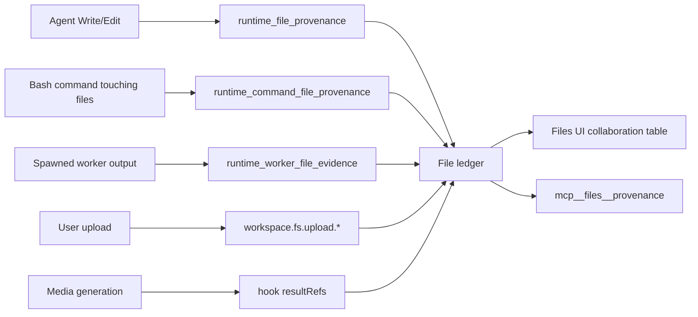

# M16 · File Service & Provenance

**Source modules:** `service`, `path_policy`, `content_store`, `conflict_store`,
`revision_retention`, `file_provenance_mcp`, `runtime_file_provenance`,
`runtime_command_file_provenance`, `runtime_worker_file_evidence`, `workspace_fs_list`,
`workspace_fs_search`, `workspace_access`, `workspace_preview`, `workspace_text_preview`,
`lineage`, `storage_cleanup`, `attachments`

---

## Purpose

Make every file in the workspace answerable: who created it, from what, who read it, what
changed, and how to go back.

## Concepts

| Concept | Meaning |
|---|---|
| **Metadata** | identity, `currentRevisionID`, tags, pins |
| **Revision** | a content-addressed version, retained per policy |
| **History** | mutation events with actor + causal fields |
| **Access** | bounded read / preview / download events, plus rollups |
| **Lineage** | actual copy source and revision ancestry |
| **Collaboration** | which departments participated with this file |

Storage: `<ws>/.neo/file-ledger` + `content_store` for revision bodies.

## Capture — the important part

Provenance is captured by the **host**, not reported by the agent:

`MIRRORED_WORKSPACE_WRITE_TOOLS = {"Write"}` — the SessionHost mirrors agent writes into the
ledger. Capture is best-effort: shell inference, external discovery and worker evidence are not complete filesystem interception. Unknown actors and causality must remain unknown.

## Visibility bounding

> "Department Space and Department Message participation bound which files and causal fields are
> visible; **redacted history must not be guessed or reconstructed**."

`canReadAllDepartments` is true only for the primary. A department sees its own files fully and
peers' files only where it participated.

## Mutating operations

| Operation | Guard |
|---|---|
| `revision.restore` | must read `currentRevisionID` first, then ask the exact confirmation question the tool returns |
| `workspace.fs.trash.*` | two-phase: `prepare` → `commit` / `abort` |
| `workspace.fs.upload.*` | four-phase: `begin` → `chunk` → `commit` / `abort` |

Staging supports recovery, but does not prove atomicity across files and ledgers or power-loss durability. Recovery and fault-injection tests are still needed for a replica.

## Path policy

- File Service operations validate lexical and canonical paths within a workspace, including symlink escapes.
- Managed paths are `.neo/file-ledger`, `.upload-tmp`, `.neo/worker-overlays` and revision-restore staging names. This does not confine Bash or every runtime file tool.
- Department `tmp/` is supplied as `TMPDIR`; this is a location convention, not a sandbox.

Gap worth fixing in a clone: tool-owned JSON (`config.json`, `okr.json`, `dashboard.json`,
task packets) is protected only by prompt instruction. Make it policy.

## Endpoints

Listed in the [generated protocol reference](../_analysis/audit/protocol-reference.md).
Notable: `collaboration.list/recent/delta/rebuild`, `indexing.progress`, `summaries`,
`directory.pin/unpin/pins`, `revision.pin/unpin/pins`, `tag.add/remove`, `access.record`.

## UI

225 Swift types — column/list/large-icon browsing, navigation history, drag-and-drop at three
levels, batch transfer, Quick Look thumbnails, Markdown preview, and the **collaboration table**
(synchronized rows showing per-file department participation and timing).

## Reuse in shotgun-next

Copy: host-side provenance capture, two-phase mutations, revision + lineage, participation-based
visibility, and the collaboration table.

For a creative studio, provenance is arguably *more* valuable than in Matrix — "which reference
did this frame come from", "who approved this cut", "what changed between v3 and v4" are the
core questions. Add: **variant sets** (v1..vN of the same deliverable) and
**approval marks** as first-class ledger events.
