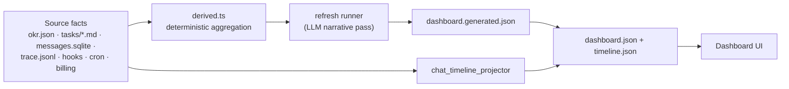

# M17 · Dashboard Projection

**Source modules:** `derived`, `operational_view`, `operational_next_step`, `refresh_config`,
`refresh_runner`, `render`, `chat_timeline_projector`, `activity`, `aggregator`,
`billing_activity`, `content_freshness`

---

## Purpose

A single answerable page: what is the state of the company, and what should happen next.

## The rule

**Agents update source facts. The daemon produces projections. Agents never edit projections.**



Two stages matter: a deterministic aggregation, then an *optional* narrative pass. If the LLM
pass fails, the deterministic data still renders — the live install shows exactly this:

```json
"refresh": { "frequency":"daily", "enabled":true, "status":"failed",
             "lastRunAt":"2026-07-13T08:26:38.655Z",
             "lastError":"Gateway 402 /v1/chat/completions: insufficient balance" }
```

…and the dashboard still shows its last good hero and cards. **Design for the narrative pass to
fail.**

## Document shape

```ts
{ version: 2, updatedAt,
  refresh: { frequency, enabled, status, lastRunAt, nextRunAt, lastError? },
  hero: { title, summary, metrics: [{id,label,value,detail}] },
  cards: [{ id, title, subtitle?, kind, sourceRefs: string[], … }] }
```

Card kinds: `metricGrid`, `proofFeed`, `learningLoop`, plus named sections
*At A Glance · Results In Motion · Needs Action · Scheduled Tasks · Current Tasks · Proof ·
Learning · Activity · Work Mix · Runtime Cost*.

## sourceRefs — traceability

```
department:a2dd8fad
task:department_message:msg_37e0628e-9995-4e0e-86d0-55a130d4e080
```

Every card cites the facts it was built from, so the UI can navigate from a number to its
evidence. Non-negotiable for a system where an LLM writes the summary.

## Shared ordering with autonomy

The dashboard's task list and the periodic wake use **the same operating ref order**
(`operational_next_step`). The board is therefore a preview of what the system will do next,
which is a strong trust property — the user is never surprised.

## Real hero output (live install)

> "Ready remains at 46 completed workspace items with 12 loaded departments, 0 open tasks, and 0
> blockers; the current 14-day window has no completions or touches, so the next useful signal
> is an ownership decision for the 口播工作室 launch-production handoff."

Note the structure: state → window → **the single next decision**. Not a wall of metrics.

## Cost telemetry

Present, but explicitly demoted:

> "Runtime Cost — cost telemetry stays secondary to objective execution facts."

## Reuse in shotgun-next

Copy: the two-stage projection, graceful narrative failure, `sourceRefs` on every card, and
sharing the ordering with the autonomy engine.

Studio adaptation — replace business metrics with production state:

```
hero      what is shipping, what is blocked, what needs your review
cards     Review Queue · In Production · Waiting on You · Delivered ·
          Style Drift (deviation from locked direction) · Asset Budget
```
