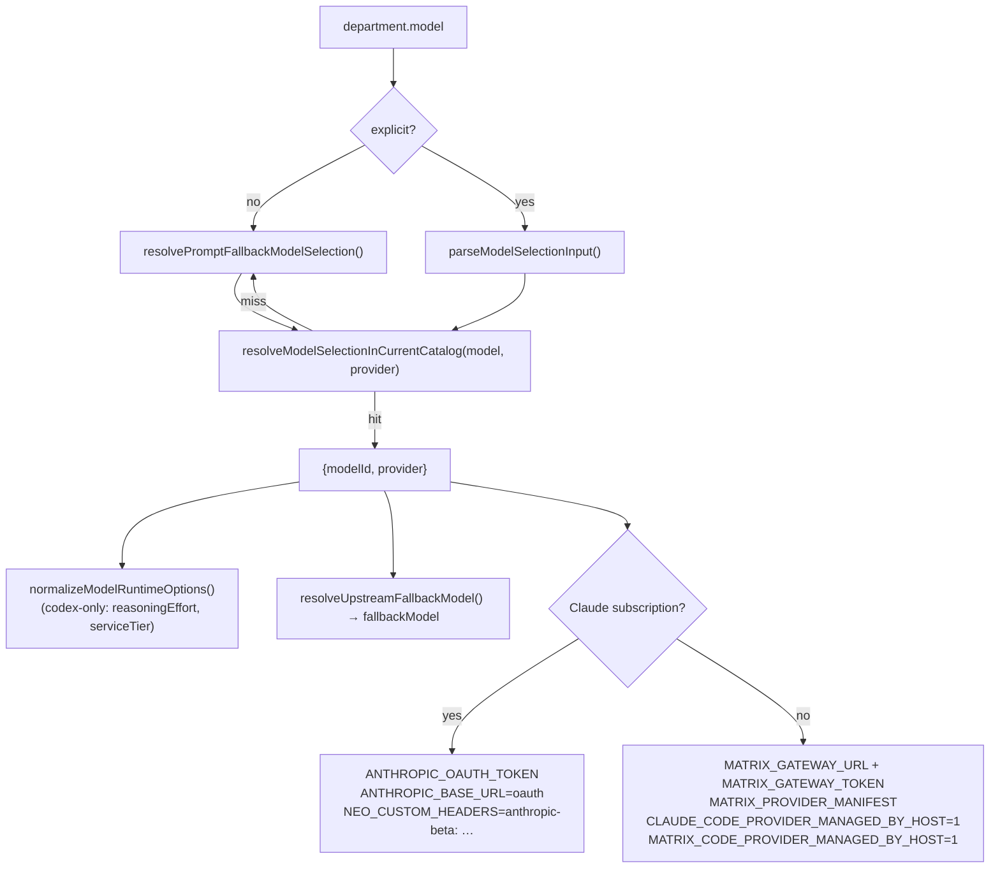

# M18 · Model & Provider Gateway

**Source modules:** `provider_registry`, `provider_graph`, `provider_graph_store`,
`local_provider_graph`, `provider_curation`, `matrix_gateway`, `gateway_catalog`, `catalog`,
`codex_catalog`, `supported_models`, `selection`, `session_host_model_routing`, `token_provider`,
`oauth`, `oauth2`, `openai_compat`, `proxy`, `outbound_proxy`, `node_runtime_fetch`,
`runtime_worker_models`, `billing_actor`, `system_model`

---

## Purpose

Decide which model serves which department, over which credential, through which transport.

## Provider shapes

| Kind | Transport | Credential |
|---|---|---|
| `matrix-account` | Matrix Gateway proxy | Matrix session (`matrix-auth.json`) |
| Anthropic subscription | Anthropic OAuth messages endpoint | OAuth token + `anthropic-beta` header |
| BYOK | direct provider API | user API key (`credentials.json`) |
| OpenRouter | OpenRouter API | user key; searchable catalog |
| Codex service | OpenAI-compatible proxy | proxy sentinel key |
| Local / OpenAI-compatible | custom base URL | user key |

## Resolution



Key property: **the agent process never chooses its own provider.** The harness writes
environment that makes the embedded runtime's provider selection a no-op
(`*_PROVIDER_MANAGED_BY_HOST=1` plus a provider manifest). That is how one Claude-Code-derived
runtime serves six credential shapes.

## Normalization

```ts
normalizeModelRuntimeOptions({provider, reasoningEffort, serviceTier}):
  provider !== CODEX_SERVICE_PROVIDER_ID → {}          // drop codex-only knobs
  reasoningEffort ∈ CODEX_REASONING_EFFORTS ? keep : drop
  serviceTier ∈ STANDARD → drop;  ∈ FAST → "priority"
```

## Model graph & curation

`provider_graph` / `provider_curation` maintain which models are enabled, default, and
per-route. `HubModelRouteKind`, `HubModelServiceTier`, `HubModelPropagationResult/Failure` —
changing a default propagates to sessions and can partially fail, and the failure is reported
rather than swallowed.

Endpoints (all present in `protocol.json`): `config.models.list/set_default/set_enabled`,
`config.providers.list/get/set/delete/set_active`, `config.providers.oauth.start/complete/sign_out`,
`config.providers.openrouter.models.search`, `config.test_connection`. There is **no**
`config.credentials.*` method family; credentials are read/written through `config.providers.set`
and the OAuth routes (see [docs/05 §3](../docs/05-daemon-protocol.md)).

## Billing

```
NEO_BILLING_ACTOR = "user"
WORKER_BILLING_MODES = ["matrix_proxy", "subscription"]
runtime.set_billing(kind, mode)
billing.activity → HubBillingActivityEntry
```

Per-runtime billing mode means a user can run Neo on Matrix credits and Claude Code on their own
Claude subscription, simultaneously. The cost notices are shipped as user-facing strings per
runtime.

## OAuth

`refreshClaudeToken()` — standard refresh-token grant against `CLAUDE_OAUTH_CONFIG.TOKEN_URL`,
`User-Agent: Matrix-OAuth/1.0`, with `isTokenExpired(expiresAt)` applying a **5-minute buffer**.
Device-code style sign-in for worker runtimes: `runtime.sign_in` →
`runtime.sign_in.provide_code` → `runtime.sign_out`.

## Reuse in shotgun-next

Copy: host-managed provider selection, the normalization step that drops
provider-specific knobs, the fallback-model chain, propagation results that can partially fail,
and per-runtime billing modes.

Simplify: one `ProviderAdapter` interface (`resolve(modelRef) → {baseUrl, headers, modelId}`)
rather than the env-var matrix.
