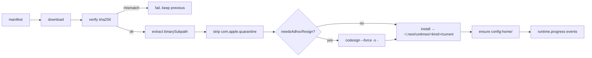

# M19 · Runtime Installer

**Source modules:** `installer`, `downloader`, `manifest`, `signer`, `version`, `state_store`,
`codex_binary`, `subscription`, `subscription_auth_files`, `subscription_prompt`, `service2`,
`lifecycle`, `paths3`, `config2`, `types3`, `installs_watcher`

---

## Purpose

Acquire, verify, install, authenticate and update the external agent runtimes — without touching
the user's own installations.

## Manifest

`Resources/runtime-versions.json`:

```json
{ "claude_code": { "version":"2.1.126",
    "url":"https://registry.npmjs.org/@anthropic-ai/claude-code-darwin-arm64/-/claude-code-darwin-arm64-2.1.126.tgz",
    "sha256":"8ef17e23ed2987a3fdd39beae7750acef7b45026c9b7a9384d98a8808c4ba5f8",
    "binarySubpath":"package/claude", "needsAdhocResign": false },
  "codex": { "version":"0.144.4",
    "url":"https://github.com/openai/codex/releases/download/rust-v0.144.4/codex-aarch64-apple-darwin.tar.gz",
    "sha256":"77c8969a481302f9db1d9ea2a6c21c083abae3f1a8fc8a7275dc38323699391e",
    "binarySubpath":"codex-aarch64-apple-darwin", "needsAdhocResign": true } }
```

## Install pipeline



Isolation: each runtime gets `~/.neo/runtimes/<kind>/config-home/` (`.claude.json` /
`config.toml`) for managed operation. Explicit `import_user_default_auth` may read the user's existing CLI credentials; isolated config homes do not mean those locations are never read.
`migrateRuntimeConfigHome(kind)` moves older layouts forward.

`BINARY_FILENAME = { claude_code: "claude", codex: "codex" }`.

## Authentication

```
runtime.sign_in → runtime.sign_in.provide_code → (success) → runtime.state_changed
runtime.sign_in.cancel
runtime.sign_out
runtime.import_user_default_auth        ← borrow the user's existing login
codex.service.status
codex.service.login.start / .cancel
codex.service.connect / .disconnect
codex.service.import_user_default / .sign_out
```

(The registry has no `experimental.codex_subscription.*` method; subscription state is read via
`codex.service.status`, and `runtime.subscription_prompt` is the event that asks the user to
choose subscription vs API billing.)

`runtime.import_user_default_auth` is a nice affordance: if you already have Claude Code logged
in, adopt that credential rather than making the user do a second device flow.

`subscription_prompt` surfaces subscription requirements in the UI
(`WorkerSubscriptionPromptEvent`, `WorkerSubscriptionState`,
`WorkerUserDefaultSubscriptionState`).

## Spawn integration

```ts
resolveSpawnEnv({ gatewayBaseUrl, proxyAuthToken? }) → env fragment
// merged into runtimeEnv by buildDepartmentPromptContext
```

and for non-source installs the daemon supplies a custom spawner:

```ts
spawnNeoCodeProcess: opts => spawn(neoCodePath, opts.args.slice(1), {
  env: opts.env, cwd: opts.cwd, stdio: ["pipe","pipe","pipe"],
  detached: true, signal: opts.signal })
```

## Watching

`installs_watcher` monitors install state and refreshes running sessions'
capabilities. `runtime.capabilities`, `runtime.list`, `runtime.worker_models.list`,
`runtime.uninstall`, `runtime.cancel_install`.

## Reuse in shotgun-next

Copy: the manifest shape (url + sha256 + subpath + resign flag), hash-before-install, quarantine
stripping, ad-hoc resigning, **isolated config homes**, progress events, and
`import_user_default_auth`.

This is the cleanest way to embed third-party agent CLIs without owning their release cadence.
