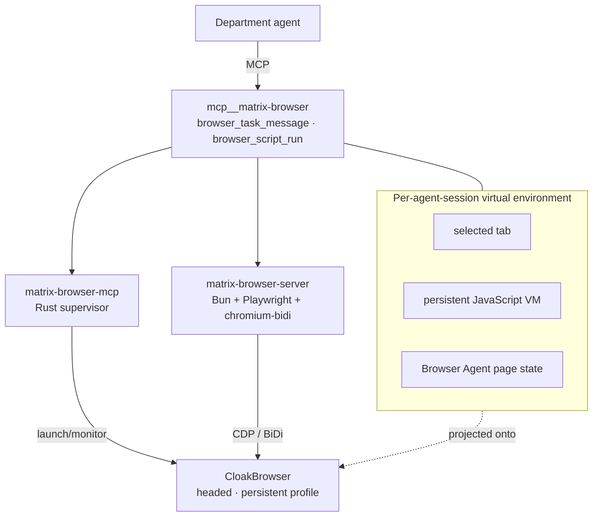

# M20 · Matrix Browser

**Components:** `matrix-browser-mcp` (Rust supervisor), `matrix-browser-server` (Bun + Playwright,
`main.js` 4.3 MB), `CloakBrowser` (Chromium 145.0.7632.109), `matrix-browser` managed skill (947
lines), daemon modules `manager`, `lifecycle`, `reapOrphanBrowser`

---

## Purpose

Give agents a real, logged-in browser — with two operating modes: precise scripting and
delegated visual action.

## Topology



**One physical browser, N virtual environments.** Each agent session gets its own selected tab,
its own JS VM, and its own Browser Agent conversation state — but they all share one Chromium
profile, one cookie jar, and one set of physical pages.

## Environment variables

```
MATRIX_BROWSER_USE_ENABLED     0|1 (plugin toggle in Settings)
MATRIX_BROWSER_DIST_DIR        distribution dir
MATRIX_BROWSER_ROOT            profile root
MATRIX_BROWSER_HEADLESS
MATRIX_BROWSER_CONTROL_HOST / _PORT
CLOAKBROWSER_AUTO_UPDATE
CLOAKBROWSER_CACHE_DIR
```

## Tool 1 — `browser.script.run`

Executes JavaScript in a **persistent VM** with globals `agent`, `display`, `console`.

```js
if (!globalThis.browser) { globalThis.browser = await agent.browser }
await browser.tabs.list()

if (typeof tab === "undefined") {
  globalThis.tab = await browser.tabs.get("tab-id-from-list")
  // or: globalThis.tab = await browser.tabs.new(); await tab.goto("https://example.com")
}
```

Semantics:

- Top-level `const`/`let`/`class` **persist across calls** and survive failed calls — so
  temporary variables belong in an async IIFE, and intentional state on `globalThis`.
- The final expression is returned as `result`; `console.log` produces log entries.
- Screenshots return byte arrays → surface with `await display(await tab.screenshot(...))`.
- No top-level `return`.
- `browser.tabs.list()` shows *all* physical pages (human's included);
  `browser.tabs.selected()` shows only this virtual environment's selection.
- `tab.close()` / `browser.tabs.finalize()` close **shared physical pages**.

Unavailable in Matrix Browser: `tab.cua`, `tab.dom_cua`, `browser.user.openTabs()` (returns
`[]`), `claimTab`, `history`, `visibility.set(true)`, `tab.content.export()`,
`exportGsuite`, `playwright.elementInfo/elementScreenshot`, `locator.downloadMedia`,
`waitForEvent("filechooser")`.

## Tool 2 — `browser.task.message`

Delegates **one bounded step** to a vision-driven Browser Agent.

```
in :  { taskId?: string|null, message: string, timeoutMs?: number (default 10 min) }
out:  { taskId, ok, actionSummary?, finalResponse?, errorMessage? }
```

- `taskId: null` starts a new conversation; passing an existing id continues it.
- Blocking until that message is handled. **Not** a submit/poll/cancel lifecycle API.
- `taskId` only means conversation continuity — not an environment, page, or lock.
- The Browser Agent keeps its own current page; `browser.script.run`'s `tab` is not an implicit
  input.

## Choosing between them

| Use `script.run` | Use `task.message` |
|---|---|
| stable DOM, precise Playwright expression | unstable DOM, clear visual path |
| repeated checks, local verification | a single step needing visual judgment |
| reading structured page state | sites with strict script detection |

> "能用脚本就不用视觉，能用脚本精确读到的就别绕到视觉."
> ("If a script can do it, don't use vision; if a script can read it precisely, don't detour
> through vision.")

And the hard boundary:

> "不要把整个任务交给 Browser Agent；只委托一个边界清晰的步骤，然后继续由你掌控任务."
> ("Don't hand the whole task to the Browser Agent; delegate one clearly bounded step, then keep
> control.")

## Operating principles (from the skill)

- One step at a time: observe → act → verify.
- Confirm the next needed fact the cheapest way after every action.
- The shared browser is **not an isolation sandbox** — scripts, the Browser Agent and the human
  all affect the same login state.
- Virtual environments expire on idle; the physical profile does not reset.
- Known bad target: **Xiaohongshu** detects Playwright and bans accounts — never script it while
  logged in.

## Lifecycle & cleanup

`reapOrphanBrowser` kills browser processes orphaned by a daemon crash. The Rust supervisor
panics with `matrix-browser-supervisor:` and reports `CloakBrowser binary not found:` when the
distribution is missing.

## Reuse in shotgun-next

Copy: the dual-mode design (script + delegated visual step), the virtual-environment-over-shared-
profile model, persistent VM semantics, and the explicit unavailable-API list in the skill.

Change: **isolate profiles per role** (a research seat and a publishing seat should not share
cookies), and add a per-site policy with an explicit "acting as you on <site>" confirmation.
