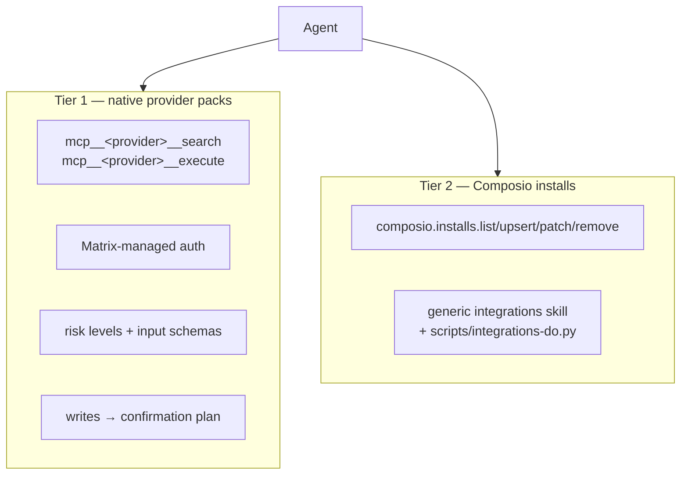

# M22 · Integrations

**Source modules:** `native`, `installs`, `installs_watcher`, `harvester`, `cloudflare_mcp`,
`provider_mcp`, `runtime_mcp`, `integration_mentions`, `marketplace_integration_routes`,
`runtime_integrations_refresh`, `composio.installs.*` endpoints
**Seed:** `integration-packs/<provider>/`, `scripts/integrations-do.py`

---

## Purpose

Connect real third-party services, as a first-class typed surface rather than "ask the agent to
curl an API".

## Two tiers



Tier 1 is explicitly privileged:

> "This is the first-class <Provider> pack surface; **do not route <Provider> through the generic
> integrations skill**."

## Provider pack contract

```
search(query)      → operation ids, risk levels, input schemas.  Call before execute when
                     parameters are uncertain.
execute(op_id, …)  → read ops run immediately;
                     write ops return a Matrix confirmation plan instead of applying.
```

Safety clauses, shipped in the description:

> "Never ask for <Provider> tokens. Do not expose account ids, resource ids, tokens, or raw
> credentials in the final user-facing answer."

Cloudflare gets a dedicated implementation (`cloudflare_mcp`) with provider operation IDs (not daemon RPC endpoints):
`cloudflare.accounts.list`, `zones.list`, `dns.records.list/upsert/delete`,
`pages.projects.list`, `workers.services.list`, `registrar.domains.check/search`.

## Integration pack layout

```
integration-packs/cloudflare/
├── .mcp.json                        MCP server definition
├── .codex-plugin/plugin.json        Codex plugin manifest
├── commands/build-mcp.md            slash commands
├── commands/build-agent.md
├── skills/<9 skills>/SKILL.md       + references/*.md, assets/*, LICENSE.txt
├── assets/cloudflare.png|svg
└── README.md
```

Connecting a provider installs **skills + slash commands + MCP server + assets** as one unit.
That is the right granularity — capability, not endpoint.

## Prompt integration

`buildDepartmentPromptContext` walks connected providers:

```ts
nativeIntegrationProviderSnapshots(snapshot)
  .filter(p => p.pack && nativeIntegrationRuntimeMcpAdapterFor(p.provider))
  .filter(p => p.connections.some(c => c.status !== "revoked"))
  → mcpServerSpecs[adapter.serverName]
  → renderNativeIntegrationActionModelGuidance(surfaces) → appended to the identity block
```

So connected integrations become visible tools **and** a line in the action model. Revoked
connections vanish automatically.

`integration_mentions` resolves `@provider` mentions. The transcript `harvester` and its offset track department work traces; they are not a generic external integration subscriber.

## Live refresh

`refreshRunningWorkspaceIntegrations()` rebuilds prompt context for every running host in the
workspace, but only when `isNiLifecycleQuiet(state, "context_refresh")`; otherwise it schedules a
deferred refresh. Returns `{applied, deferred, notRunning, failed}`.

Endpoint: `runtime.integrations.refresh`.

## Read-only allowlist

The embedded runtime contains read-only tool-name classification, but the native provider-pack execution decision uses the operation catalog's `risk` field. `read` uses the execute route; all other or missing risks use the plan route. These are separate mechanisms.

**Allowlist reads, gate writes.** Simple and effective.

## Reuse in shotgun-next

Copy: two-tier design, `search`-then-`execute`, confirmation plans for writes, integration packs
as the distribution unit, prompt guidance generated from live connections, and the read-only
allowlist.

Studio-relevant providers to ship first: Figma, Google Drive, Notion, Frame.io/Dropbox, YouTube,
Instagram/TikTok publishing, Slack.
