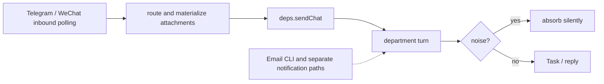

# M24 · Channels (Email, Telegram, WeChat)

**Source modules:** `channel`, `channel2` (`WeChatChannelRuntime`), `handler` (telegram.*),
`email` managed skill, `neo email` CLI, `inbox`/`outbox`, `external_signal_gate`

---

## Purpose

Let the company be reachable from outside, and let external messages become work.

## Email

Workspace creation can suggest a mailbox (`team@<slug>.agent`); an actual configured address is surfaced as
`NEO_EMAIL_ADDRESS` in every session env, configured via `workspace.email.get/set`.

Access is through the **`neo email` CLI**, invoked from the `email` skill via a Bash helper:

```bash
neo_email_cli() {
  local cli_exec="${NEO_AGENT_CLI_EXEC:-}"; local cli_entry="${NEO_AGENT_CLI_ENTRY:-}"
  # prefer the app-provided executable (bun + entry, or a direct binary)
  # fall back to `neo` on PATH; otherwise fail loudly with both env values
}
neo_email_cli inbox --status unread --limit 20 --json
```

Operations: `inbox`, `read`, `send`, mark, archive, download attachments.

Three rules in the skill worth copying verbatim:

> "Use this workflow **only for external email**. Use department messages for internal
> coordination with other departments."

> "If `NEO_EMAIL_ADDRESS` is missing, stop and tell the user workspace email is not configured."

> "**Do not print auth tokens, inspect token files, or hand-write gateway `curl` calls.** Use the
> CLI helper so authentication stays inside the app."

That last one is the important pattern: when a capability must run through Bash, ship a **helper
function in the skill** rather than raw endpoints — it keeps credentials out of the model's
context entirely.

The skill also declares its constraints in frontmatter:

```yaml
allowed-tools: Bash
shell: bash
```

## Noise policy

From the department prompt's Closed Loops:

> "Generic newsletters, coupons, spam, and promotions with no account-specific action are
> absorbed silently — no reply, escalation, or Task."

Without this, an inbox turns every marketing email into a wake.

## Telegram

Endpoints: `telegram.status`, `.configure`, `.connect`, `.sign_out`, `.stop`, and the event
`telegram.status_changed`. A bridge so the founder can talk to the company from a phone.

## WeChat

`WeChatChannelRuntime` (class, ~full implementation in `channel2`) with:

```ts
phase: "signedOut" | …            // QR-code login
qrCodePayload, credentials, route, availableRoutes[]
lastInbound/OutboundPreview, lastInbound/OutboundAt, lastConnectedAt
processedMessageCount, deliveredReplyCount, materializedAttachmentCount
pendingReplies: Map, processedMessageIDs[], contextTokens
controlGuidePending
```

State is persisted at `~/.neo/wechat-channel.json`. `saveState` and `writeStoredState` serialize credentials as JSON (`neo-agent.fmt.js:145067`, `145663`). The AES functions handle encrypted media payloads, not credential-at-rest protection. Attachments are materialized into the workspace.

`route` / `availableRoutes` means an inbound WeChat message is routed to a chosen department.

## Inbound → work



## Reuse in shotgun-next

`harvester` harvests department transcripts into traces, not all external channels. WeChat and Telegram call `deps.sendChat` at extracted lines 144755 and 146266. Do not implement a fictitious common harvester pipeline.

Keep: the workspace mailbox as identity, the CLI-helper-in-skill pattern for credentialed Bash
work, the external/internal channel split, the noise-absorption rule, and the external signal
gate.

Drop or defer: WeChat/Telegram bridges. For a studio, the valuable inbound channels are a
**client review link** (comments come back as work items) and **asset drop** (files land in a
production's storage and register as inputs).
