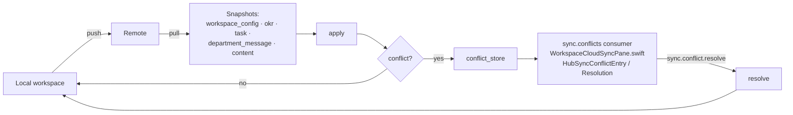

# M26 · Cloud Sync

**Source modules:** `apply`, `pull`, `push`, `resolve`, `conflicts`, `conflict_store`,
`department_message_snapshot`, `okr_snapshot`, `task_snapshot`, `workspace_config_snapshot`,
`revision_retention`, `content_store`

---

## Purpose

Replicate a workspace across devices with explicit, resolvable conflicts.

## Model

Endpoints: `sync.status`, `sync.pull`, `sync.push`, `sync.apply`, `sync.conflicts`,
`sync.conflict.resolve`.

## Transport and gating **[V]** (fourth pass)

The sync layer is an **operation log**, not a file mirror:

| Element | Evidence (`neo-agent.fmt.js`) |
|---|---|
| Master switch | `syncOutboxEnabled()` reads `MATRIX_SYNC_OUTBOX` and requires `1`/`true` (`:13169`). `sync.status` answers `{enabled:false, synced:true}` and `sync.push` short-circuits when unset (`:109605`) |
| Shipped default | the client's 98 recovered env keys (`_analysis/audit/client-env-keys.txt`) do not include `MATRIX_SYNC_OUTBOX`; the pane's *"Cloud sync is disabled in the connected daemon"* is therefore the normal state of the shipped app |
| Identity | `<ws>/.neo/sync/identity.json` → `cloudWorkspaceId`; unlinked workspaces skip with `skipped: "unlinked"` |
| Op envelope | `{opId, cloudWorkspaceId, entityType, cloudEntityId, lamport, baseVersion?, payload, createdAt}`; `lamport` and `baseVersion` must be safe non-negative integers |
| Entity types | `workspace · department · session · task · memory · okr · timeline · department_message · transcript` — only `task`, `workspace`, `okr`, `department_message` have apply handlers; the rest are pulled and **skipped** (`applyOne`, `:41690`) |
| Outbox | `writeStructured()` appends an op after each structured persist when enabled; `department_message` projection at `:41412` |
| Push | `POST /sync/op-log {ws, ops[]}` through the gateway client (`processName: "neo-harness-sync"`), batches of 100 (max 500), acknowledged op IDs marked pushed |
| Pull cursor | `<ws>/.neo/sync/pull-cursor.json` → `seenLamport`; pulled ops land in an inbox and are applied in `(lamport, opId)` order |
| Conflict record | `conflicts` store keys `opId · entityType · cloudEntityId · lamport · reason · recordedAt · resolvedAt · resolution · resolutionDetails · details · op` |

Consequence: the per-domain snapshot apply below is what happens *after* a correct op-log
transport. A replica gets the transport for free by copying this shape; the missing piece is
still field-level merge.

## Per-domain snapshots

Sync is **not** a file-tree diff. Each domain has a snapshot module that knows its own identity
and merge semantics:

| Snapshot | Identity | Merge behaviour |
|---|---|---|
| `workspace_config_snapshot` | workspace config target | same body: already current; missing: write; different existing body: conflict |
| `okr_snapshot` | target OKR document | same/missing/different-body rule |
| `task_snapshot` | task target path | same/missing/different-body rule |
| `department_message_snapshot` | message id and normalized bundle | identical: already current; different: conflict; missing parent: conflict; otherwise import |
| other entity types | `applyOne` dispatch | unsupported types skipped; file-ledger revisions do not prove asset synchronization |

`applyInbox` orders operations by Lamport value and operation ID, then records each result. The inspected apply functions (`neo-agent.fmt.js:41655`) do not merge fields or append-only arrays. Even independent edits to different fields in one document can produce a whole-document conflict. A replica must define its own merge policy explicitly.

## UI

`Matrix/WorkspaceCloudSyncPane.swift` (recovered source-file name) hosts `WorkspaceCloudSyncPane`,
`WorkspaceCloudSyncAction`, `WorkspaceCloudSyncError`; conflict DTOs are `HubSyncConflictsResponse`,
`HubSyncConflictEntry`, `HubSyncConflictResolution`, `HubSyncConflictResolveResponse`. Related
maintenance UI: `WorkspaceCollaborationRebuildSheet(+Content/Footer)`,
`WorkspaceCollaborationMaintenanceSection/Header/Actions`.

Degrades honestly: *"Cloud sync is disabled in the connected daemon."*

Related: portable workspace files — *"Saved chats for portable workspace files"* — and
`zip_import` as a marketplace source, so a workspace can move as an archive without the cloud.

## Reuse in shotgun-next

Per-domain snapshot organization is reusable as a design pattern. Automatic merging and lazy asset synchronization would be new work, not behavior recovered from this implementation.

Priority for a studio: productions are large (media). Sync **state** (briefs, milestones, work
items, reviews, decisions) eagerly and **assets** lazily with explicit pinning, or the first real
production will saturate the user's connection.
