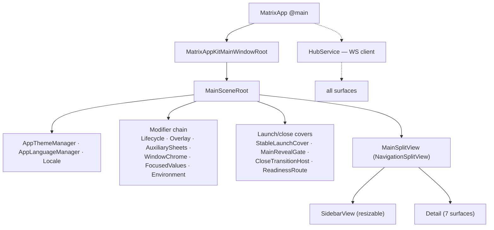

# M27 · Swift App Shell & Hub Client

**Source:** `MatrixApp`, `MainScene*`, `MainSplitView`, `Sidebar*`, `Stage*`, `HubService` +
259 `Hub*` DTOs, `MatrixDesign*`, `AppThemeManager`, `AppLanguageManager`

---

## Purpose

The cockpit: window, navigation, transport, and the design system everything else renders in.

## Composition



## HubService

- One WebSocket to `ws://127.0.0.1:7319/ws`
- `HubConnectionStatus` drives UI states ("Matrix is still connecting")
- `HubInboundEvent` + `HubEventCodingKeys` + `HubChannelValue` decode the envelope
- Outbound broadcasts: `broadcastFocus(focusedDepartmentId:workspace:)`,
  `broadcastActivity(lastActivityMs:)` — each with a local `Ack` type
- `ChatEventBatchQueue` batches high-frequency deltas before touching SwiftUI state

There are 259 `Hub*` top-level names, including services and enums, not 259 proven hand-written DTOs. The fourth pass looked for generation evidence and found the opposite pattern **[I, strong]**: the 227 874-line string table has no codegen marker (`Generated by`, `do not edit`, `openapi-generator`, `quicktype` … appear only for Xcode's asset/string symbols, protobuf and UniFFI); `HubService` declares function-local Codable structs (`Ack #1 in HubService.broadcastActivity`, `… broadcastFocus`, each with its own `CodingKeys`) and file-private helpers (`ParsedInboundFrame`, `ParsedNotification`, `ParsedResponse`, `PendingRequest`); `HubChannelValue` has a hand-written `init(from: Decoder)`; and the recovered source-file list shows one `Matrix/HubService.swift` with no `Hub*Generated*.swift` beside it. Everything points to hand-written Codable types. A shared, generated schema is therefore a genuine change for shotgun-next, not a restoration.

## Sidebar

```
WorkspaceHeaderView + proactive control (button, waveform, hover card)
PinnedNavigationArea
DepartmentSectionView — avatar stacks, live dots, active-worker badges,
                        message "flight" animations, unread previews
Module rows — Dashboard · Work · Files · Terminal · Memory · Skills · Marketplace
SidebarOfficeTVView — a live 3D preview with a LIVE badge and playback control
AccountView — identity, subscription, appearance, language
```

`SidebarModuleBadgeStateStore` + persisted `SidebarModuleBadgeSeenItemKeys.v1` gives per-item
unread tracking across modules.

## Stage — the window manager

```
StageCardType: task | terminal | browser | hook
StageCard → StageCardFocusedView / StageCardGroup
StageManagerStrip · StageSpreadWindowView · StageWindowThumbnailView
StageTaskProgressBar · StageSound · StageTapModifier
StageManagerTimeTriggerRecord
```

Long-running work detaches into cards you can spread across the screen. This is the answer to
"eight agents are running, how do I not lose my mind" — and it is the right answer.

## Design system

See [docs/07-ui-architecture.md §2](../docs/07-ui-architecture.md#2-design-system).
71 `MatrixDesign*` top-level names: glass surfaces, floating panel windows, a layered folder
icon, flow layout, foldable status containers, deferred fade-in.

## Persistence

`UserDefaults` keys are versioned (`.v1`) and workspace-scoped:

```
Matrix.WindowRestore.ActiveWorkspaceID.v1
Matrix.WindowRestore.SidebarSelection.v1      e.g. "agentRemote:a2dd8fad"
Matrix.SelectedDepartmentIDsByWorkspace.v1
Matrix.SidebarModuleBadgeSeenItemKeys.v1
Matrix.DepartmentSidebarPreviews.v1
Matrix.ChatComposerWorkerRoutingPreferences.v1
Matrix.AgentAliases.v1
Matrix.Onboarding.v1.<uuid>
```

Typed selection strings make `matrix://` deep links and restoration trivial.

## Localization

`AppLanguageManager` + 12 `.lproj` bundles; base language is English text used as the key, with
namespaced exceptions (`founder.*`, `tutorial.*`). 5 768 strings.

## Reuse in shotgun-next

Copy: the split-view shell with a fixed rail, the Stage card system, versioned workspace-scoped
UserDefaults, typed selection strings, the live 3D preview in the rail, and batched event queues
before state updates.

Change: **generate the DTO layer** from the same schema the daemon validates with. If building
cross-platform, Tauri + React gives you the same shell for a fraction of the type-maintenance
cost, at the price of the native terminal and Metal office.
