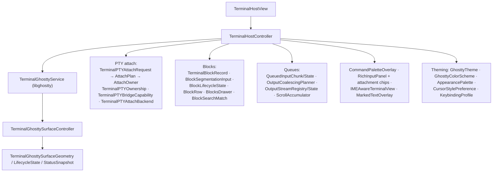

# M28 · Terminal (Ghostty)

**Source:** `Terminal*` (141 Swift types), `GhosttyRuntime/`, `SwiftTerm.bundle`,
daemon `terminal.*` endpoints, `~/Library/Application Support/com.matrixai.app/ghostty/`

---

## Purpose

A first-class terminal inside the app — for the user, and as the **window into a running
worker**.

## Stack



Ghostty and SwiftTerm-related resources/types are present. The backend enum name alone does not prove selection rules or an operational fallback path.

## Bundled runtime

```
Resources/GhosttyRuntime/
├── ghostty/shell-integration/{bash,zsh,fish,elvish}
├── ghostty/themes/            (~500 themes, also used as app color schemes)
└── terminfo/{67,78}/…
Resources/.zshenv · bash-preexec.sh · ghostty.bash
```

Shell integration is what makes **block segmentation** possible: the shell reports
command start/end so output can be cut into semantic blocks (Warp-style) rather than a flat
stream.

User config lives at `~/Library/Application Support/com.matrixai.app/ghostty/{config,user-config}`
and sessions at `terminal-sessions.json`.

## PTY ownership — the interesting part

A terminal surface has an **owner**, and ownership can transfer:

| Owner | Scenario |
|---|---|
| user | you opened a terminal |
| worker | a Claude Code / Codex worker is running its TUI |
| shared | you are watching a worker and can take over |

`WorkerTUITerminalView`, `WorkerNativeTUILaunchMode`, `WorkerMonitorScreen` render a worker's
live TUI; `TerminalPTYAttachPlan` + `TerminalPTYAttachRequirement` negotiate the handover.

`OfficeWorkerScreenTextureSignature` suggests output textures in the 3D office. Exact TUI capture, refresh rate and interaction behavior require native code or live observation; a symbol is not proof of direct PTY-to-texture transfer.

## Daemon endpoints

```
terminal.run                              one-shot command
terminal.session.create / list / attach / close
terminal.session.input / resize
terminal.session.output ↯ / status ↯
```

## Input/output discipline

- `TerminalGhosttyOutputCoalescingPlanner` + `OutputActivityBatch` — coalesce bursts before
  touching the UI
- `TerminalGhosttyQueuedInputChunk/State` — ordered, chunked input with write-state tracking
- `TerminalGhosttyScrollAccumulator` — smooth scroll accumulation
- `TerminalInputIntent` / `TerminalInputMode` / `TerminalInputPayloadPreview` — typed input
  with preview (so a pasted multi-line payload can be reviewed before it hits the shell)

## Reuse in shotgun-next

Keep if native: embedding libghostty is worth it — a real terminal plus shell-integration blocks
plus PTY handover is a genuine differentiator and hard to fake.

If web-based: use xterm.js + a PTY service, accept that block segmentation needs your own shell
integration, and keep the **ownership/attach model** — that is the product idea, not the
emulator.

Either way keep: output coalescing before UI updates, typed input with preview, and projecting
the worker's terminal into wherever you visualize agents.
